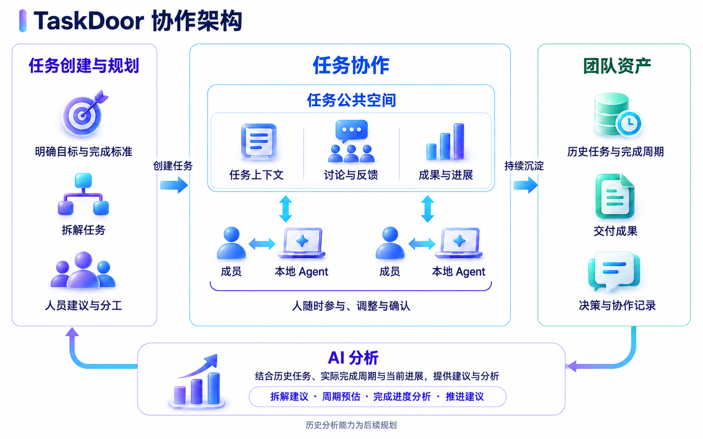

# TaskDoor

TaskDoor 是一套面向**团队成员与个人 Agent** 的任务协作产品。它把模糊需求整理为可执行任务，明确目标、任务完成标准和人员分工，让成员与本地 AI 工具围绕同一份任务上下文工作，并把讨论、文件、进展和结果持续留在任务中。

仓库同时包含三部分：

1. **TaskDoor 产品原型**：账号、团队、任务创建、任务协作与本地 Agent 连接。
2. **自动化测试工作台**：用结构化用例验证模型与 TaskDoor Skills 的任务创建、拆解、分配和分析能力。
3. **正式 PRD 文档站**：以 Markdown 为唯一内容源，维护产品流程、规则、截图和功能验收标准。

> 当前仓库以产品原型和设计验证为主。界面存在不等于生产服务已经接通；当前实现、已确认目标和待实现差异以 [PRD 实现状态表](docs/prd/current-implementation-matrix.md) 为准。

## TaskDoor 解决什么问题

个人 Agent 可以提高单人的执行速度，但团队工作仍会遇到这些问题：

- **需求难以执行**：一句“做一次活动”缺少明确目标、交付内容、完成标准和必要限制。
- **复杂工作不会自然拆开**：单任务、多个平行任务、父子任务和已有任务关系容易混在一起。
- **找人依赖记忆**：团队知道需要协作，却不容易根据成员责任域找到合适负责人和参与者。
- **责任与参与混淆**：谁负责结果、谁参与协作、谁只是被邀请，需要分别表达。
- **AI 上下文停留在私人对话**：Agent 看不到完整任务背景，产出也没有回到团队可以继续使用的位置。
- **进度缺少依据**：状态、实际进展和单条任务完成标准经常被当成同一个概念。
- **协作信息分散**：讨论、文件版本、任务关系、操作记录和最终结果散落在不同工具中。

TaskDoor 希望形成一条连续闭环：

```text
输入需求
  → 必要时补充信息
  → 判断单任务、多任务或已有任务关系
  → 生成目标、任务完成标准和任务结构
  → 按成员责任域推荐人员，由用户确认
  → 人与 Agent 在任务公共空间协作
  → 记录讨论、文件、活动、进度与结果
  → AI 提供分析，用户确认完成
```

## TaskDoor 协作架构



任务从规划进入公共空间，成员与各自的本地 Agent 基于同一份任务上下文协作；讨论、文件、进展和交付成果持续沉淀为团队资产，再为后续任务拆解、周期预估、进度分析和推进建议提供依据。

## 产品如何工作

### 1. 从需求创建任务

用户通过对话输入需求。系统先理解目的、交付内容和限制；信息不足时补问，再判断应该建立一个任务、多个任务，还是作为已有任务的子任务。创建前展示完整待确认方案，用户可以修改后统一提交。

每个任务包含：

- 任务名称与目标；
- 一条或多条任务完成标准；
- 负责人、参与者和计划时间；
- 父子任务及前置关系；
- 与任务相关的文件和上下文。

### 2. 根据责任域匹配人员

TaskDoor 根据团队成员已确认的责任域和任务需要推荐负责人或参与者。推荐只是建议，最终人选由用户决定。团队外人员可以通过邮箱邀请加入团队，再参与任务。

### 3. 在任务公共空间持续协作

任务详情统一承载目标、完成标准、子任务、关系、讨论、文件和活动记录。成员可以随时补充信息、调整方案和确认结果，后续加入的人或 Agent 可以从同一上下文继续工作。

### 4. 连接本地 Agent

任务内可以选择 **Codex、Claude Code、WorkBuddy 或 Cursor**。TaskDoor CLI／MCP 结构用于把用户有权访问的任务上下文交给本地工具，并把产出、讨论或文件结果带回 TaskDoor。Agent 继承当前用户权限，不扩大访问范围。

### 5. 分析进度并由人确认完成

系统分别处理两类进度：

- **任务整体进度**：结合任务完成标准、子任务和当前事实给出阶段性分析。
- **单条完成标准**：AI 判断证据和完成程度，用户独立进行人工确认或撤销。

AI 分析用于辅助判断，不会自动替用户修改正式状态或确认任务完成。

## 仓库组成

```text
taskdoor/
├── src/                         # TaskDoor React / TypeScript 产品界面
│   └── test-lab/                # 自动化测试工作台前端
├── server/                      # 本地服务、测试及工作台 API
│   └── test-lab/                # 用例、运行器、断言、模型调用与本地存储
├── mcp/                         # TaskDoor MCP 服务和任务卡片
├── skills/                      # TaskDoor Agent Skills、共享规则和示例
├── docs/
│   ├── prd/                     # 当前正式 PRD Markdown 内容源
│   ├── task-design-kit/         # 任务工作区设计约束与交互基线
│   ├── component-research/      # 组件与交互研究
│   ├── product-v2/              # 产品探索、决策与历史设计材料
│   └── test-lab-usage.md        # 自动化测试工作台使用说明
├── public/prd/                  # 由正式 PRD 自动生成的阅读页
├── scripts/                     # PRD 构建、测试工作流及开发脚本
├── test-lab.html                # 自动化测试工作台入口
└── package.json                 # 开发、构建和测试命令
```

| 子项目 | 主要入口 | 用途 |
| --- | --- | --- |
| TaskDoor 产品 | [`src/`](src/) | Web 产品界面、账号与团队、任务工作区、创建和协作流程 |
| MCP 服务 | [`mcp/README.md`](mcp/README.md) | Agent 读取任务上下文和呈现任务卡片的集成入口 |
| 自动化测试工作台 | [`docs/test-lab-usage.md`](docs/test-lab-usage.md) | 管理测试团队、用例、Skill 版本、模型运行和验收报告 |
| 正式 PRD | [`docs/prd/index.md`](docs/prd/index.md) | 当前产品需求、流程、规则和功能验收标准 |
| PRD 阅读页 | [`public/prd/index.html`](public/prd/index.html) | 由 Markdown 生成的图文浏览页面 |
| 任务设计基线 | [`docs/task-design-kit/README.md`](docs/task-design-kit/README.md) | 任务列表、详情、进度和本地数据的设计约束 |

## 本地运行

建议使用 Node.js 22.12 或更高版本。

```sh
npm ci --legacy-peer-deps
npm run dev -- --host 127.0.0.1
```

启动后可以访问：

| 地址 | 内容 |
| --- | --- |
| `http://127.0.0.1:5173/` | TaskDoor 产品原型 |
| `http://127.0.0.1:5173/prd/` | 完整 PRD 阅读页 |
| `http://127.0.0.1:5173/test-lab.html` | 自动化测试工作台 |

常用命令：

```sh
npm run build          # TypeScript 检查和产品构建
npm run build:mcp      # 构建 MCP 服务
npm test               # 运行服务端测试
npm run test:lab       # 运行测试工作台相关测试
npm run typecheck:lab  # 检查测试工作台类型
```

## 自动化测试工作台

自动化测试工作台用于回答：**不同模型和 Skill 在真实团队上下文下，能否稳定地产出符合 TaskDoor 规则的任务方案与分析结果？**

它不是普通单元测试页面，而是一套本地隔离的产品验收环境：

1. **准备团队上下文**：维护成员、责任域、已有任务、文件和事件等测试资料。
2. **编写测试用例**：记录输入需求、多步骤对话、预期结果、自动断言和人工核对项。
3. **固定 Skill 版本**：测试可跟随当前工作区，也可以绑定不可变 Skill 包版本，便于复现。
4. **选择模型运行**：同一批用例可选择多个模型，逐个执行并保留实际输入、输出、耗时和 Token 数据。
5. **自动与人工验收**：系统先校验 JSON 结构和业务断言，再由人工判断任务拆解、人员匹配及语义是否合理。
6. **比较和导出**：按模型查看执行完成率、断言达成率和最终验收结果，可导出 JSON 与 JUnit 报告。

测试数据写入本机 `data/test-lab/state.json`，与产品原型数据隔离；测试接口只允许本机访问。真实模型运行目前使用兼容 PPIO Responses 的接口，需要在服务端环境配置：

```sh
PPIO_API_KEY=your-key
PPIO_MODEL=pa/gpt-5.5-pro
# 可选：PPIO_BASE_URL=https://api.ppinfra.com/openai/v1
```

工作流命令示例：

```sh
npm run lab:workflow -- --list
npm run lab:workflow -- --team lab-manufacturing --flow delivery --check
npm run lab:workflow -- --team lab-manufacturing --flow delivery --run --model <模型ID>
```

默认预检不会调用模型。真实运行会生成 JSON 和 JUnit 报告；详细操作、指标口径、批量限制及 Skill 版本规则见[自动化测试工作台使用说明](docs/test-lab-usage.md)。

## PRD 项目分布

当前正式 PRD 只维护在 **[`docs/prd/`](docs/prd/)**。Markdown 是唯一内容源，生成页用于阅读，不能反向替代正文。

```text
docs/prd/*.md + docs/prd/modules/*.md + docs/prd/assets/*
                         │
                         ▼
          scripts/build-agentdoor-prd.mjs
                         │
                         ▼
          public/prd/index.html
          public/prd/module-index.json
```

### 正式 PRD 文件

| 路径 | 内容 |
| --- | --- |
| [`docs/prd/index.md`](docs/prd/index.md) | PRD 总目录和模块分组 |
| [`docs/prd/modules/`](docs/prd/modules/) | 17 个正式功能模块；每个模块包含目的、范围和边界、详细功能设计、功能验收标准 |
| [`docs/prd/assets/`](docs/prd/assets/) | 当前页面截图、状态示意和流程图 |
| [`docs/prd/CHANGELOG.md`](docs/prd/CHANGELOG.md) | 可追溯的需求语义变更记录 |
| [`docs/prd/source-map.md`](docs/prd/source-map.md) | PRD 结论与代码、页面及证据来源的对应关系 |
| [`docs/prd/current-implementation-matrix.md`](docs/prd/current-implementation-matrix.md) | 当前已实现、已确认目标和待验证差异 |
| [`docs/prd/screenshot-manifest.json`](docs/prd/screenshot-manifest.json) | 截图编号、来源、状态和更新时间 |
| [`docs/prd/README.md`](docs/prd/README.md) | PRD 编写、截图、变更和发布规范 |

正式模块按五组组织：

- **产品概览**：产品界面预览、产品目标与核心流程。
- **账号与团队**：账号与个人资料、团队管理、工作区与导航、成员邀请与任务分工。
- **任务管理**：任务列表、任务创建、任务详情、任务进度与完成。
- **协作与连接**：讨论、通知、活动、文件、成果提交、Agent 与 CLI 连接。
- **系统规则**：删除与数据保留、成员退出、权限、异常、质量、语言与时区。

修改 PRD 后重新生成阅读页：

```sh
node scripts/build-agentdoor-prd.mjs
```

`docs/product-v2/`、`docs/component-research/` 和历史导出材料用于研究与追溯，不替代当前正式 PRD。部分旧文件名和内部标识仍使用 `agentdoor`，对外产品名称统一为 **TaskDoor**。
