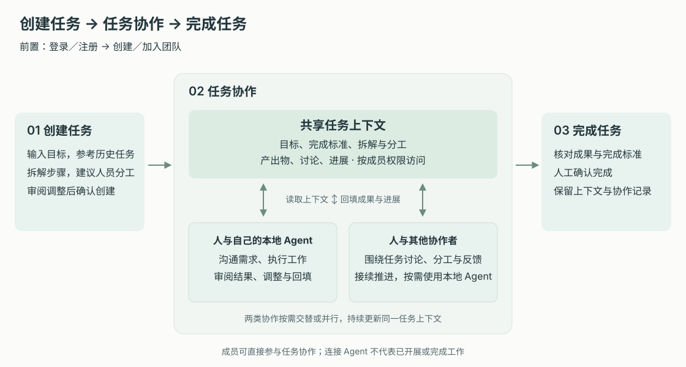

# 产品目标与生命周期

## 1. 目的

TaskDoor 帮助团队成员和其授权的个人 Agent 围绕同一任务持续工作：知道要完成什么、由谁负责、能够读取哪些上下文，以及结果是否已经正式提交和确认。目标用户包括发起工作的团队管理员、负责或参与任务的成员，以及使用本地工具执行任务的成员；Agent 是受委托的执行主体，不替代人的结果责任。

产品成功的证据是用户能够从获得身份一直走到结果收口或安全退出，且 Web 与 CLI 看到相同的任务、权限、版本和历史。注册成功、连接成功或上传成功只是阶段结果，不能单独证明团队工作已经完成。本 PRD 分开描述当前 MVP 与上线目标，现有界面和 Mock 不作为生产认证、持久化或权限可用的证明。

## 2. 范围和边界

首版包含账号访问、团队建立、工作区、可选 CLI 连接、任务查找与创建、责任确认与协作、讨论与文件、正式提交、任务完成、删除恢复以及成员和账号退出。每个正式 Task 的 Owner 基数为 `0..1`：可以暂时未分配，但不能有多位正式 Owner。AI 只生成建议或草稿，正式写入必须由用户确认。团队邀请、任务参与邀请和负责人变更分别确认。

范围外包括人与人 Handoff 完整协议、外部访客与跨组织协作、计费与订阅、自动责任推断、组织级 AI 洞察，以及无确认自动写入、自动邀请或自动完成任务。这些方向不参与首版验收。

## 3. 详细功能设计

### 3.1 生命周期与阶段证据

**当前 MVP。** 登录、注册和找回密码由浏览器本地流程演示，六位数字验证不证明真实邮箱所有权。无团队的新账号直接创建团队，有邀请则核对后加入；创建团队进入不注入演示任务的空工作区，加载过渡持续到工作区模块就绪，失败可重试。默认任务工作区可创建、查找和打开本地任务；连接 AI 提供指南与上下文入口，尚不能证明真实 CLI 授权或执行。

**上线目标。** 以下阶段证据及服务端对象、Web／CLI 一致性构成目标合同，不代表当前 MVP 已闭环。

用户按工作需要进入各阶段，不必连接 CLI 才能创建或完成任务。返回用户可以直接恢复有效团队与工作上下文。各模块共用服务端事实和操作回执，失败不伪装为已完成，未知数据不显示为零。

*FIG-LIFE-001 · 目标流程：CLI 是可选执行入口；正式提交、任务完成和删除是各自独立的动作。*

| 阶段 | 用户目标 | 关键操作 | 阶段完成证据 |
| --- | --- | --- | --- |
| 访问与身份 | 获得可使用的身份 | 注册、验证邮箱、登录或找回密码 | 已验证且未停用的账号获得有效会话。 |
| 团队激活 | 明确在哪个团队工作 | 创建团队或接受邀请 | 服务端存在有效成员关系，角色为管理员或成员。 |
| 进入工作区 | 找到工作入口 | 恢复团队、打开任务或我的工作 | 当前团队明确，已加载有权数据或真实空状态。 |
| 连接本地工具（可选） | 用 CLI 延续同一工作 | 设备授权、绑定任务上下文 | 设备授权有效，CLI 能读取指定团队内有权任务。 |
| 创建与规划 | 明确目标和责任 | 创建根任务或子任务，核对 Owner 状态及完成标准 | 正式任务有稳定 ID，Owner 为 `0..1`；未分配、待接受与正式负责可区分。 |
| 协作与执行 | 与成员交换上下文 | 邀请、讨论、更新任务、上传文件版本 | 实际变更可读，邀请接受与责任生效有独立记录。 |
| 结果提交 | 留下可追溯的成果 | 审阅草稿、正式提交 Commit | 不可变 Commit 引用明确文件版本和证据，任务不自动完成。 |
| 完成或删除 | 收口工作或清理误建任务 | 确认完成；预览删除影响并确认 | 完成有证据和活动；删除有回收站记录及 30 天清理时间。 |
| 退出与继续 | 安全结束当前使用 | 切换团队、退出登录、离开团队或停用账号 | 会话或成员权限按对应范围结束，责任已处理，历史可追溯。 |

### 3.2 三类用户闭环

#### 新用户创建团队

**当前 MVP。** 注册通过本地验证后创建团队并成为管理员，经过加载过渡进入空工作区。列表提供“新建任务”，成员邀请在设置的成员入口，顶栏提供“连接 AI”；新团队不放演示任务、虚假统计或假完成率。

**上线目标。** 用户经真实邮箱验证创建团队后，创建首个任务，按需邀请成员与连接 CLI，在 Web 或本地提交文件和结果，讨论确认后完成任务。后续可以继续工作，也可以按责任处理规则离开团队或停用账号。

#### 受邀用户加入团队

**当前 MVP。** 用户打开邀请链接，注册或登录过程中保留上下文，卡片显示团队名称和加入身份，不展示邀请人。核对后点击“立即加入”进入本地团队；当前引导页没有拒绝按钮，退出页面不记为已拒绝。

**上线目标。** 受邀邮箱通过认证并确认后，接受产生服务端有效成员关系，拒绝不产生关系。进入后只显示有权任务；需要协作时另行接受任务参与邀请或负责人变更，执行并提交成果。离开或被移除时处理责任并撤销相应访问，不抹去历史贡献。

#### 返回用户继续工作

**当前 MVP。** 登录读取本地账号，有团队时进入任务工作区，有邀请时优先进入邀请确认，无团队时进入创建页；通知、切换团队、设置和退出登录由顶栏提供。当前任务列表不提供独立“我的工作”入口。

**上线目标。** 登录后恢复服务端有效团队，读取通知和待处理事项，打开原任务，在 Web 或 CLI 继续更新并提交结果。上次团队已失效时选择其他有效团队；没有团队时回到创建或加入流程。用户可以完成任务、预览并删除不再需要的任务，然后切换团队或退出登录。

### 3.3 跨阶段数据与恢复

**当前 MVP。** 团队目录、任务和置顶等使用浏览器本地状态；当前 AI 规划含 Mock，创建者不是选定负责人时默认加入参与人。详情的协作区为讨论、文件和活动，子任务在任务信息内。真实权限、服务端持久化和审计仍需按下述上线合同完成。

**上线目标。**

账号、团队成员关系、任务和设备授权分别保存；打开邀请链接或连接设备不自动分配任务责任。写入成功以服务端回执为准，业务变化生成活动，通知只发给事件涉及且有权的接收者。通知不是另一份业务状态，必须回到来源处理。

创建、更新和删除携带幂等键；已有对象变更同时校验版本。超时先查询原操作或以原键重试，不能重复建团队、任务或 Commit。权限变更后重新鉴权并移除过期内容，不通过错误、数量或缓存泄露隐藏任务。断网与加载失败保留可安全保留的输入及重试入口，敏感认证凭据不写入普通草稿。窄屏逐层进入并可返回，键盘用户能够完成各主要动作。

### 3.4 端到端验收旅程

以下十条旅程是**上线目标**验收，连续覆盖首版生命周期；活动来自实际业务事件，身份类操作使用安全审计，不混成任务活动。当前 MVP 可演示的进入流程以 3.2 为准。

| 旅程 | 前置 | 关键步骤 | 数据变化与记录 | 失败恢复 | 最终结果 |
| --- | --- | --- | --- | --- | --- |
| 1. 新用户注册创建团队 | 未注册、可接收邮箱验证码 | 注册→验证邮箱→创建团队→进入工作区 | 账号验证、团队及管理员成员关系生效；记录安全及团队创建事件 | 验证码过期重发；创建超时查询原结果或原键重试 | 只创建一个团队，空工作区可创建首个任务。 |
| 2. 受邀用户加入 | 有效邀请、受邀邮箱可用 | 打开邀请→注册或登录→核对邀请→接受 | 邀请变为已接受，建立成员关系并记录加入事件；不产生任务责任 | 邮箱不符切换账号，过期请求管理员重新邀请；重复接受返回已有结果 | 进入邀请团队，只看到有权数据。 |
| 3. 返回用户恢复 | 已验证账号、曾使用团队 | 登录→恢复有效团队→我的工作或原任务 | 更新会话与最近团队；不制造任务变更活动 | 旧团队失效选择其他团队，无团队进入建立流程 | 恢复有效工作上下文，无旧团队缓存泄露。 |
| 4. 简单任务 | 有效成员、有创建权限 | 输入目标与完成标准→明确选择本人、他人提议或暂不分配→创建 | 生成一个根任务及创建活动；允许未分配且不会回填创建者或首位成员 | 校验失败保留草稿；超时以原幂等键恢复 | 列表和详情展示同一任务 ID、版本与 Owner `0..1` 真相。 |
| 5. 父子任务邀请协作 | 有效成员、协作者在团队内 | 规划父子任务→确认创建→发参与邀请或 Owner 提议→对方接受 | 保存父子关系、各自 Owner 状态和独立邀请；他人接受前 `ownerId` 保持原值或 `null` | 拒绝或过期保留原责任；本人创建的未分配任务从“待确认负责人”找回 | 父子边界可读；待接受和未分配不进入正式负责任务或“我的工作”。 |
| 6. Web 讨论上传更新 | 可访问并有相关写权限的任务 | 发布讨论→上传明确文件→等待可用→更新允许字段 | 讨论、文件版本、任务版本各自保存；真实变更生成活动，提及按权限通知 | 上传失败可重试；版本冲突展示有权最新版本再确认 | 刷新仍可读取正式讨论、可用文件及更新结果。 |
| 7. CLI 登录读取创建更新删除正式提交 | 有效成员、已安装 CLI | 设备授权→绑定任务→读取→创建根/子任务→更新→预览并删除临时任务→在保留任务正式提交 | 使用 Web 同一任务与版本；设备、actor/on-behalf-of、删除和 Commit 均可追溯 | 拒绝或过期重发授权；超时原键重试；撤权后停止调用 | 无重复写入；临时任务进回收站，正式 Commit 可在 Web 查阅且任务未自动完成。 |
| 8. 完成沉淀 | 已提交成果且有完成确认权限 | 检查完成标准与证据→明确确认完成 | 状态变化及活动关联成果；相关成员收到可访问通知 | 证据缺口或版本冲突时保持原状态，补齐后重新确认 | 完成状态可读，历史版本和不可变 Commit 可追溯。 |
| 9. 删除回收恢复 | 有删除权限的任务，可检查影响 | 预览后代、依赖、文件与草稿影响→确认范围→删除→30 天内恢复 | 正常列表隐藏任务，产生回收站记录；恢复重新检查关系并记录事件 | 影响变化重新预览；无效关系标明缺口，不伪造恢复 | 可恢复任务重新进入正常查询，共享文件与 Commit 不被连带删除。 |
| 10. 成员离开/移除/账号停用 | 有任务责任或管理员身份的成员 | 处理有效任务责任→补足管理员→离开/由管理员移除；停用前处理全部团队和设备 | 正常 Owner 走受控转移；仅失联 Owner 死锁由 `task.assignment.recover` 恢复为已同意成员或未分配 | 正常转移仍可用、缺少 step-up auth 或唯一管理员未交接时阻止执行 | 被移除者无团队访问；历史 Owner 与 Activity 保留，任务 Owner 仍为 `0..1`。 |

## 4. 验收标准

当前 MVP 验收：本地账号流程、邀请团队名称与加入身份、创建团队后的空工作区和加载失败重试可用；原型认证、Mock AI 和连接指南不得标为生产能力。

以下为上线目标验收：

- 三类用户均可从入口到达有效团队与任务工作状态；未验证或无有效团队不能直接进入工作区。
- 首次空工作区可创建任务，并可从成员设置和顶栏进入邀请与连接流程；未加载和无权限不显示为真实空数据。
- 十条验收旅程均能以服务端对象、版本、回执及可访问历史核对结果，刷新或更换 Web/CLI 入口不会产生另一套事实。
- 接受团队邀请不改变任务责任，连接 CLI 不证明工作已执行，正式提交不自动完成任务。
- Task Owner 在所有入口均为 `0..1`；创建不默认回填创建者或首位成员，待接受提议和未分配任务不进入正式负责任务或“我的工作”。
- 删除、撤权、成员离开和停用账号后，列表、详情、通知与 CLI 的可访问范围一致收口；责任和历史按对应模块保留。
- 网络重试不重复创建资源，冲突不静默覆盖，键盘和窄屏均能完成进入、工作与退出的主要流程。
