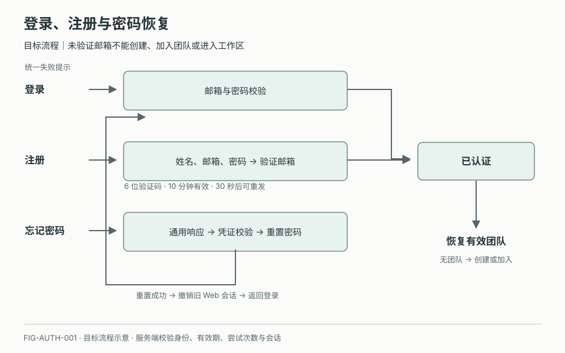
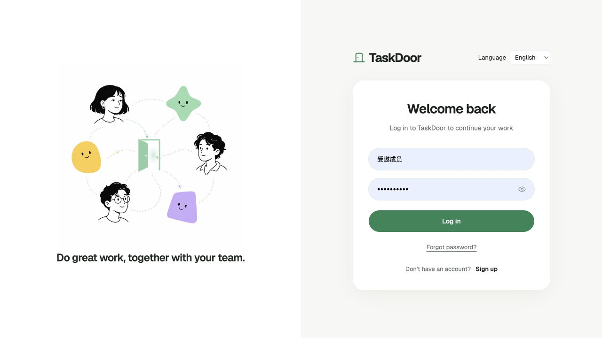
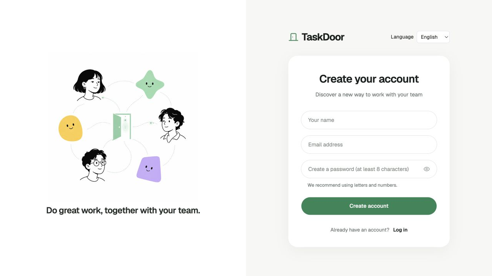

# 账号与身份

## 1. 目的

为团队协作建立可验证的邮箱身份，并让用户在遗忘密码、验证码失效或会话结束后恢复访问。成功结果是服务端认可的已验证、未停用账号和有效会话，不是浏览器保存了一个姓名或登录标记。

## 2. 范围和边界

覆盖登录、注册、验证邮箱、重发验证码、验证前修改邮箱、忘记密码、重置密码、退出登录，以及已验证账号的个人信息查看与编辑。团队建立见模块 03，设备授权见模块 05，账号停用见模块 14。本模块不引入第三方登录、外部访客身份、敏感画像或以本地 Mock 代替正式认证。

## 3. 详细功能设计

### 3.1 访问入口与输入规则

**当前 MVP。** `/login`、`/signup`、`/forgot-password` 分别提供登录、注册与找回密码表单；邀请链接保留在注册与登录切换过程中。注册填写姓名、邮箱和至少 8 位密码；页面支持显示密码、字段错误、提交防重及六位验证码粘贴。账号摘要、流程状态和工作区会话保存在浏览器 sessionStorage，团队目录使用 localStorage；直接打开根路径仍可进入演示工作区，并不存在完整的服务端认证路由保护。

**上线目标。** 以下受保护入口、会话、个人信息版本与安全要求属于上线合同，不由本地状态证明已实现。

未认证访问展示登录表单，并提供注册和忘记密码入口。来自受保护任务或邀请链接时保留安全的产品内返回地址；认证成功后仍需校验来源权限，不跳转任意外部地址。已登录且有效的用户进入团队恢复流程。

邮箱统一执行 trim + lowercase 后校验格式并作为规范身份；姓名去除首尾空白后为 1–40 字；密码至少 8 位且不自动裁剪或改写。表单有显式标签、显示/隐藏密码按钮和就地错误。空值不发请求，提交中防止重复点击，失败保留邮箱和姓名，密码不进入日志、URL 或普通本地缓存。

*FIG-AUTH-001 · 目标流程：注册必须验证邮箱，找回密码完成后返回登录；认证后再检查有效团队。*

*FIG-AUTH-002 · 当前英文界面，主工作区运行实拍，2026-09-21。登录页：邮箱、密码、找回密码与注册入口。*

*FIG-AUTH-003 · 当前英文界面，主工作区运行实拍，2026-09-21。注册页：姓名、邮箱与密码，尚未提交注册。*

### 3.2 注册与验证邮箱

**当前 MVP。** 页面明确提示输入任意 6 位数字即可；这是当前本地原型限制，不发送真实邮件，也不校验验证码真伪或过期。30 秒重发倒计时只控制本地按钮。六位数字通过后把本地待注册资料记入账号状态：无邀请且无团队时进入创建团队，有邀请时进入邀请确认。修改邮箱返回输入页；这些状态不能充当生产邮箱所有权证明。

**上线目标。** 下述邮件发送、验证码有效期和一次性使用必须由服务端实施。

用户填写姓名、邮箱、密码并提交。服务端校验后建立待验证账号并发送验证码，页面显示已发送的目标邮箱、6 位验证码输入、剩余等待时间、重发及修改邮箱入口。注册邮箱已存在时引导登录或找回密码；不得重建账号或覆盖已有密码。

验证码为 6 位、10 分钟有效，30 秒后可重发。服务端负责有效期、重发间隔及尝试次数限制，不能靠客户端倒计时绕过。重发成功后旧验证码失效，页面更新倒计时；重发失败不冒充已发送。验证码提交成功后原子标记邮箱已验证、消耗验证码并建立认证会话。重复提交不重复创建身份；未验证账号不能创建或加入团队，也不能进入工作区。

验证前选择“修改邮箱”返回邮箱编辑，保留姓名；新邮箱重新规范化和校验，成功后旧验证请求失效并向新邮箱发送新验证码。若新邮箱已注册则引导登录，不迁移或合并账号。邀请码仍绑定原受邀邮箱，修改注册邮箱不改变邀请接收人。

验证码为空、格式不符、错误或过期时给出相应输入提示；过期提供重发入口。页面刷新重新读取验证状态及可重发时间，不凭本地状态假定验证成功。账号已验证时不重复发送注册验证码，引导继续登录或进入团队。

### 3.3 登录与返回位置

**当前 MVP。** 登录检查本地账号及密码摘要，不自动注册，错误统一提示邮箱或密码不正确。有邀请时先核对邀请；否则有已保存团队时进入该团队，无团队时直接进入创建页。当前未实现服务端会话撤销、停用检查及受保护任务深链接恢复。

**上线目标。**

邮箱与密码通过服务端校验才建立会话。登录失败统一显示“邮箱或密码不正确”，不泄露账户存在性；未认证阶段也不以独特错误区分停用与不存在。正确凭据对应未验证账号时进入验证邮箱流程，仍不授予团队访问。

登录成功恢复上次有效团队；旧团队失效则选择其他有效团队，没有团队进入模块 03。存在未处理邀请时先恢复邀请确认页面，核对受邀邮箱；存在任务返回地址时，在确认团队和任务访问权限后回到任务。失效来源提供明确返回工作区入口。

账号停用后拒绝新会话，已有会话在校验时失效并清除受保护界面；已认证用户可看到账号不可用的状态和联系支持说明。会话超时引导重新登录，保留非敏感的产品内目标地址，不保留可被其他账号读取的任务正文缓存。

### 3.4 忘记密码与重置密码

**当前 MVP。** 输入邮箱、通过本地六位数字校验后，为已保存账号显示一个新密码输入框；更新本地摘要后返回登录，提示重新登录。不存在账号会在验证步骤提示无法验证；没有真实重置邮件、二次密码确认或跨设备会话失效机制。

**上线目标。** 下述反枚举、一次性重置与会话失效规则仍须实现。

用户在忘记密码页输入邮箱。无论账号是否存在，响应统一为“如果该邮箱可用于找回密码，我们会发送重置说明”，时序和频率限制同样不能用于枚举账户。页面提供返回登录和重新发送入口。

重置凭证一次使用、短时有效，有效时间在邮件和页面明确显示，并由服务端校验。用户打开凭证后输入新密码并二次确认；通过规则且两次一致才提交。成功后更新密码、消耗凭证并撤销该账号已有 Web 会话，返回登录页以新密码登录；不自动替用户授权 CLI。无效、已用或过期凭证不改变密码，提供重新发起找回密码。提交超时查询结果或重新登录核对，不能显示未经确认的成功。

### 3.5 退出登录与会话清理

**当前 MVP。** 工作区账户菜单提供“退出登录”，清理当前浏览器工作区身份并返回登录；引导页也提供退出当前账号入口。该操作没有服务端会话或真实 CLI 授权可撤销。

**上线目标。**

个人中心提供退出登录。执行后服务端撤销当前浏览器会话，当前浏览器的标签页同步结束认证状态并回到登录页，后退或刷新不能恢复受保护页面。清理本机的 Web 敏感凭据与授权内容缓存，不删除云端任务、文件、历史记录或用户主动保存的本地工作文件。

Web 退出登录不自动撤销 CLI 设备授权；设备由已连接设备页单独撤销。退出请求失败时清理本机敏感会话状态并明确远端会话撤销尚未确认，网络恢复后补发撤销；不能把未确认的远端处理宣称成功。

### 3.6 个人信息查看与编辑

**当前 MVP。** 账户菜单的“设置”可进入个人信息，本地资料编辑不等同于跨设备身份服务。

**上线目标。** 以下稳定资料、版本检查和历史快照要求保留。

个人设置的“个人信息”读取一份跨团队稳定的 `user_profile`，至少展示显示名称和已验证邮箱；邮箱在此只读，修改登录邮箱需要未来独立的重新验证流程。首版不采集绩效、能力评分、健康、家庭、证件或其他与协作闭环无关的敏感画像，也不把团队角色、责任说明或 Task Owner 合并进个人资料。

用户进入编辑后可以修改显示名称；保存提交 `profile_version`、字段补丁和幂等键。服务端校验当前账号、字段长度与操作权限，成功后返回新版本并同步到各团队的当前身份投影；历史 Discussion、Commit 和 Activity 继续使用发生时的最小显示名快照，不被回写改名。保存期间显示进行中，失败保留输入；无权限或账号停用时只读；网络超时先按 operation ID 查询或以原幂等键重试。

版本冲突时页面保留用户输入，并列显示“你的修改”和当前 `user_profile`；用户基于最新版本重新确认，不静默覆盖。读取为空只表示可选字段尚未填写，加载失败不显示为空资料。窄屏单列展示，键盘可进入编辑、保存或取消，错误摘要定位到字段，关闭后焦点返回“个人信息”入口。

### 3.7 失败、限流与可访问性

**当前 MVP。** 表单提供本地校验、操作中与浏览器存储失败提示，切换步骤时聚焦标题；尚未实现邮件服务、服务端限流和安全审计。

**上线目标。**

认证和邮件服务加载中显示具体动作，失败提供重试而不伪装成功；频率限制显示可再次尝试时间，服务端同时限制凭据尝试和验证码发送。验证码过期、发送失败和网络失败分别说明下一步，不显示内部堆栈或完整令牌。安全审计记录注册、验证、登录、重置和退出结果，不记录密码、验证码或重置凭证。

所有流程支持键盘顺序操作、回车提交和验证码整段粘贴，错误与剩余等待时间可被辅助技术读取。移动端表单单列，邮箱和验证码使用相应输入键盘；错误不会遮住提交按钮或清空已填内容。

## 4. 验收标准

当前 MVP 验收：注册、登录和重置可按上述本地流程演示；任意六位数字只作为原型行为展示，邀请上下文可恢复，浏览器存储失败不能显示已进入工作区。

以下为上线目标验收，不表示当前原型已满足：

- 邮箱前后空白和大小写不生成第二个账号；姓名超出 1–40 字、密码不足 8 位时不能提交有效注册。
- 未验证用户不能进入团队；6 位验证码在 10 分钟后失效，30 秒前无法重发，重发后旧码不可用，修改邮箱后旧验证请求失效。
- 不存在邮箱和错误密码的登录响应均为“邮箱或密码不正确”；找回密码对存在与不存在邮箱给出相同响应。
- 重置凭证只能成功使用一次，重置成功后旧 Web 会话失效，旧密码无法登录。
- 登录按有效成员关系恢复团队或进入团队建立流程，失效邀请和无权任务不会绕过权限校验。
- 退出后当前浏览器全部标签页失去认证内容，云端数据与 CLI 独立授权保留；停用账号不能新建会话。
- 用户可以查看并编辑跨团队稳定的个人信息；保存校验 `profile_version`，冲突保留双方内容，历史作者快照不被改写，且不采集无关敏感画像。
- 加载、限流、邮件失败、验证码过期均有可操作反馈，键盘和移动端可完成完整流程。
