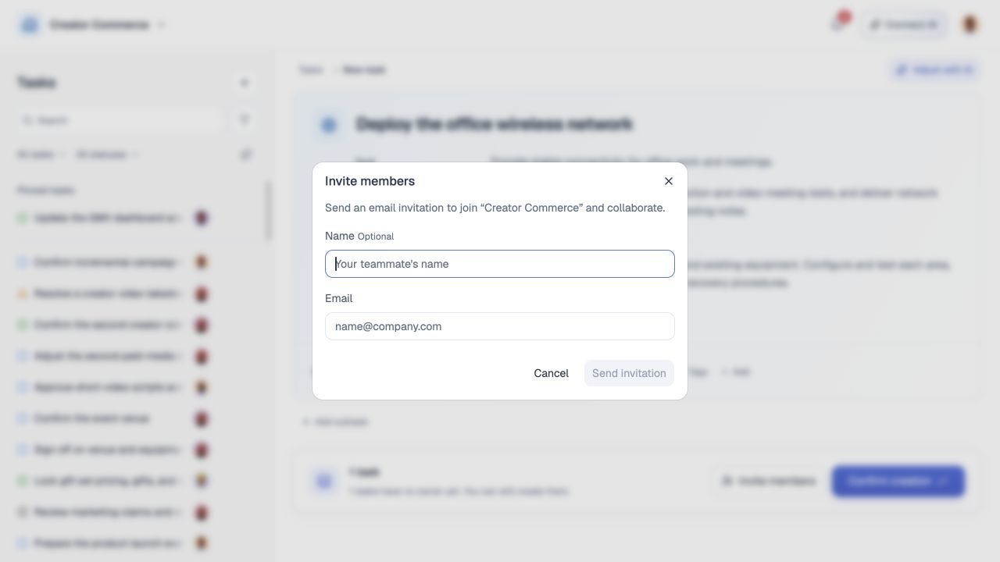

# 任务创建与规划

## 1. 目的

让用户通过输入需求、AI 辅助规划和手工编辑，把一个工作意图变成目标明确、完成边界可核对、责任与关系清晰的任务。当前创建页先形成可编辑草稿，只有用户最终确认后才写入本地任务；推荐、选择和接受责任保持为不同状态。手工创建的独立入口与服务端写入另按上线目标说明。

## 2. 范围和边界

本模块覆盖根任务和子任务的创建入口、手工创建、AI 辅助规划、简单／复杂任务判断、父子任务与依赖、人员、日期、预计投入、草稿调整、最终确认和创建回执。创建后的字段维护由模块 08 定义，邀请与负责人变更由模块 09 定义，文件和正式 Commit 由模块 11 定义。

AI 只生成建议和草稿，不自动创建任务、不自动邀请成员、不自动指派负责人，也不以“已分析”冒充查过全部团队资料。首版不支持无需确认的批量创建；创建页中的过程展示只说明用户可核查的步骤和结果，不展示或伪造模型内部思维链。

**当前 MVP。** `TaskCreationExperience` 只挂载统一创建页，规划、补问与调整由本地规则和 Mock 过程驱动，草稿及提交使用浏览器存储。演示场景只是帮助填入需求的示例；示例日期和演示输出不是生产规划规则，当前规划上下文使用上海时区当天日期。

**上线目标。** 真实 AI 服务、团队成员验证、邀请投递、原子事务、幂等与资源版本校验须由服务端实现；以下涉及这些能力的要求不表示原型已上线。

## 3. 详细功能设计

### 3.1 入口与创建方式

本节及后续关系、人员章节按七个内置示例展示创建过程。截图均来自英文界面的本地 Mock，停在方案审阅或空邀请表单；不代表真实 AI 调用、正式创建成功或邀请已发送。

**当前 MVP。** 用户从任务工作区选择“新建任务”进入需求输入页，也可从任务详情新增子任务并携带父任务上下文。顶栏明确当前团队；确认前检查本地父任务仍存在，失败保留方案。草稿按用户与团队隔离，进入创建页保留原列表查询，确认成功后打开新任务详情。

**上线目标。** 所有入口校验创建权限，父任务失效、不可见或版本变化时停止确认并保留草稿。切换团队前提示未保存草稿的影响，不能把草稿静默写入另一团队。

**手工创建与编辑。** 当前 MVP 允许在生成的方案中手工编辑任务名称、目标、完成标准、负责人、参与人、截止日期、标签及子任务，并查看预计投入。代码另有直接建立“未命名任务”的本地辅助函数，但当前“新建任务”按钮没有挂载该路径，不将其写成已外露的空白表单入口。上线目标保留独立手工创建：用户直接填写字段，最少有可识别名称；名称用于识别，目标说明希望改变的结果，二者不能自动填成同一句话。完成标准可显式留空，不填入演示内容。

**AI 辅助。** 当前 MVP 中用户输入原始需求，本地规划器按场景进入补问、关系确认或方案审阅；补问逐题确认，可返回修改。示例需求、Mock 播放和本地匹配不是实际模型调用或团队资料检索。上线目标只在缺口会改变目标、交付或结构时补问，单轮最多两个问题；“不知道／待定”继续保持未知。生成失败、停止或返回修改时保留原文和已确认回答，不提前出现成功回执。

*FIG-CREATE-001 · 上线目标流程：无论手工还是 AI 辅助，正式任务都只在用户最终确认且服务端校验通过后产生；当前本地流程以正文说明为准。*

*FIG-CREATE-002 · 当前英文界面，主工作区运行实拍，2026-09-21。描述工作需求并选择规划示例，未创建正式任务。*

#### 示例过程 · 单任务：直接整理为可审阅草稿

选择 Single task 示例后，需求填入输入框。点击 Start 后形成一个任务草稿，用户核对目标、完成标准和人员，再决定是否确认创建。

*FIG-CREATE-003 · 选择示例后的需求输入。English 界面，2026-09-21 主工作区实拍；本地 Mock 过程，未提交创建。*

*FIG-CREATE-004 · 单任务草稿与确认创建入口。English 界面，2026-09-21 主工作区实拍；本地 Mock 过程，未提交创建。*

#### 示例过程 · 需求不清楚：两步补问后继续规划

选择 Unclear request 示例。先明确活动目标，再确认交付内容；本次示例选择提升产品认知，以及方案、物料和复盘。回答进入后续草稿，日期和预计投入仍可保持未设置。

*FIG-CREATE-005 · 第 1 步：确认活动要达到的目标。English 界面，2026-09-21 主工作区实拍；本地 Mock 过程，未提交创建。*

*FIG-CREATE-006 · 第 2 步：选择需要交付的内容。English 界面，2026-09-21 主工作区实拍；本地 Mock 过程，未提交创建。*

*FIG-CREATE-007 · 补问后的草稿：目标和完成标准承接已确认回答。English 界面，2026-09-21 主工作区实拍；本地 Mock 过程，未提交创建。*

### 3.2 任务成形与关系

**当前 MVP。** 支持独立任务、父子方案和挂靠已有任务的候选确认，用户可核对已有任务后再选择关系；关系确认本身不创建任务。创建流程子任务卡片不展示前置依赖摘要，编辑子任务时仍可维护草稿依赖，创建后的正式任务关系仍可在详情维护。

**上线目标。** 下述结构判断与关系约束保持有效，服务端需再次校验当前有权数据。

系统根据“是否需要独立交付、独立责任、独立上下文或独立验收”判断结构：一个结果可以持续跟进时形成简单任务；存在多个可独立交付或并行负责的结果时形成复杂任务，由一个父任务和必要的子任务组成。系统不套用固定的“分析／执行／验收”拆分步骤，也不为显得完整而机械拆分。

父子任务只用稳定 `parentTaskId` 表达，标签和列表分组都不能替代父子关系。前置依赖只指向当前团队中有权读取的稳定任务 ID；创建时校验自依赖、重复、悬空和已知循环。依赖是可编辑的参考关系，不自动串行可并行工作、不自动改变状态，也不禁止开始或完成。相似任务或可能父任务仅作为候选，用户可以打开核对、选择关联或继续独立创建；未经确认不得改动既有任务。

#### 示例过程 · 复杂项目：主任务与七个子任务

选择 Complex project 示例并发起规划。先审阅主任务目标与完成标准，再向下查看七个子任务及负责人；确认区域汇总为一个主任务、七个子任务。

*FIG-CREATE-008 · 复杂项目原始需求。English 界面，2026-09-21 主工作区实拍；本地 Mock 过程，未提交创建。*

*FIG-CREATE-009 · 主任务目标、完成标准与预计投入。English 界面，2026-09-21 主工作区实拍；本地 Mock 过程，未提交创建。*

*FIG-CREATE-010 · 子任务分工与整份方案的确认入口。English 界面，2026-09-21 主工作区实拍；本地 Mock 过程，未提交创建。*

#### 示例过程 · 多层项目：展开层级核对交付边界

选择 Nested project 示例后，方案可展开内容制作、脚本规划与具体脚本工作。缩进与连接线显示父子层级，底部按全部层级汇总任务数量。

*FIG-CREATE-011 · 多层项目的主任务草稿。English 界面，2026-09-21 主工作区实拍；本地 Mock 过程，未提交创建。*

*FIG-CREATE-012 · 展开后的四层结构：主任务加三级子任务，共 10 个任务。English 界面，2026-09-21 主工作区实拍；本地 Mock 过程，未提交创建。*

#### 示例过程 · 相似任务：核对已有工作后独立规划

选择 Similar task 示例后，先查看只读候选任务。截图展示选择 Plan independently 后继续形成独立草稿的路径；候选关系确认和方案审阅均未写入正式任务。

*FIG-CREATE-013 · 只读候选任务与查看、独立规划入口；已有任务正文保留原语言。English 界面，2026-09-21 主工作区实拍；本地 Mock 过程，未提交创建。*

*FIG-CREATE-014 · 选择独立规划后形成的新任务草稿。English 界面，2026-09-21 主工作区实拍；本地 Mock 过程，未提交创建。*

#### 示例过程 · 已有父任务：确认归属后审阅子任务

选择 Existing parent 示例，先核对父任务范围和已有子任务，再选择 Continue as a subtask。后续草稿顶部保留父任务路径，确认区域明确为一个子任务。

*FIG-CREATE-015 · 父任务候选及已有子任务；已有任务名称和正文保留原语言。English 界面，2026-09-21 主工作区实拍；本地 Mock 过程，未提交创建。*

*FIG-CREATE-016 · 确认归属后的子任务草稿与父任务路径。English 界面，2026-09-21 主工作区实拍；本地 Mock 过程，未提交创建。*

### 3.3 人员、日期、标签与预计投入

**当前 MVP。** 创建者如果不是负责人（以草稿选定人选判断，包括暂不分配），默认加入参与人；创建者如果就是负责人，不重复加入参与人。该规则逐项应用于主任务和子任务并去重，确认前即可审阅。人工移除创建者后，编辑其他字段和保存仍尊重选择；负责人发生变化时重新按新选择计算默认关系。

当前选择他人负责会保存待接受提议而不直接确立正式 Owner。参与关系与邀请当前依赖本地状态，不代表服务端已投递或接受；人员推荐来自本地任务文本与责任匹配，不能当作真实经验或可用时间结论。

**上线目标。** 下述成员来源、正式关系与邀请合同继续适用；创建者的默认本人参与可在确认时直接建立，其他成员仍需接受邀请。

主任务和每个子任务分别显示正式负责人、负责人待接受提议、正式参与人、任务参与邀请及匹配依据。候选人来自当前有效团队成员及其已确认责任信息；缺少证据时如实显示，不补造经验、可用时间或匹配结论。AI 推荐不产生任何关系。

正式 Task 的 Owner 基数为 `0..1`。创建时不默认回填创建者或首位成员，也不因为没有 Owner 阻断最终确认。用户明确选择本人负责时可以直接写入本人；选择其他成员时，接受前 `ownerId` 保持草稿继承的原值或 `null`，同时以 `proposedOwnerId` 创建待接受的 owner proposal，不会由创建者兜底。用户明确“暂不分配”时以 `ownerId = null` 创建，并进入可找回的未分配范围。

选择其他成员参与时只创建待接受的任务参与邀请，接受后才建立正式 Participant；拒绝、撤销或过期都不会进入参与人集合。选择本人参与可在确认后直接建立关系，但负责人不能重复出现在参与人中。负责人提议和任务参与邀请是两个独立对象、两条通知和两类回执，不能用一个“成员邀请”状态代替。

尚未加入团队的人只能先收到团队邀请。团队邀请不会自动创建 owner proposal、任务参与邀请、负责人或参与人；对方加入团队后，任务发起人仍需再次明确选择责任或参与操作。创建草稿可以保留“等待加入团队”的提示，但不能预建正式任务关系，也不能把团队邀请统计进任务邀请结果。

计划开始日和结束日均为可选；当前 MVP 的日期入口编辑截止日期，允许只设置结束日，确认前校验日期格式。上线目标在二者都存在时校验结束日不得早于开始日，并校验子任务日期与父任务边界的冲突及标签权限，已删除或无权标签在确认前提示替换或移除；不能用固定 Mock 日期填补用户未设置的日期。

预计投入表示约定工具方式下的人类净投入，显示单位为人天，`1 人天 = 8 人时 = 480 分钟`。复杂任务按当前有效叶子任务去重汇总，父任务不与子任务重复累计；缺失、过期或范围变化的估算标为待估算／需重估／待核对，不补成 0。人员经验只能用于解释具体工作差异，不能形成个人效率系数。

#### 示例过程 · 没有匹配负责人：保留未分配并提供邀请入口

选择 No matching owner 示例后，方案不凭空指定负责人。页面保留未分配提示，可继续核对草稿，也可打开邀请表单；截图止于空表单，未发送邀请。

*FIG-CREATE-017 · 未分配负责人提示与 Invite members 入口。English 界面，2026-09-21 主工作区实拍；本地 Mock 过程，未提交创建。*

*FIG-CREATE-018 · 从创建方案打开的成员邀请表单。English 界面，2026-09-21 主工作区实拍；本地 Mock 过程，未提交创建。*

### 3.4 草稿审阅、校验与最终确认

**当前 MVP。** 候选方案可手工编辑、增删子任务并应用用户选中的 AI 调整；未保存的子任务编辑会阻止确认。点击“确认创建”后执行本地校验和存储，当前要求主任务目标、各任务名称与非空完成标准，成员、日期和依赖必须通过校验。原始需求、补问及方案阶段均不提前创建。当前不能据此证明服务端事务、跨用户资源版本或重试幂等已经实现。

**上线目标。**

候选页把主任务和子任务连续展示。用户可编辑字段、增删或调整子任务、人员和依赖；“AI 帮你改”必须先说明作用范围与字段差异，用户选择应用后才修改当前草稿。调整顺序不改变依赖指向；删除被依赖的草稿任务时先展示影响并要求修复关系。

最终确认前统一校验：名称、当前团队、父任务、成员有效性、Owner `0..1` 与提议状态、参与邀请状态、Owner 不重复出现在参与人中、日期、标签、依赖、预计投入口径和资源版本。存在阻断项时定位到具体字段并保留全部输入；未分配任务只聚合提示数量，不制造逐项阻断告警，也不触发创建者或首位成员回填。用户可以返回继续编辑或取消，取消不产生正式任务、邀请或活动。

用户点击“最终确认”后，客户端提交整份草稿版本、团队、幂等键和确认范围。服务端重新鉴权并以一个原子操作写入父子任务、依赖、owner proposal、任务参与邀请和创建活动；任一关键写入失败时不产生半套任务。网络超时使用同一幂等键查询或重试，不能生成重复任务或邀请。草稿版本过期时保留用户输入并展示变化，用户核对后重新确认，不静默覆盖。

### 3.5 创建结果与回执

**当前 MVP。** 本地创建成功后记录创建数量、主任务 ID 和标题，并直接打开主任务；创建页尝试本地保存草稿及已创建的会话结果，但历史会话列表和重开入口当前尚未开放。完成创建后再次新建进入空白创建会话。失败保留方案并显示错误。当前没有展示 operation ID、服务端资源版本及邀请投递统计的独立成功页。

**上线目标。** 创建回执提供 operation ID、正式任务 ID、实际创建数量、未分配数量、负责人待接受数量、参与邀请待接受数量和当前资源版本，可据此打开主任务或继续创建。回执中的数量和 ID 来自正式写入结果，不用客户端推测，团队邀请不计入上述两项。每个新任务产生一次创建活动；负责人提议和任务参与邀请分别记录为“待接受”，不记成责任已转移或参与关系已建立。创建失败保留草稿和错误定位；无权限、父任务失效和版本冲突都不泄露无权对象内容。

空白页只显示明确输入与发起动作；规划中只显示实际到达的步骤；窄屏按输入、草稿、确认顺序单列；键盘用户可以到达所有字段、子任务、差异和最终确认，错误摘要把焦点移到首个问题但不清空其他内容。

## 4. 验收标准

当前 MVP 验收：

- 新建进入需求页，补问、关系确认、方案编辑后点击“确认创建”才生成本地任务；成功打开主任务，失败保留方案。
- 创建者未被选为负责人时默认参与，被选为负责人时不重复参与；主子任务逐项去重，用户手动移除后保存不重新加入。
- 创建子任务卡片不展示前置依赖摘要，草稿编辑和正式详情仍可维护关系。
- Mock 规划、示例日期、本地成员与存储不宣称为真实 AI、服务端事务或邀请投递。

以下为上线目标验收：

- 用户可从工作区手工创建根任务，也可从详情创建子任务；简单工作只生成一个候选，复杂工作按独立结果形成必要父子任务。
- AI 辅助只在关键缺口时补问，停止、失败和未知输入均保留原文；未经应用和最终确认，不创建、邀请、指派或修改任何正式对象。
- 父子任务和依赖使用稳定 ID；调整顺序不会改变依赖，自依赖、重复、悬空和已知循环在确认前被阻止。
- Task Owner 为 `0..1`；不选择 Owner 时可以创建且不默认设为创建者或首位成员。选择他人负责只形成待接受提议，接受前 `ownerId` 保持原值或 `null`；本人创建的未分配任务可从“待确认负责人”找回，但不进入正式负责任务或“我的工作”。
- 选择他人参与时只产生任务参与邀请，接受后才建立正式 Participant；负责人待接受、参与邀请待接受和团队邀请分别存储、通知与统计。
- 父任务预计投入按叶子任务去重汇总，缺失或过期数据不补 0，日期、成员、标签及投入口径错误会保留草稿并定位问题。
- 用户最终确认后，父子任务、关系与创建活动原子写入；超时重试不重复创建，回执能用 operation ID 和任务 ID 在 Web／CLI 重读同一结果。
