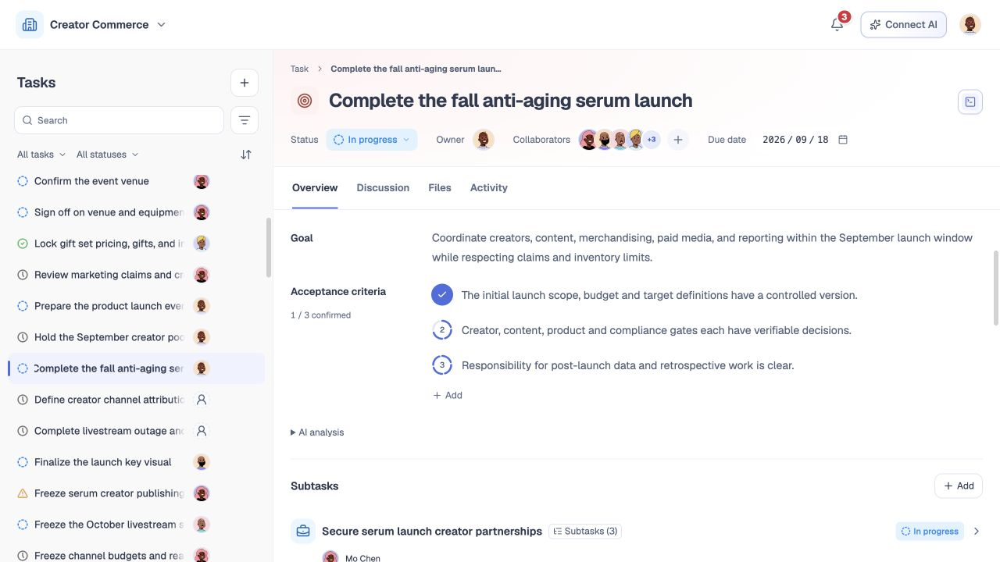

# 任务详情与维护

## 1. 目的

让有权限的成员在一个稳定页面中理解任务要达到什么结果、怎样算完成、由谁负责、当前处于什么状态，以及去哪里继续协作。任务详情既是任务定义的权威阅读入口，也是普通字段维护与受控业务动作的统一入口。

## 2. 范围和边界

本模块覆盖任务标题、目标、完成标准、状态、负责人、参与人、日期、标签、预计投入、父子任务、依赖、AI 分析，以及讨论、文件、活动和“删除任务”入口。讨论与通知由模块 10 定义，文件与 Commit 由模块 11 定义，进度和完成收口由模块 12 定义。“删除任务”入口只发起模块 13 的影响预览；影响确认、逻辑删除、回收站和恢复均以模块 13 为准，任务详情不能直接跳过预览执行删除。

任务详情不提供没有真实数据来源的仪表盘。AI 分析和建议只读，除非用户明确应用变更；未知、受限和过期数据分别展示，不伪装成正常或 0。状态、负责人、ACL 和正式验收是受控动作，不能借普通字段编辑绕过确认、权限和审计。以下并发、审计和服务端校验是保留的正式合同，当前接入情况以实现矩阵为准，不能把界面存在视为所有服务端能力均已上线。

## 3. 详细功能设计

### 3.1 页面布局与读取

桌面左侧保留任务列表，右侧是统一任务详情。任务标题、状态、负责人、协作者与截止日期常驻顶部，下方按顺序显示 Overview、Discussion、Files、Activity，默认打开 Overview（概览）。概览连续展示目标、完成标准、AI 分析、子任务、前置依赖和标签；其他三个 Tab 分别占用完整内容区。

切换 Tab 保留当前任务、编辑草稿与文件选择。从通知、讨论附件或来源进入时，先选择对应 Tab 再定位记录。桌面与窄屏共用同一组 Tab，不再提供任务信息与协作区的双栏收起或“任务／协作”二次切换。键盘方向键、Home、End 可切换，隐藏面板不进入键盘导航。

进入页面先校验账号、团队、任务和读取权限。加载、失败、无权限和回收站只读沿用各模块规则，不把旧任务内容或失败当作当前有效数据；生产鉴权与跨设备恢复仍是上线目标。

*FIG-DETAIL-002 · 当前英文界面，主工作区运行实拍，2026-09-21。统一四个 Tab；概览展示三条完成标准，其中一条已人工确认。*

### 3.2 顶部任务摘要与吸顶状态

顶部展示任务路径、图标、标题及状态、负责人、参与人、截止时间。滚动任务信息或协作内容时，顶部摘要保持可见；吸顶只保留同一任务的摘要与操作上下文，不生成另一份任务状态。路径中的可访问祖先可以打开，当前任务有明确标记；权限不足时不展示隐藏路径。

**当前 MVP。** 状态选择器提供五个正式状态：待开始、进行中、已阻塞、已完成、已取消。用户选择后更新本地任务状态，当前完成入口与上线目标的区别见模块 12。

**旧值兼容。** “待审核”仅用于旧值兼容读取，不是新的可选状态。只有同时匹配内置演示任务 ID 和对应团队的旧“待审核”记录，才迁移为“进行中”；普通任务和其他团队记录不改写。旧记录缺少团队时，沿用既有 `creator-commerce` 团队兼容值后再核对，不扩大迁移范围。

标题用于识别任务，用户点击进入编辑，失焦或明确保存时校验非空、长度和权限。上线目标中，状态变更使用专用命令，先展示目标状态和必要影响，进入已完成由模块 12 校验完成标准、证据和未收口关系。依赖只提供参考，不自动把任务改为已阻塞，也不直接禁止开始或完成。命令成功后原子写入状态和活动，失败时恢复服务端状态并保留用户意图供重试。

负责人／Owner 基数为 `0..1`，可以处于明确的未分配状态。已有有效 Owner 不能通过普通字段清空或直接替换，必须使用受控转移命令；选择另一成员先形成待接受提议，目标成员接受后才生效，接受前 `ownerId` 保持原值。首次从未分配到有人负责同样保留提议、接受和审计；模块 14 的 `task.assignment.recover` 仅处理 Owner 失联死锁，不成为详情页普通编辑入口。参与人增删与负责人分开处理，负责人不在参与人中重复出现；加入团队、收到邀请或出现在推荐中都不等于接受任务责任。

页面可读地区分正式负责人、待接受人选、未分配和无权查看。人员无效、被移除或当前用户无权变更时保持只读并给出下一步；责任变更的通知与接受流程见模块 09。

### 3.3 目标、完成标准与 AI 分析

目标说明期望结果，用户点击字段进入编辑，失焦或明确保存时校验内容和权限；目标为空时显示“尚未设置任务目标”或有权限时的添加提示，不填演示文案。父任务下的目标若采用继承策略，页面显示来源并禁止把继承值误存为子任务自有值。

完成标准按可独立核对的条目展示，可新增、编辑和删除。保存时记录完整新版本；标准允许显式为空，上线目标要求状态进入完成时由模块 12 校验完成证据，当前本地状态切换尚未接入该核对流程。讨论中的建议只有经明确操作写入完成标准后才成为任务事实。

每条标准左侧使用四段圆环及序号。AI 评估按与任务进度一致的“少量完成／部分完成／大部分完成／接近完成”梯度亮起，不显示精确百分比或连续百分比弧线。没有依据时圆环不亮，提示“AI 暂无评估”；有效零值表示未形成结果。已有数值记录仅用于兼容映射，不写回为人工确认。

编号环直接执行人工确认。默认展示序号及 AI 梯度环，悬停或键盘聚焦时中心序号变成勾，并以两行提示“AI 分析：当前梯度”和“点击人工确认达成”；已确认时第二行提示“已人工确认 · 点击撤销”，仍保留 AI 来源；点击或按 Enter／Space 直接保存。保存成功后变成实心勾，短暂显示“已人工确认 · 撤销确认”；再次点击已确认圆环可撤销。保存中显示加载标记并禁止重复提交，失败保留原状态并在该条下方提供错误提示，原入口可重试。标题附近按条数统计人工确认数量。

AI 梯度来源通过圆环 hover／键盘聚焦提示说明；已确认与未确认显示各自操作提示。当前页面不再常驻逐条 AI 文案或独立依据按钮；详情的 AI 分析模块保留整体进度和来源查看。只读或标准尚未保存时不能确认。

悬停圆环轻微放大，序号与勾交替淡入；按下轻微收缩，保存成功后实心勾与短暂光环反馈。减少动态效果设置下关闭过渡与动画。触屏及窄屏常显独立“确认达成／撤销确认”文字入口，圆环及确认入口至少 44px，不依赖 hover。键盘可聚焦查看 AI 梯度并确认或撤销。

确认与撤销均保存确认人和时间并生成活动记录；保存失败保留原状态并提供重试提示。编辑未保存时不提供确认操作；标准文字变更后原确认及评估失效。当前字符串数组按位置与原文核验，删除或移动导致位置变化的条目需重新确认。只读入口显示环与 AI 提示，不提供确认操作。当前原型复用任务本地保存事务，跨设备服务及真实逐条 AI 分析尚未接入。

创建草稿使用编号而非装饰勾，不冒充已经验收。

完成标准示例覆盖全部 232 个内置任务（577 条标准）及防晒衣创建示例主任务、7 个子任务：逐条保存固定的合成评估、双语依据与观察时间，涵盖部分完成、AI 最高档未确认、人工已确认和未知。原有业务场景依据保留；新增覆盖使用明确标为模拟的固定梯度场景，不从任务状态或总工作量反推，也不代表已核验真实交付。示例依据明确标为“示例评估”，不代表真实 AI 服务结果；确认示例保留确认人及时间。GMV 等没有实际结果的数据保持未知，不使用准备工作进度替代。

旧 Mock 仅在任务名称、目标及完整标准与示例匹配且没有确认／评估字段时补齐。已有记录（含显式空数组）、用户编辑、未知任务和已删除任务保留；撤销示例确认后刷新不能补回。创建示例保存后使用同一匹配规则。

AI 分析位于完成标准之后，默认折叠；展开后查看完成进度、当前情况和下一步建议，有刷新能力时提供刷新入口。分析只基于用户有权读取且能定位来源的任务字段、讨论、文件、Commit 和验收记录；显示数据截至时间和分析版本，每条来源可展开查看来源对象、来源版本及读取时间。不能取得可信时间或版本时明确标为未知，不补造。

整体任务进度与逐条完成标准分开：逐条 AI 梯度不显示百分比、不等于人工确认；整体任务完成展示遵循模块 12，两者的依据和记录分开，详见模块 12。演示预测不代表已接入生产评估服务；资料不足显示未知，状态与证据冲突时显示待核对。AI 分析只读，刷新或展开都不写入任务；只有用户明确应用具体变更后，才进入相应字段或受控命令流程。

任务字段、讨论、文件版本、Commit、验收记录、权限或可见范围等源事实变更后，当前分析版本应标为过期并刷新，不再把旧结论表示为当前事实。刷新成功后同时更新内容、数据截至时间、分析版本和各来源版本；刷新失败保留仍有权限查看的旧内容供核对，但持续标记过期并提供重试。权限变化导致来源不可见时立即移除对应内容和缓存，再基于剩余可见事实重新计算，不能在过期内容中继续泄露旧来源。尚未接入的自动刷新能力不得表述为持续运行。

### 3.4 子任务、前置依赖与标签

子任务是任务信息中的纵向模块，属于基础信息，不是协作 Tab。模块标题旁提供“新增”；没有子任务时显示“当前任务还没有子任务”的空状态卡片，有创建权限时仍可点击“新增”。列表展示直属子任务的图标、名称、负责人和状态；若某一项还有直接子任务，则在名称后以轻量圆角标记展示“N 个子任务”。该数量只统计下一层任务，不递归累计全部后代；数量为 0 时不显示。数量仅用于帮助用户识别还可继续展开的工作层级，不增加独立按钮，点击名称仍进入该任务详情。展开一项可核对完成进度与截止信息。待接受负责人保持待接受标记，不冒充正式负责人；无有效进度来源时显示未知，不填演示百分比。

点击“新增”沿用模块 07 的创建规则；父任务仍存在、可见且有创建权限才允许最终确认。成功后新子任务进入当前列表，失败保留输入；对子任务的删除不在列表中静默执行，必须进入影响预览。

前置依赖位于子任务之后。用户可添加、移除或清空当前团队可见任务的依赖，保存时校验自依赖、父子归属、重复和循环，并携带当前关系版本。依赖名称可以打开关联任务，状态来自关联任务当前记录。不可见、失效或已取消关系标为待核对，不展示隐藏对象细节；保存失败保留选择。AI 再分析不得覆盖用户已保存的依赖。

前置依赖是可编辑参考关系，不限制开始或完成，也不自动标记阻塞。正式依赖出现前置未完成、状态待核对或日期顺序异常时，只形成“建议核对”提醒，引导用户打开关联任务核实当前记录；提醒不把参考关系升级为任务事实。

标签位于前置依赖之后，显示当前任务已有标签；有维护权限时可从当前团队标签目录选择、添加或移除。没有标签时给出添加入口或只读空态，保存后以服务端结果更新；标签不自动变成优先级或责任事实。

### 3.5 讨论、文件与活动协作区

讨论、文件、活动与概览处于同一级 Tab，普通打开默认概览。讨论承载成员发言、回复、提及和附件；文件承载当前任务可见的文件与版本；活动只读呈现真实业务变更。活动不计入讨论数，AI 历史建议不冒充讨论或活动。通知和来源链接按类型进入对应记录，无法访问时给出不泄露隐藏内容的提示。

切换 Tab 保持当前任务及各面板滚动位置，每个页签的空、加载和失败状态独立，不因一个区域失败清空已成功读取的任务定义。空讨论提供发言入口，空文件显示文件添加入口或权限说明，无活动只说明尚无可见变更；各区操作分别遵循模块 10、11 的保存、权限和来源合同。

### 3.6 字段维护、并发与反馈

用户可更新计划周期、截止日期和预计投入；日期与父子边界冲突时提示但不伪造修正。预计投入显示人天，复杂任务按当前有效叶子任务去重汇总；缺估、过期或非法分别显示待估算、需重估或待核对。普通字段保存成功后返回新资源版本并只产生一次实际变更活动；值未变化返回 no_change，不生成伪活动。

普通字段更新携带任务版本、字段补丁和幂等键；状态、负责人、依赖等受控动作调用各自命令并携带影响版本。服务端按账号、团队、对象和操作重新鉴权，成功后返回 operation ID、新资源版本和实际变更摘要。页面以服务端结果更新本地视图，不能只凭乐观界面宣称成功。

发生版本冲突时，系统保留用户尚未保存的输入，读取仍有权的最新版本，并并列显示“你的修改／最新内容／冲突字段”。用户可逐项采用最新值、保留自己的值或取消，随后基于新版本重新提交；无关字段可以安全合并，状态、负责人和关系冲突必须重新确认。离开页面前有未保存输入时给出明确提示；网络失败允许使用同一幂等键重试，不产生重复活动。

页签支持左右方向键、Home 和 End，所有可编辑字段、折叠入口、关系入口、状态与负责人命令均提供可读名称、焦点状态和错误定位。窄屏切换 Tab 不丢失未保存输入。

### 3.7 删除任务入口

任务详情的更多操作中提供“删除任务”，但只有当前 Principal 在该任务 ACL 中具备 `task.delete` capability 时才展示并可用。团队管理员不因角色名称自动绕过 Task ACL，也必须通过同一 capability 判断；权限在菜单打开后被收回时，客户端关闭入口并清除已加载的影响数据。无权限用户直接访问预览或确认接口时返回不区分任务不存在与无权的通用结果，不泄露任务标题、版本、后代与依赖数量、文件、草稿或 `impact_digest`。

用户选择“删除任务”后，详情页不修改任务，只提交当前任务 ID 与已读取的 `task_version`，进入模块 13 的影响预览。服务端重新校验 Principal、团队成员关系和 `task.delete`，以任务最新版本计算后代、依赖、文件引用、未提交草稿及保留内容，返回最新 `task_version`、`impact_digest`、生成时间、失效条件和需要明确选择的级联范围。预览未完成、影响未知或摘要已过期时，确认保持禁用。

用户核对影响后再次确认，客户端按模块 13 提交预览绑定的最新 `task_version`、`impact_digest`、明确的级联选择和幂等键；服务端再次鉴权并重算影响，版本或摘要变化时要求重新预览，不能沿用旧结果删除。成功后详情关闭并进入有权限的回收站结果或返回当前列表，失败则保留预览与用户选择。任务列表和子任务区都不提供静默删除；它们的“删除任务”动作只能打开同一影响预览流程。

## 4. 验收标准

- 每条标准显示 AI 梯度环；人工确认后为实心勾，按已确认条数统计；AI 最高档不自动确认或完成任务。
- 确认与撤销保存成功才更新显示；失败保留原状态。标准修改后旧确认失效，刷新不能重新补回已撤销的示例确认。
- hover／键盘聚焦明确说明 AI 来源与人工操作，触屏提供文字确认入口，减少动态效果设置下关闭动画。

- 桌面为任务列表与统一详情；概览、讨论、文件、活动四个 Tab 同级，默认概览；窄屏使用同一组 Tab。
- 顶部任务摘要在内容滚动时保持可见，状态、负责人、参与人和截止时间始终来自同一任务记录。
- 标题、目标、完成标准、日期和标签等普通字段保存后返回新版本并记录一次真实活动；无变化不产生伪活动。
- 当前状态选择器提供五个正式状态；“待审核”仅兼容读取，只有 ID 与团队同时匹配的内置演示记录按规则迁移。
- 上线目标要求状态和负责人通过受控命令变更；待接受人选不显示为正式负责人，邀请或推荐不会自动建立责任关系。
- Owner 为 `0..1`；已有有效 Owner 不能普通清空，未分配到有人负责及 Owner 变更都要经过提议、接受和审计，失联恢复只从模块 14 发起。
- 子任务属于概览基础信息，空状态卡片保留有权限的“新增”动作；名称可打开详情。存在直接子任务时名称后显示准确的“N 个子任务”圆角标记，只统计下一层，0 个不显示且不增加额外操作；展开内容无有效来源时不显示虚构进度。
- 依赖使用稳定 ID，可添加、移除或清空；自指、重复、循环及失效关系得到明确处理，前置未完成和日期异常只给建议核对，不限制开始或完成、不自动标记阻塞。
- AI 分析默认折叠且只读，未经用户明确应用不写回任务；执行中百分比标明 AI 评估，用户确认已完成时显示 `100% · 用户确认`。
- 当前情况使用可定位来源，展示数据截至时间、分析版本和来源版本；源事实变化后旧结论标为过期并刷新，权限变化时先移除不可见来源再重新计算，未知不显示为 0。
- 版本冲突时用户输入不丢失，页面能比较最新内容并重新确认；网络重试不重复写入或生成活动。
- 具备 `task.delete` capability 的用户能从详情发起“删除任务”，并依次完成影响预览、绑定最新 `task_version`／`impact_digest` 和再次确认；列表与子任务区不能绕过该流程。
- 团队管理员不能绕过 Task ACL；无权限时入口不可见，直接调用也不会泄露任务存在性、版本或影响范围。
- 无权限、加载失败、区域失败、回收站只读、移动端和键盘操作均有明确且可恢复的结果。
