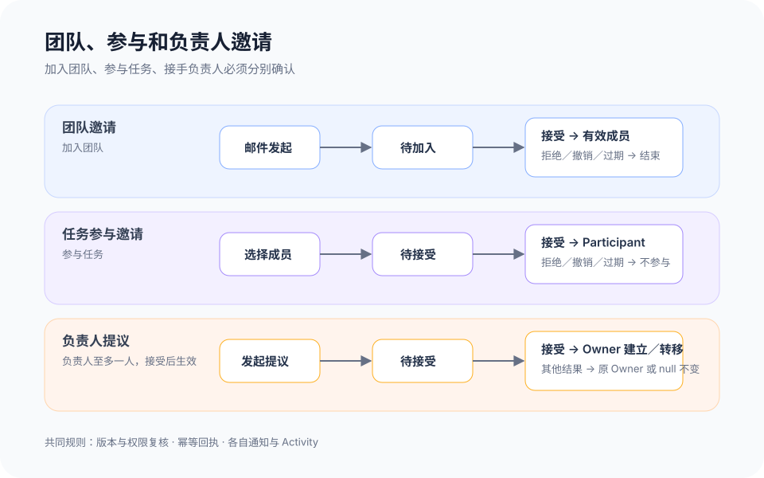

# 团队成员与协作邀请

## 1. 目的

让用户清楚区分“获准进入团队”“受邀参与任务”和“接手任务负责人”三件事，避免把推荐、选择或加入团队误记为责任已经生效。每条链路都说明发起人、目标人、有效期、当前状态和接受后的实际变化，成员可以在承担责任前做出明确决定。

## 2. 范围和边界

本模块覆盖团队成员列表、邮件邀请、邀请并选择、团队邀请的接受／拒绝／撤销／过期／重新发送、任务参与邀请、负责人变更提议，以及管理员修改角色和移除成员。首版只有 `admin`、`member` 两种有效成员角色和 `pending` 待加入状态；不提供 guest、外部访客或 cross-org 跨组织协作。

当前 MVP 的入口与本地行为见 3.0；3.1–3.6 是上线目标，不能把本地人员选择、模拟令牌或提示文案当作真实发信、服务端成员关系和授权回执。创建者默认参与规则统一引用模块 07 的 3.3，本模块不另设一套默认关系。

加入团队只建立成员关系，不等于接受任务责任。任务参与邀请建立 Participant，负责人提议只在目标成员接受后建立或替换 Owner；Task Owner 基数为 `0..1`，两条链路不能共用状态、按钮或回执。TeamRole 只控制团队级成员管理，任务动作另由 Task ACL 的具体 capability 决定；团队管理员不能仅凭 admin 身份绕过 Task ACL。AI 可以推荐候选人并说明依据，但不能自动发送邀请、接受邀请、分配负责人或改变角色。成员离开、被移除及其责任收口见模块 14。

## 3. 详细功能设计

### 3.0 当前 MVP：成员选择与邀请

任务人员选择器按名称或邮箱查找无匹配时，提供“邀请人员”入口并打开邀请弹窗，提交后完成邀请并选择；名称查询预填名称，邮箱查询预填邮箱。表单名称选填、邮箱必填，校验邮箱格式及名称长度，未填有效邮箱不能提交。当前任务选人和设置页“邀请人员”复用同一邀请弹窗与流程；设置页可选择角色，任务入口发送后把返回的人员加入当前选择，尚不代表对方已接受团队或任务责任。

发送后人员显示为“待加入”，设置页支持“重新邀请”；同一邮箱复用原人员，重新邀请更新本地令牌并使旧链接失效。设置页人员第二行只展示邮箱，不附加邀请时间或邮件预览操作。已加入人员不重复建邀请；非管理员不能发起邀请，存储失败保留输入并提示失败。取消弹窗回到原搜索，成功后关闭并恢复入口焦点。

邀请、重新邀请和保存等操作结果复用顶部居中的共享 Toast；不新增页面底部提示或私有提示组件。字段校验与邀请表单内错误仍在原位置展示，便于继续修改。

当前原型不真实发信：成员关系、邀请令牌、邮件模板和接受流程都由浏览器本地状态演示。当前提示使用“邀请已发送，等待对方加入”，但其依据仅是本地保存成功，不能作为真实投递回执；本地接受会核对受邀邮箱、预览验证状态和过期时间，但不是生产邮箱所有权校验。服务端发信、一次性邀请令牌、正式接受／拒绝和跨用户同步为上线目标。

当前推荐度为高／中／低，使用同形星芒，以紫色深浅区分；悬浮说明给出本地任务文本与职责关键词匹配依据。已选成员隐藏星芒，只显示勾选；待加入人员不展示推荐星芒。推荐不是能力评分或自动指派，仍需确认经验和可用时间。

证据：`MemberSelector.tsx`、`PersonPicker.tsx`、`MemberInvitations.tsx`、`PersonalCenterPage.tsx`、`src/lib/teamInvitations.ts`、`taskCreationParticipants.ts`；`server/teamEmailInvitations.test.ts`、`unassignedOwnerInvitation.test.ts`、`taskMemberRecommendations.test.ts`。

*FIG-MEMBER-002 · 当前英文界面，主工作区运行实拍，2026-09-21。成员邀请表单：姓名选填、邮箱与角色；未发送邀请。*

### 3.1 上线目标：成员列表与角色

团队成员页按“有效成员”和“待加入邀请”展示。有效成员显示姓名、规范邮箱、`admin`／`member` 角色和加入时间；待加入项显示受邀邮箱、邀请人、发送时间、过期时间及 `pending` 状态，不伪造成成员头像或在线状态。普通成员可查看同团队公开成员信息和待邀请是否可选，但不能读取邀请令牌、修改角色或移除成员。

管理员可以把有效成员在 `admin` 与 `member` 间调整，也可以进入移除流程。角色变更使用专用命令并记录前后值；唯一管理员降级或移除必须先指定另一位管理员。搜索、空态和数量都经过团队权限过滤，无权用户不能通过邮箱搜索判断某人是否属于其他团队。

### 3.2 上线目标：团队邀请

正式发信由服务端创建邀请、签发一次性邀请令牌并记录投递结果，不能继续以本地预览状态证明送达或加入。

管理员从成员页输入邮箱发起邀请；在任务创建或详情中搜索不到目标人时，可使用“邀请并选择”。该动作先创建团队邀请，并在当前任务草稿中保留“等待加入团队”的本地选择提示，不预建 Participant、Owner 或负责人提议。系统规范化邮箱，阻止当前有效成员的重复邀请；同一团队、同一邮箱仍有有效邀请时返回原邀请或允许管理员重新发送，不创建并行有效令牌。

受邀人打开邮件链接后，系统先检查邀请是否存在、未撤销且未过期，再要求使用受邀邮箱登录或注册。页面显示团队、邀请人和将获得的 `member` 角色；受邀人可接受或拒绝。接受后原子创建有效成员关系并消费邀请；拒绝后邀请终止且不加入团队。邮箱不匹配时允许切换账号，不泄露团队其他内容。

管理员可撤销待加入邀请；过期或撤销后旧链接不能使用。重新发送会使旧令牌失效，并生成新的有效期和一次通知。已接受或已拒绝的邀请不能再次处理；网络重试使用同一幂等键返回相同结果。无论接受、拒绝、撤销、过期还是重新发送，都不会自动改动任何任务责任。

### 3.3 上线目标：任务参与邀请

发起人只能从当前团队有效成员中选择任务参与者。选择尚未加入的人时先走团队邀请，对方加入后仍需发起人再次确认并发送任务参与邀请。任务参与邀请展示任务名称、目标、完成标准、邀请人、预期参与边界和截止信息；状态为待接受、已接受、已拒绝、已撤销或已过期。

目标成员接受后才建立正式 Participant，并生成对应活动；拒绝、撤销或过期均不进入参与人集合。已经是 Participant 时返回 no_change；Owner 不能在 Participant 中重复出现。邀请人可在有效期内撤销或重新发送，重新发送不改变旧邀请的历史。邀请送达失败不等于业务邀请失败，页面分别显示邀请写入结果和通知投递状态。

### 3.4 上线目标：负责人变更

任务首次指派他人或从现任 Owner 转交时，系统创建独立的负责人变更提议。提议显示任务、现任负责人或未分配状态、拟接手人、完成标准、必要上下文和提议有效期。创建任务时若选择他人负责，接受前 `ownerId` 保持 `null`，不由创建者兜底；已有任务转交时，在目标成员接受前现任 Owner 保持不变。待接受人不进入“我的工作”，也不显示为正式负责人。

目标成员接受后，服务端重新检查双方成员状态、任务版本和变更权限，并原子替换 Owner、结束提议、生成 Activity 和通知。拒绝、撤销、过期或版本变化均不转移责任；任务已删除、已完成或目标成员已失效时，提议进入不可处理状态并提供返回任务的路径。普通字段更新不能绕过此命令直接写入 `ownerId`。

*FIG-MEMBER-001 · 上线目标状态：三类邀请并行但不合并；加入团队、参与任务和接手负责人分别在各自接受动作后生效。*

### 3.5 上线目标：任务动作能力矩阵

任务权限先要求操作者是当前团队的有效成员，再以 Task ACL 校验具体 capability。Owner、Participant、创建者和 Team Admin 都是关系或角色，不天然产生任务操作权；Agent 只能在实际用户委托与设备 scope 同时允许时代表该用户执行。

| 动作 | 可以执行的人 | 必需能力与对象约束 |
| --- | --- | --- |
| 发起／撤销任务参与邀请 | 当前 Task ACL 授予该能力的有效成员 | `task.manage_participants`；发起与撤销都重验任务版本、目标成员和邀请状态 |
| 接受／拒绝任务参与邀请 | 邀请中唯一的目标成员 | 邀请对象的 respond 权限；不因此获得其他 Task ACL |
| 发起／撤销负责人变更提议 | 当前 Owner，或在未分配任务中被 Task ACL 明确授权的有效成员 | `task.transfer_owner`；不得用普通字段更新代替 |
| 接受／拒绝负责人变更 | 提议中唯一的拟接手人 | 提议对象的 respond 权限；接受时重验任务版本、现任 Owner 和成员有效性 |

Owner 只有在 ACL 同时授予对应 capability 时才能管理参与人或发起负责人变更；Participant 只表示参与关系，不能据此邀请他人或转移 Owner。Team Admin 可以管理团队邀请、成员角色和移除成员，但团队管理员不能仅凭 admin 身份绕过 Task ACL 发起或撤销任务参与邀请、负责人提议。若管理员确需介入，必须像其他成员一样在该任务上获得对应 capability，并留下授权依据。

### 3.6 上线目标：通知、回执与异常

每次发起和处理都返回对象 ID、当前状态、资源版本、operation ID 和实际生效结果；列表以服务端状态为准。写操作携带版本和幂等键，重复接受不会建立第二条成员或责任关系。版本冲突保留用户操作意图并刷新当前状态；无权限与不存在使用不泄露对象详情的结果。

桌面端可在成员页和任务详情完成操作，窄屏用列表—详情分层呈现。状态按钮具备可读名称和焦点反馈；处理后焦点回到对应记录并由状态区域播报结果。邮件不可达、通知延迟、邀请过期、目标成员失效和服务失败都提供明确重试或返回路径，不把 `pending` 伪装为成功。

## 4. 验收标准

当前 MVP 验收：名称或邮箱查找无匹配可打开统一邀请弹窗；名称选填、邮箱必填；本地提交后出现待加入人员并可重新邀请，设置页与任务选人复用同一流程。推荐仅分高／中／低，选中后只保留勾选；不把本地邀请提示作为真实邮件送达证明。

以下为上线目标验收：

- 团队邀请、任务参与邀请和负责人变更使用三个对象、三组状态和三类回执，页面与通知不会把它们合并成一个“协作邀请”。
- 邮件邀请支持接受、拒绝、撤销、过期和重新发送；旧令牌失效，受邀邮箱不匹配时不能加入团队。
- “邀请并选择”只发团队邀请并保留草稿提示；加入团队后仍需再次发送任务邀请或负责人提议。
- 任务参与邀请接受后才建立 Participant；负责人提议接受后才建立或替换 Owner，接受前现任 Owner 保持不变，未分配任务保持 `ownerId = null`，不由创建者兜底。
- 首版只出现 admin、member 和 pending，不出现 guest、外部访客或跨组织协作入口。
- 管理员能修改角色和进入移除流程，普通成员只能查看允许公开的信息；唯一管理员不能被直接降级或移除。
- 只有持有 `task.manage_participants` 的有效成员可发起或撤销任务参与邀请，只有持有 `task.transfer_owner` 的当前 Owner 或明确 ACL 主体可发起负责人提议；目标成员只能处理发给自己的邀请或提议。
- Owner、Participant 和 Team Admin 都不能仅凭关系或团队角色绕过 Task ACL；拒绝授权时不泄露任务与邀请详情。
- 重复提交、通知失败、版本冲突、成员失效和无权限均不会产生重复成员、重复 Participant 或错误 Owner。
