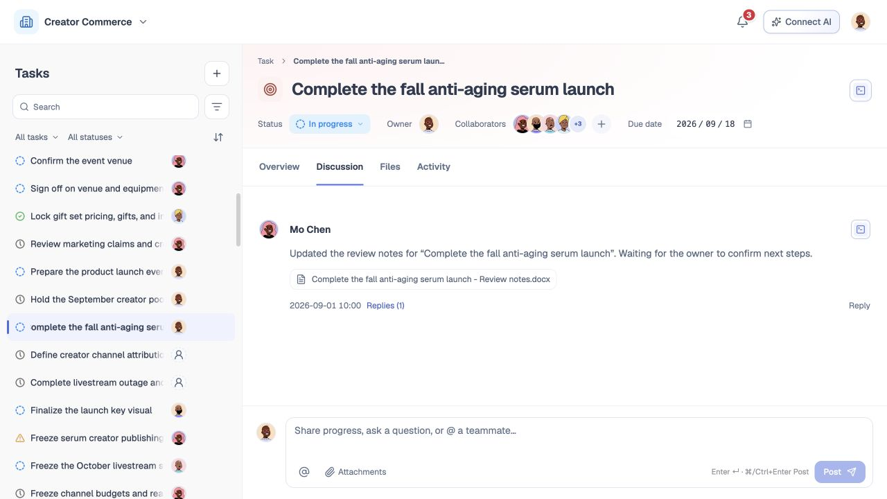
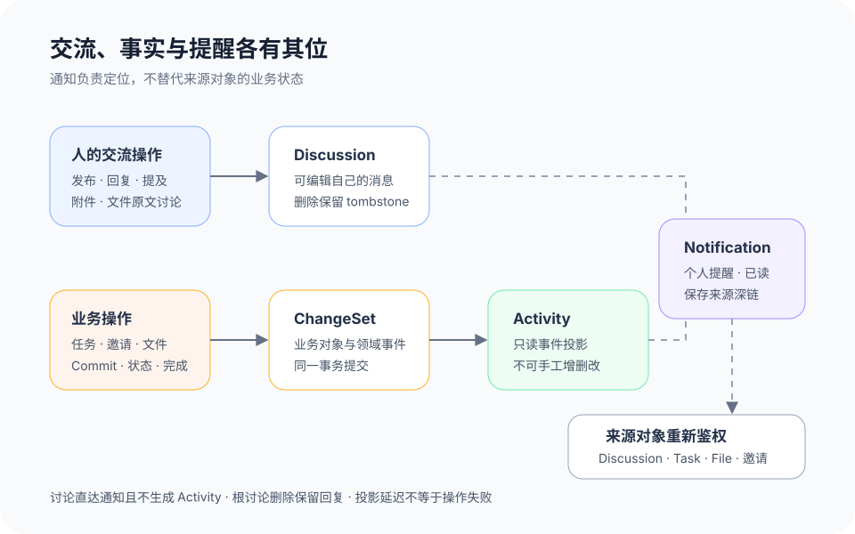
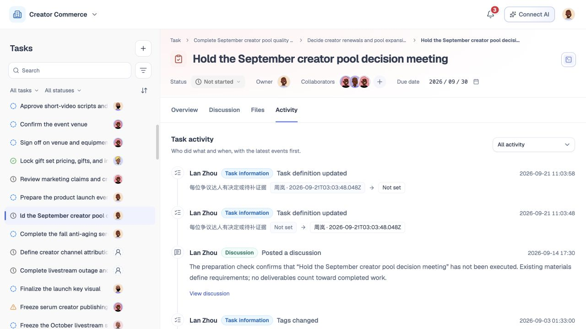

# 讨论、通知与活动记录

## 1. 目的

让团队成员围绕任务和文件进行可追溯交流，及时找到需要处理的来源，同时不把人的发言、提醒和系统事实混成一条记录。讨论回答“成员说了什么”，通知回答“我需要关注什么”，Activity 回答“业务对象实际发生了什么变化”。

## 2. 范围和边界

本模块覆盖根讨论、回复、编辑自己的消息、删除自己的消息、@ 提及、附件、文件原文讨论、通知已读与来源深链，以及由业务事件生成的只读 Activity。任务字段与状态写入由模块 08、12 定义；邀请的接受结果由模块 09 定义；文件和 Commit 由模块 11 定义。

通知不是业务状态，已读不等于已处理，通知投递失败也不能回滚已经成功的业务操作。当前全局通知仅有本地演示邀请；上线目标要求讨论消息、回复和 @ 提及直接产生通知，不经过 Activity。Activity 只投影任务字段、人员关系、文件业务变化、正式 Commit、状态和完成等已提交领域事件，用户和 AI 都不能直接新增、编辑或删除 Activity。讨论中的建议、表态和 AI 回复在被明确写入任务字段、文件或受控命令前，都不是任务事实。下文明确标记当前 MVP；真实通知投递、删除占位及服务端事务回执属于上线目标，不能据此宣称已经接入。

## 3. 详细功能设计

### 3.1 任务讨论与回复

任务详情采用概览、讨论、文件、活动四个同级 Tab，默认概览；用户选择讨论后进入完整讨论区，子任务在概览中维护。每条消息展示作者、发送时间、正文、编辑标记、附件和回复数；根讨论与回复使用同一 `DiscussionMessage` 对象，通过稳定的父消息 ID 关联。用户可发布根讨论或回复，编辑自己的正文、附件和提及，也可逻辑删除自己的消息；管理员不能用日常界面改写他人的发言。

**当前 MVP。** `DiscussionMessages` 过滤带 `deletedAt` 的已删除评论，不展示 tombstone 占位。回复或引用仍可能提示原消息已删除，但这种来源提示不等于在原位置保留删除占位，也不代表真实通知已投递。

**上线目标。** 发布时先校验任务可见性、正文、附件版本和被提及人是否在当前可见范围，再以幂等写入消息。讨论消息、回复与 @ 提及直接产生通知：根讨论通知任务内有权且订阅的成员，回复通知被回复者，提及通知被提及者；同一人只收到一条合并提醒。成功回执包含消息 ID、版本和 operation ID；通知异步投递，投递失败只显示提醒状态，不撤销消息。编辑携带消息版本，冲突时保留输入并显示最新正文。

**上线目标 · 删除线程。** 删除根讨论时保留仍存在的回复及其先后关系，根位置显示“原讨论已删除”的 tombstone，不从历史中物理抹去；回复不会被提升成看似独立的新观点。删除回复只替换该条内容。引用已删除、无权或缺失的来源时显示必要缺口，不回显隐藏正文。

*FIG-DISC-002 · 当前英文界面，主工作区运行实拍，2026-09-21。讨论正文、附件、回复与发言入口。*

### 3.2 提及、附件与文件原文讨论

输入 `@` 只搜索当前团队内对任务有可见性的成员，选择后写入稳定 principal ID；显示名变化不破坏提及。被提及不自动成为 Participant、Owner 或获得任务权限。没有任务读取权限的人不接收含任务详情的通知。

附件引用明确的 File 与 FileVersion，不能只保存文件名，也不能借附件扩大正文权限。用户在文件页选中文字发起讨论时，消息保存文件 ID、版本 ID 和可定位的选区锚点；发送后进入任务讨论并提供“查看原文”深链。文件已更新时仍定位到原引用版本并提示存在新版；文件无权或不可用时保留讨论正文，只把原文入口标为不可用。

### 3.3 通知中心与来源定位

**当前 MVP。** 全局通知仅展示本地演示邀请，关闭演示数据时为空。用户可按全部、未读、已读筛选，打开或全部标为已读，也可在演示详情中接受或拒绝；这些操作只更新组件内的本地状态，不构成真实邀请回执。讨论、提及和业务变更通知尚未接入全局通知中心，不能把当前演示解释为生产投递能力。

**上线目标。** 通知中心按全部、未读和已读筛选，支持单条已读和全部标为已读。通知围绕讨论、提及、邀请与真实业务变更展示类型、触发人或系统、发生时间和最少必要上下文；打开即记录已读，但邀请、负责人提议、版本冲突等业务对象仍保持原状态。AI 分析的只读刷新不产生独立提醒类型。清理通知只影响个人提醒投影，不删除讨论、邀请、任务或审计记录。

每条通知携带来源类型、来源对象 ID 和可选锚点。用户打开通知时重新鉴权：仍有权限则定位到任务、消息、文件版本、邀请或当前情况的具体记录并把焦点移到来源；来源已变化时显示最新状态；来源已删除、过期或无权时给出不泄露详情的说明。通知不能复制隐藏正文作为长期缓存。

### 3.4 Activity 与 ChangeSet

**当前 MVP。** 任务活动页按时间从新到旧展示当前本地任务的讨论、任务信息修改和文件提交记录，并可按活动类型筛选。列表反映现有本地投影，不等同于下述服务端 ChangeSet、审计和投影回执已经上线。

**上线目标。** 状态、负责人、参与关系、任务字段、文件创建／版本／引用变化、正式 Commit 和完成等真实业务操作在同一事务中形成 ChangeSet 与领域事件；Activity 是这些事件的只读投影。每条 Activity 显示操作者、实际动作、发生时间、有意义的前后值、changeSet ID 和仍可访问的来源链接。讨论消息的发布、编辑和删除不生成 Activity；值未变化、页面刷新、通知已读和 AI 只读分析同样不生成伪 Activity。

Activity 不提供手工发布、编辑或删除接口。投影延迟时，业务回执明确显示 `projectionState=updating`；活动稍后出现，但不能因为列表暂未更新宣称操作失败。隐藏界面记录、删除讨论展示或删除任务正文都不删除正式审计事实；权限收紧后只保留用户仍可见的摘要。

*FIG-DISCUSS-001 · 上线目标：Discussion 直接触发 Notification；Activity 只投影业务领域事件，Notification 只是可回到来源的个人提醒。*

*FIG-DISC-004 · 当前英文界面，主工作区运行实拍，2026-09-21。任务活动时间线与类型筛选。*

### 3.5 状态、失败与可访问性

讨论、通知和 Activity 分别加载，单一区域失败不清空其他已成功内容。空讨论提示发起交流；空通知说明当前筛选无结果；无 Activity 只说明尚无可见变更，不解释为任务没有变化。离线或超时后使用原幂等键查询或重试，避免重复消息。

窄屏按列表—详情显示，深链返回时恢复原筛选和滚动位置。消息操作、已读按钮和来源链接可用键盘到达；新回复、发送失败、已读结果和深链定位通过状态区域播报。焦点不会在通知关闭后丢失。

## 4. 验收标准

### 4.1 当前 MVP 验收

- 概览、讨论、文件、活动为同级 Tab；默认概览，子任务不占独立页签。
- 已删除评论被过滤，不展示 tombstone；引用处的删除提示不能冒充原位置占位。
- 全局通知仅为本地演示邀请，筛选、已读和回应只影响本地状态；讨论、提及和业务变更不产生已上线通知的承诺。

### 4.2 上线目标验收

- 成员可发布讨论和回复，编辑或删除自己的消息，使用 @、附件和文件原文引用；被提及不会自动获得权限或任务责任。
- 删除根讨论后仍存在的回复保持在线程原位置，根消息显示 tombstone，回复上下文不会被错误改写。
- 通知可按已读状态筛选并回到具体来源；标为已读、清理通知或投递失败不会改变邀请、任务、文件或完成状态。
- 讨论、回复与 @ 提及直接产生通知；讨论消息的发布、编辑和删除不生成 Activity，投递失败也不回滚消息。
- Activity 只投影任务字段、人员关系、文件业务变化、正式 Commit、状态和完成等领域事件；无变化、只读分析和页面刷新不生成记录，且用户不能直接增删改 Activity。
- 文件原文讨论固定来源版本并可返回原文；无权或缺失时不泄露文件内容。
- 写入超时重试不会产生重复讨论或活动；投影延迟与业务失败有不同反馈。
- 三个区域的空、加载、失败、无权限、窄屏与键盘状态相互独立且可恢复。
