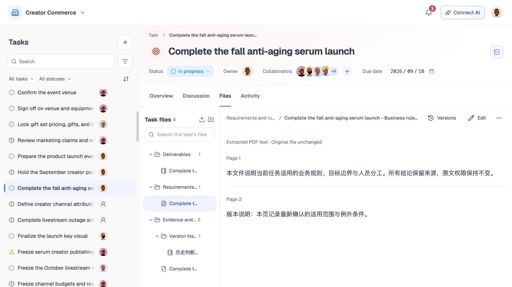
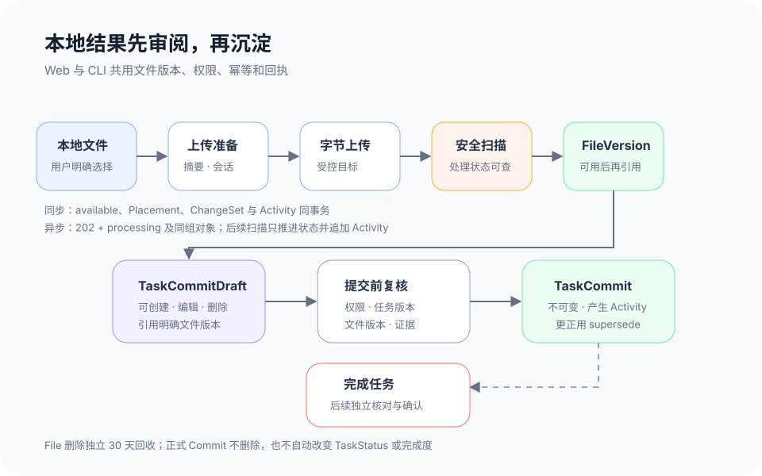

# 文件与本地提交闭环

## 1. 目的

让成员和 Agent 把本地产出安全地上传到同一任务，明确文件身份、版本和任务归属，并先审阅可修改的提交草稿，再沉淀为不可改写的正式结果记录。Web 与 CLI 使用同一对象、权限、版本和回执，不维护两套提交历史。

## 2. 范围和边界

本模块覆盖任务文件夹、上传准备、字节上传、安全扫描、完成上传、文件版本、任务引用、从任务移除、删除规范文件、`TaskCommitDraft` 与 `TaskCommit`，以及 CLI 对任务和提交数据的首版读写。正式 Commit 不等于任务完成，只是完成核对时可引用的一类证据；完成动作见模块 12。

当前 MVP 的文件管理、附件选择与本地编辑见 3.0；3.1–3.8 是上线目标。浏览器里的文件节点、修订记录、撤销提示和示例提交，不证明已具备服务端 FileVersion、文件 ACL、正式 Commit、回收站或远端同步。

文件夹只组织当前任务中的文件位置，不承担任务状态或权限语义。文件夹的新建、重命名、移动和删除为 Web 能力，不进入首版 CLI。TaskFilePlacement 不复制文件、也不自动授予正文权限。“从任务移除关联”和“删除文件”是两个影响不同的动作。CLI 不提供账号、团队、成员邀请或角色管理；这些操作仅在 Web 完成。

## 3. 详细功能设计

### 3.0 当前 MVP：文件管理与讨论附件

讨论编辑器统一使用单一“附件”入口，菜单分为“上传本地文件”和“从文件列表选择”。从文件列表选择时按文件夹层级逐级展开，点选文件即加入草稿并收起菜单；文件夹本身不能作为附件。已添加文件显示勾选并禁用，移除后可以重选。选中复用同一 File ID，不重复上传、不生成文件副本；移除草稿附件也不删除文件本体。

附件选择器支持跨多层文件夹搜索，按文件名或文件夹路径匹配，多词可组合，忽略英文大小写与多余空格；同名文件显示各自路径并保留原 ID。归档分支、已归档文件和脱离可见树的节点不进入搜索结果。无结果、文件夹为空和暂无任务文件分别提示，清除搜索后回到层级浏览。上传本地文件通过浏览器存储保存字节；上传失败可重试或移除，附件就绪前不能发布。浏览器本地保存不等同于向远端上传或通过安全扫描。

任务文件区提供多层文件树、文件夹新建／重命名／移动／删除、文件上传／重命名／移动／删除、预览、支持格式的编辑与本地修订历史、文件讨论。节点移动阻止循环和同级重名；非空文件夹删除可选择把内容移到上级或归档整支。文件区的搜索按节点名称过滤并保留祖先路径，与附件选择器按完整路径搜索的行为区分。删除或归档后可通过当次提示“撤销”恢复内存快照；提示关闭或页面卸载后不承诺恢复，也没有 30 天 File 回收站。

当前已删除评论在讨论列表和文件讨论中不展示，保留的回复按模块 10 组织；审计和保留目标另见模块 13。当前服务端 FileVersion、固定／跟随版本的正式引用、安全扫描、正式 Commit 及跨设备同步均为上线目标。本地文件版本和演示提交历史不能充当不可变业务凭证。

证据：`src/components/discussion/DiscussionComposer.tsx`、`DiscussionFileMenu.tsx`、`src/components/task-files/`、`src/lib/taskFileTree.ts`、`taskFileSearch.ts`、`discussionUploads.ts`、`useTaskCollaboration.ts`；`server/taskFileTree.test.ts`、`taskFileSearch.test.ts`、`taskFileEditorRendering.test.ts`。

*FIG-FILE-002 · 当前英文界面，主工作区运行实拍，2026-09-21。文件树与预览使用英文界面；历史文件原文保留原始语言。*

### 3.1 上线目标：任务文件与文件夹

任务文件页显示当前用户有权读取的文件夹和文件层级。文件项展示名称、类型、当前有效版本、维护人、更新时间和版本策略；文件夹支持新建、重命名、移动和删除，且只改变组织位置。删除非空文件夹前必须选择迁移内容或逐项处理，不能静默删除内部文件。

引用已有文件时继续使用同一 File ID，可选择固定明确 FileVersion 或跟随最新版。固定版本不会随新版本漂移；跟随最新版在版本变化时显示更新提示。添加到任务前重新检查文件 ACL 与 Task scope，Placement 本身不扩大权限。

### 3.2 上线目标：上传与新版本

上传采用四步协议；上传准备和字节传输不创建正式文件业务对象：

1. **上传准备。** Web 或 CLI 提交目标任务／已有 File、文件名、MIME、大小和内容摘要，服务端返回短期 upload ID、大小上限和允许类型。
2. **字节上传。** 客户端只把用户明确选择或命令明确指定的本地文件传给受控上传会话；模型参数不能读取任意本地路径。
3. **扫描与处理。** 服务端校验实际大小、MIME、摘要、会话归属、目标权限和基准版本，并选择同步完成或异步受理。
4. **完成上传。** 只有扫描通过且 `availability=available` 才形成可用版本与业务投影，回执返回各对象 ID、版本和当前处理状态。

**同步路径。** 完成请求内同步扫描通过后，服务端在一个事务中创建新 File（已有文件则复用）、创建 `FileVersion(available)`、按上传目标创建 TaskFilePlacement 或推进已有 File 的当前版本，并提交 ChangeSet 与 Activity；随后返回成功回执。任何一步失败都整体回滚，不能出现 Activity 已存在但版本或引用不存在。

**异步路径。** 扫描不能在完成请求内结束时，服务端返回 `202 + outcome=accepted_async` 与查询入口。在同一受控事务中，新文件上传同时形成新 File、首个 `FileVersion(processing)`、TaskFilePlacement、ChangeSet 和 Activity；已有文件的新版本则复用 File，并在同一事务中形成 processing 版本及对应变更记录。首事务 Activity 表达“上传已受理、扫描中”，不能表示文件已经可用。

后续扫描事件只推进既有版本的 available、quarantined 或 failed 投影并追加相应领域事件与 Activity，不重建 File、FileVersion 或 TaskFilePlacement。扫描通过后，既有 Placement 变为可用，或跟随最新的引用开始解析到该版本；扫描失败时保留可审计失败记录和失败 Activity，TaskFilePlacement 保持不可用并提供替换或移除入口，已有 File 的当前可用版本不变。processing 期间版本不可预览，不可作为可用附件或 Commit 证据，也不能被当前情况当成已交付结果。

字节上传完成不等于文件可用。隔离或失败文件不能被预览、引用到 Commit 或伪装成成功版本。已有 File 的新版本携带预期 ordinal，冲突时保留本地文件选择并要求用户核对，不覆盖别人刚上传的版本。

### 3.3 上线目标：移除关联、删除与恢复文件

“从当前任务移除”只删除 TaskFilePlacement，File、FileVersion、其他任务引用和历史 Commit 不变；页面展示当前任务将失去的入口。“删除文件”则作用于规范 File，并使用独立于 Task 删除的产品合同。

删除规范 File 前必须读取最新 File 影响预览，连续展示当前有权查看的 File／FileVersion、所有共享或跨任务 TaskFilePlacement、跟随最新版与固定版本策略、正式 Commit 引用和保留事实。无权对象只形成不可展开的阻断或受影响摘要，不得通过任务名、FileVersion、Placement 数量或 `impact_digest` 差异泄露。确认必须携带 File 资源版本、服务端最新 `impact_digest` 和幂等键；服务端写入前重新鉴权并重算影响，摘要或资源版本过期即拒绝删除并要求重新预览。

确认后规范 File 进入逻辑删除状态及独立 30 天 File 回收记录，正常文件选择、预览、下载和新 Placement 立即不可用；FileVersion 与 Placement 不被物理抹除。正式 Commit、Activity、ChangeSet 和安全审计不删除，固定 FileVersion 引用保持不可变历史事实，但读取仍受原权限与保留策略约束。共享和跨任务引用转为“来源文件已删除”的受控缺口，不回显已撤权来源。

30 天内，持有 `file.restore` capability 的用户可以从 File 回收站发起恢复。服务端重新校验当前 File ACL、团队与任务 ACL、存储配额、名称／版本冲突、回收记录版本和幂等键；恢复规范 File 及仍可恢复的 FileVersion。TaskFilePlacement 不自动全量复活：只恢复当前仍合法且用户在恢复确认中明确选择的引用，其余跨任务、无权、目标已删或版本策略失效的引用逐项列为缺口。永久清理完成后不可恢复；清理与保留细节见模块 13。

### 3.4 上线目标：提交草稿与正式 Commit

Web 与 CLI 都可为有权限的任务创建 `TaskCommitDraft`。草稿包含说明、结果摘要、明确 FileVersion 引用、其他证据引用和基于的任务版本；创建者可读取、编辑和删除自己的有效草稿。草稿变更携带版本与幂等键，冲突时保留未提交输入并展示仍有权读取的最新版本。

用户选择“正式提交”后，服务端重新校验任务、草稿、文件版本、证据、权限和 `basedOnTaskVersion`，再把草稿原子转换为不可变 `TaskCommit`，同时形成 ChangeSet、Activity 和提交回执。正式 `TaskCommit` 只能创建和读取，不能编辑或删除；发现错误时新建一个 `superseding Commit`，通过 `supersedesCommitId` 指向被更正记录，旧记录仍保留。

正式 Commit 不等于任务完成，不自动变更 TaskStatus、完成标准或完成度。提交成功页提供 Commit ID、序号、文件版本、证据引用、任务版本和 Activity 投影状态；只有后续独立的“完成任务”动作才能进入完成状态。

*FIG-COMMIT-001 · 上线目标流程：文件可形成版本，草稿可改可删；正式 Commit 不可变，更正追加新记录，完成任务另行确认。*

### 3.5 上线目标：正式提交能力矩阵

TeamRole 先确认操作者仍是有效团队成员，Task ACL 再决定是否可提交；Owner、Participant 或 Team Admin 的关系本身都不等于提交权限。

| 动作 | 可以执行的人 | 必需能力与约束 |
| --- | --- | --- |
| 创建提交草稿 | 对任务与引用证据有写入权限的有效成员，或受其委托的 Agent Principal | 草稿记录实际创建者；FileVersion 与 evidence refs 分别重新鉴权 |
| 更新／删除草稿 | 草稿创建者，或受其委托的 Agent Principal | 草稿仍为 draft，且 Task ACL、草稿版本和引用权限仍有效 |
| 提交正式 TaskCommit | 草稿创建者，或受其委托的 Agent Principal | Task ACL 明确授予 `task.commit`；同时满足任务、草稿、FileVersion、证据和版本复核 |
| 提交 superseding Commit | 满足上一行的主体 | `task.commit`；新草稿明确引用被更正 Commit，旧记录不可改写 |

Owner 或 Participant 只有在 Task ACL 授予 `task.commit` 时才能提交正式 TaskCommit；其他有效成员也必须获得同一 capability，不能从可读权限推导。团队管理员不能仅凭 admin 身份绕过 Task ACL 提交或更正 Commit。Agent 的设备授权、用户委托、Task scope 与 `task.commit` 缺一不可。

### 3.6 上线目标：TaskDoor CLI 操作闭环

设备授权和上下文绑定完成后，CLI 在当前授权团队和任务范围内支持：读取任务上下文；创建根任务或子任务；更新允许修改的普通字段；发布讨论和回复；上传文件或新版本；创建、更新、预览和删除 `TaskCommitDraft`；提交正式 Commit；读取回执、Activity 和资源版本。状态、负责人和权限仍调用受控命令，不能用普通字段更新绕过规则。任务文件夹的创建、重命名、移动和删除仍只在 Web 完成。

CLI 也支持任务删除的影响预览和确认删除，但必须使用与 Web 相同的最新摘要绑定、版本及回收站规则。预览不造成写入；删除结果返回 operation ID 和回收站期限。账号注册、登录设置、团队创建、成员邀请、角色和账号停用只在 Web 操作，CLI 只显示跳转说明。

### 3.7 上线目标：幂等、版本、回执与失败恢复

所有写入以实际用户、设备、团队、对象和操作范围重新鉴权；客户端提供 `expected_version`／`If-Match` 和幂等键。幂等键绑定租户、Principal、操作和规范化载荷；相同键与相同载荷返回原对象 ID 并标记 replayed，不重复创建任务、版本、草稿、Commit 或 Activity。网络超时先查询 operation 或用原键重试。

版本冲突返回当前可公开版本与恢复动作，不自动合并文件版本、正式提交或删除等高影响操作。无权限时不回显文件名、任务名、版本差异或影响数量。CLI 回执至少包含 outcome、operation ID、资源 ID、版本和下一步；异步扫描另含当前状态与查询入口。投影延迟不回滚已经成功的业务事务。

### 3.8 上线目标：文件交互状态与多端操作

文件树加载时保留结构骨架，不把缓存名称表示为当前事实；读取失败保留已成功加载的节点并提供局部重试。文件树空态明确显示“当前任务还没有文件”，提供“新建文件夹”和“上传文件”，不生成示例文件或虚假数量。搜索无结果与真实空树分别表达，清除搜索可回到原层级和选中项。

上传准备、字节传输和扫描中分别显示当前阶段；扫描中可离开页面并从任务文件页继续查询。网络导致的上传失败保留文件选择、目标文件夹、摘要和可安全复用的上传会话，允许重试；会话过期时重新准备，但不能生成第二个可用版本。扫描拒绝、隔离或处理失败显示服务端允许公开的原因与替换文件动作，不提供绕过扫描的继续按钮。成功后只按服务端返回的 FileVersion 与 Placement 更新文件树。

窄屏和移动端采用“文件树／文件详情”层级浏览：选择文件后进入详情，返回恢复原展开层级、搜索、选中项和滚动位置；面包屑可返回上级。键盘用户可用方向键、Home、End 浏览树，用 Enter 打开，用可读菜单执行新建、重命名、移动、移除和删除；上传入口与版本记录均可到达。对话框取消、操作完成或失败后，焦点恢复到发起按钮；若该节点已移除，则回到最近仍存在的父文件夹或文件树标题。

## 4. 验收标准

当前 MVP 验收：单一附件入口可上传本地文件或按多层文件夹选择现有文件；选中即加入草稿并收起，已添加项勾选禁用，移除后可重选，File ID 保持不变。文件区管理与附件搜索按各自现有范围运行，已删除评论不展示；本地修订、上传和当次撤销不冒充服务端版本、正式 Commit 或回收站。

以下为上线目标验收：

- 任务文件按文件夹和版本呈现；固定版本与跟随最新版可区分，Placement 不复制 File 或扩大权限。
- 上传完整经历准备、字节上传、扫描和完成；字节已传但扫描未通过时不能显示为可用文件。
- 同步扫描通过时 File／FileVersion、必要 Placement、ChangeSet 与 Activity 原子产生；异步 `accepted_async` 的首事务同样原子形成 processing 版本、Placement、ChangeSet 与受理 Activity。
- 后续扫描事件只推进既有对象的可用／失败投影并追加 Activity，不重建首事务对象；processing 不能作为附件或 Commit 证据，失败保留审计且 Placement 不可用。
- 从任务移除关联只删除 Placement；删除规范 File 先展示最新影响，且不删除历史版本、正式 Commit、Activity 或审计。
- 删除规范 File 的确认包含资源版本、最新 `impact_digest` 和幂等键；任一过期都拒绝删除并要求重新预览。
- 删除规范 File 后进入独立 30 天 File 回收站；`file.restore` 恢复前重验 ACL、配额和冲突，并仅恢复仍合法且用户明确选择的 Placement，永久清理后不可恢复。
- Web 与 CLI 都能创建、更新和删除 TaskCommitDraft；TaskCommit 生成后不可编辑或删除，更正通过 superseding Commit 追加。
- 正式提交要求草稿创建者或其受托 Agent 同时持有 `task.commit`；Owner、Participant 和 Team Admin 不能仅凭关系或角色绕过 Task ACL。
- 正式 Commit 不等于任务完成，不会自动改变状态、完成标准或完成度。
- CLI 可创建／更新任务、预览／删除任务、讨论、上传和提交，但文件夹、团队与账号管理仅 Web 可用。
- 幂等重试返回同一资源；版本冲突保留输入，无权响应不泄露对象与影响详情，所有成功写入提供可查询回执。
- 文件树空态提供创建与上传入口；上传／扫描加载和失败可恢复；窄屏层级浏览、键盘文件操作与操作后的焦点恢复均可完成。
