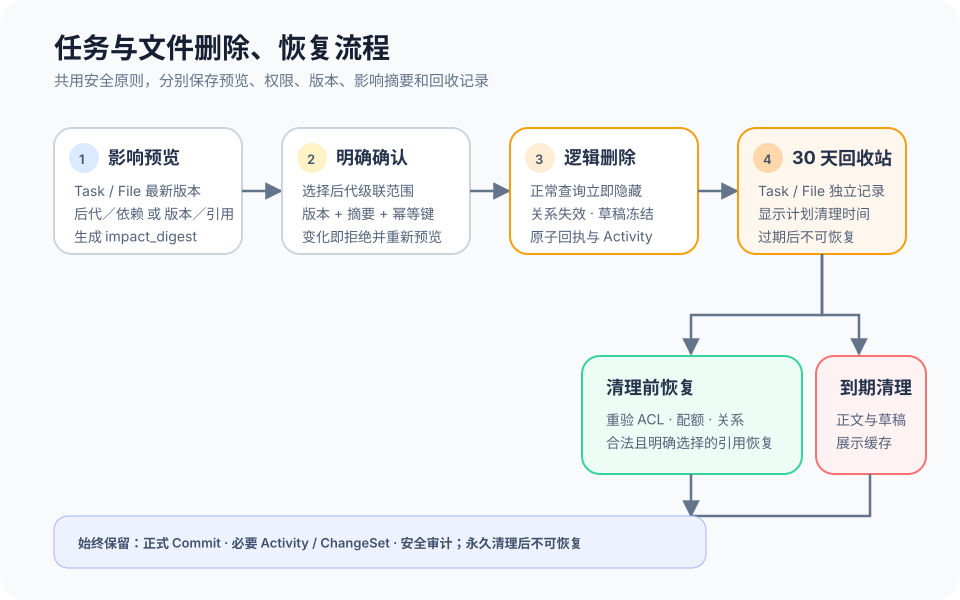

# 删除、恢复与数据保留

## 1. 目的

让用户在删除任务前看清会受影响的后代、依赖、文件引用和未提交草稿，误删后可在 30 天内恢复。删除不是完成任务的替代入口，也不是抹掉历史的手段；正式结果、变更事实和安全审计仍可按原权限追溯。

## 2. 范围和边界

本模块覆盖 Web 与 CLI 共用的影响预览、删除确认、后代级联选择、逻辑删除、回收站、恢复和到期清理，并明确 Task 与规范 File 使用两个独立回收合同。任务完成与重新打开见模块 12；文件、文件版本和正式 Commit 的操作入口见模块 11；统一权限和错误见模块 15。

当前 MVP 的删除行为见 3.0；3.1–3.6 的服务端影响预览、逻辑删除、Task／File 回收站、恢复与保留治理都是上线目标。下述 30 天期限不是当前浏览器原型提供的恢复承诺。

Task 删除只处理 Task 及其任务范围内的可变展示，不把删除扩展成“清除所有关联数据”。删除 Task 不删除共享 File、正式 Commit、Activity 或审计记录，也不通过删除父任务自动抹掉依赖它的其他任务。删除规范 File 则按 File 自身影响预览、30 天回收和恢复规则处理，不借 Task 删除隐式完成。两类回收站都不是普通列表；无权读取对象时，预览、确认、恢复和清理查询都不能泄露其存在或影响范围。

## 3. 详细功能设计

### 3.0 当前 MVP：本地删除与撤销边界

任务列表和子任务区已提供删除确认：本地预览显示将删除的任务名称、全部后代数量及受影响的外部依赖数量；确认前重算范围签名，变化后要求重新确认。成功后移除本地任务树、相关状态与依赖引用，保留其他任务并记录相应本地活动；多键存储失败会回滚或提示恢复本地记录。界面明确提示永久删除、无法撤销，没有 Task 回收站。存储故障恢复只修复一次写入的一致性，不是误删后的任务恢复。

文件删除和文件夹归档在当前文件树上生效，当次提示提供内存快照“撤销”，不提供独立 File 回收站、30 天保留或重新鉴权后的选择性引用恢复。团队设置另有删除／离开确认，当前只移除本地团队资料并切换剩余团队；该入口不证明生产团队数据已永久清理，详见模块 14。

已删除评论当前不展示；回复保留与展示见模块 10、11。正式审计、到期清理、法律保全、跨任务 File 保留和历史作者最小化均未形成当前服务端闭环，以下作为上线目标保留。

证据：`src/lib/workspaceSubtaskEditing.ts`、`src/App.tsx`、`src/components/task-files/TaskFileExplorer.tsx`、`src/lib/taskFileTree.ts`、`PersonalCenterPage.tsx`；`server/workspaceSubtaskEditing.test.ts`、`taskFileTree.test.ts`、`personalCenterProfile.test.ts`。

### 3.1 上线目标：影响预览

用户在任务详情选择“删除”，或在 CLI 执行删除预览命令。Web 与 CLI 使用同一服务和同一影响预览合同：服务先校验 Principal、有效团队成员关系、Task ACL 与 `task.delete` 操作范围，再基于任务最新版本计算结果，不接受客户端自行拼出的影响清单。

预览展示当前任务、直属和全部后代、被其他任务依赖的关系、有效文件引用、未提交的 TaskCommitDraft，以及删除后仍会保留的正式事实。结果包含 `task_version`、`impact_digest`、生成时间、失效条件和是否需要显式级联。页面不把“影响为未知”显示成零；投影未就绪时阻止确认并允许刷新。

若存在后代，用户必须明确选择“删除当前任务及全部后代”或取消；首版不把后代静默改为根任务，也不支持任意勾选部分后代。依赖任务不会被级联删除，预览只说明其关系将失效并在相关任务中形成待处理缺口。共享 File 本体和 FileVersion 不进入级联范围，仅使被删任务的 TaskFilePlacement 失效。

无权限、已撤权或跨团队请求在计算并返回删除影响前终止。不得通过标题、ID、后代或依赖数量、文件名、草稿数量、当前版本或摘要差异泄露隐藏对象；存在不可展示的阻断影响时只给出可恢复的抽象提示，并要求由有权主体处理。

### 3.2 上线目标：确认与逻辑删除

确认区连续展示删除对象、级联范围、保留内容和 30 天恢复期限。用户必须再次确认；Web 按钮和 CLI 命令都提交预览中的最新资源版本、`impact_digest`、明确的 cascade 选择和幂等键。服务端重新鉴权并重算影响：版本不一致返回 412，影响摘要变化返回 409；两者都保留用户意图并要求重新预览，不能沿用旧摘要执行。

确认成功后，在一个受控事务中写入逻辑删除标记、回收站记录、关系失效结果、ChangeSet、领域事件与幂等结果。回执返回 operation ID、删除时间、清理时间、实际级联的 Task ID（仅限当前用户仍可读取的对象）和 `projectionState`。同一幂等键与同一载荷只执行一次；网络超时后先查询 operation 或重试原键，不换键重复删除。

逻辑删除后，任务和被级联后代从正常列表、详情、我的工作与 CLI 查询中隐藏，待处理邀请和负责人提议终止，未提交草稿冻结且不可再正式提交。依赖该任务的可见任务显示“引用任务已删除”的缺口，不回显已无权读取的原任务内容。

### 3.3 上线目标：回收站与恢复

回收站按当前团队展示用户有权恢复的记录，包含可公开的任务名称、删除人、删除时间、计划清理时间、级联范围和当前可恢复状态。列表使用游标加载；空态说明没有可恢复任务，加载失败不把结果显示为空。权限收紧、成员被移除或切换团队后立即清除旧回收站投影。

恢复前服务端以当前 Principal、团队成员关系、Task ACL、最新回收站版本和幂等键重新校验。恢复会重新校验父任务、后代、依赖、成员、文件引用和当前权限：仍有效且允许恢复的关系重新建立；父任务已清理、依赖已删除、成员已离开、文件已撤权等不可恢复关系不被伪造，而以“关系缺口”逐项列出并提供后续修复入口。恢复父任务不自动恢复曾被单独清理或不在原级联记录中的对象。

恢复成功后原子撤销逻辑删除、恢复允许的关系、生成 Activity 和回执。任务保留原稳定 ID，版本递增；正常列表按当前查询和排序重新出现，而不是强插到旧位置。版本冲突、摘要过期或权限变化会保留恢复意图并要求刷新；超过清理时间后不再提供恢复。

*FIG-DELETE-001 · 上线目标流程：Task 与 File 共用“预览—确认—30 天回收”原则但保持独立记录；恢复重新校验各自关系，正式事实不随逻辑删除消失。*

### 3.4 上线目标：File 独立删除与恢复

PRD-0004 将 API 文档中的开放问题收口为 v1 产品决定：规范 File 与 Task 分开删除。File 删除影响预览读取最新 File 版本，列出当前有权查看的 FileVersion、共享或跨任务 TaskFilePlacement、固定／跟随版本策略、正式 Commit 引用及明确保留项；隐藏任务或引用只返回不可展开的抽象影响，不显示标题、ID、数量或版本。

确认方必须具备 `file.delete`，提交 File 版本、最新 `impact_digest` 与幂等键；服务端重新鉴权、重算影响并在同一事务中写入逻辑删除、独立 `file_recycle_record`、引用失效投影、Activity 与审计。规范 File、可变 FileVersion 投影和 Placement 进入 30 天回收范围，但正式 Commit、必要 Activity／ChangeSet 和审计不删除；正式 Commit 对固定 FileVersion 的引用继续作为不可变历史事实。正常文件选择、下载和新引用不再返回已删 File，且不从缺口泄露跨任务资料。

恢复只向持有 `file.restore` capability 的主体开放，并重新校验 File ACL、相关 Task ACL、当前存储配额、同名或版本冲突、回收记录版本、影响摘要和幂等键。服务恢复规范 File 与仍处于保留期的可恢复版本（FileVersion）；TaskFilePlacement 仅恢复当前仍合法并由用户在恢复确认中明确选择的引用。无权任务、已永久删除目标、失效版本策略或配额阻断形成缺口列表，不伪造原引用，也不泄露不可见正文。

30 天从 File 删除事务提交时间起算。到期清理把 File 回收记录改为不可恢复墓碑，并按保留规则清理允许清理的 File 元数据和未被正式事实保留的内容；永久清理完成后不可恢复。法律保全或正式 Commit 的固定版本引用可以延长对应 FileVersion 内容保留，但不让 File 回到活动态，也不自动扩大读取权限。

### 3.5 上线目标：30 天清理与保留规则

30 天从删除事务的服务端提交时间起算，回收站明确显示计划清理时间。到期作业再次核对删除状态和保留策略；已恢复任务不清理，仍在回收站的任务清理正文、完成标准等可变业务内容及面向界面的缓存副本，并把回收站记录变为不可恢复的最小墓碑。清理失败进入受控重试和安全日志，不能提前向用户显示已永久清理。

清理任务正文不等于清除工作历史：系统继续保留正式 Commit、必要 Activity 和审计最小记录，并分别执行原有读取权限与独立保留期限。

正式数据保留矩阵如下。表中的默认期限是 v1 产品决定；部署不得静默缩短，因地区法律需要延长时应由数据治理负责人记录覆盖规则。

| 数据 | 默认期限或生命周期边界 | 到期动作 | 责任主体 |
| --- | --- | --- | --- |
| Task 可变正文／回收站 | 逻辑删除后 30 天 | 清理正文、完成标准、任务内草稿与展示缓存；保留不可恢复墓碑和必要关联键 | Task 服务负责人执行，数据治理负责人审查策略 |
| 正式 TaskCommit | 随团队生命周期保留，不因任务删除、成员退出或账号停用删除 | 保持不可变结果和固定 FileVersion 引用；只有未来团队整体删除合同或法律要求可以触发后续处置 | Commit 服务负责人和数据治理负责人 |
| Activity／ChangeSet | 必要事实随团队生命周期保留，不因任务删除、成员退出或账号停用删除 | 保留事件类型、操作者快照、时间和变更引用；清理可变任务标题等展示副本，Activity 可由 ChangeSet 重建 | 事件平台负责人和数据治理负责人 |
| Discussion | 随团队生命周期保留；用户删除按模块 10 保留必要 tombstone 和回复结构，已删除评论不在普通界面展示 | 清理已主动删除正文允许清理的副本，保留回复结构与必要审计引用；任务删除本身不触发清理 | 协作服务负责人 |
| 共享 File／FileVersion | 规范 File 逻辑删除后 30 天进入独立 File 回收站并可恢复；正式 Commit 固定引用、法律保全或独立政策可延长所需 FileVersion 内容保留 | Task 删除只解除 TaskFilePlacement；File 删除形成独立回收记录，到期清理允许清理的内容并保留不可恢复墓碑，正式 Commit、Activity 与审计不删除 | 文件服务负责人、存储负责人和数据治理负责人 |
| SecurityAudit | 默认自事件发生起 365 天 | 期限届满且无保全时安全清理原始记录；只输出经授权的审计结果，不向普通成员开放日志 | 安全负责人和数据治理负责人 |
| 幂等记录 | 默认自业务事务提交起 30 天 | 清理请求载荷和业务回执；安全调查需要的最小 operation ID、摘要与主体引用转由 SecurityAudit 策略管理 | 平台网关负责人 |

历史作者采用最小化投影：仅保留发生时的显示名快照和不可逆内部主体引用，邮箱、手机号等个人敏感字段不进入历史投影。账号停用时同步应用这一最小化规则，但不会改写正式 Commit、Activity／ChangeSet 或 Discussion 的作者归属。

法律保全优先于上表期限：命中保全的对象冻结清理和匿名化，记录保全依据、范围、责任人和解除时间；保全解除后恢复原计划，按原始到期时间进入受控清理队列，不重新赠送一段保留期。团队整体删除属于首版范围外，必须作为未来独立的清理触发器定义影响预览、法律保全和各对象期限；在该合同落地前，不能用任务删除或成员退出代替团队清理。

任何被保留的数据都不自动扩大读取权限；“被保留”不等于团队管理员、原作者或支持人员可以读取正文。

### 3.6 上线目标：状态、移动端与键盘

预览加载中禁用确认；删除失败保留预览和级联选择；过期状态突出显示“重新预览”。窄屏按影响、保留内容、恢复期限和确认动作单列排列，确认按钮不固定遮挡内容。键盘用户可以完整浏览影响项、选择级联范围、关闭对话框并回到触发点；错误摘要把焦点移到首个可恢复问题，状态变化由可访问状态区域播报。

## 4. 验收标准

当前 MVP 验收：本地任务删除展示后代与依赖影响，过期预览不能继续确认，写入失败不伪装为删除成功；File 当次撤销与写入故障恢复不被描述为回收站恢复。当前不承诺 Task 或 File 误删后保留 30 天。

以下为上线目标验收：

- Web 与 CLI 在同一权限服务下生成同结构的影响预览，并在确认时提交最新任务版本、`impact_digest`、级联选择和幂等键。
- 有后代时必须显式选择级联全部后代或取消；依赖任务、共享文件、正式 Commit、Activity 和审计不随 Task 级联删除。
- 版本变化返回 412、影响变化返回 409；客户端保留用户意图并要求重新预览，不使用旧摘要继续删除。
- 删除成功后任务只进入逻辑删除和 30 天回收站，正常列表、我的工作和 CLI 正常查询不再返回它。
- 恢复时重新校验父子、依赖、成员、文件和权限；不能恢复的关系列为缺口，不伪造原状态。
- 规范 File 与 Task 使用独立影响预览和 30 天回收记录；File 恢复要求 `file.restore` 并重验 ACL、配额与冲突，只恢复仍合法且用户明确选择的 Placement，缺口逐项列出。
- File 永久清理后不可恢复；正式 Commit、必要 Activity／ChangeSet 和审计不随 File 删除，隐藏的共享或跨任务引用不通过预览与缺口泄露。
- 到期清理仅移除允许清理的 Task 正文、草稿和展示缓存；正式 Commit、必要 Activity／ChangeSet、Discussion 和共享 File 按团队或对象生命周期保留，SecurityAudit 默认保留 365 天。
- 历史作者只保留显示名快照和不可逆内部主体引用，邮箱与手机号不进入历史投影；账号停用同步执行敏感字段最小化。
- 法律保全冻结清理并在解除后恢复原计划；团队整体删除作为未来独立清理触发器，不由任务删除或成员退出替代。
- 撤权、跨团队和无权限请求不能通过删除影响、错误、版本或回收站数量泄露隐藏对象。
- 幂等重试只产生一次删除或恢复结果；加载、失败、冲突、窄屏和键盘流程均可安全恢复。
