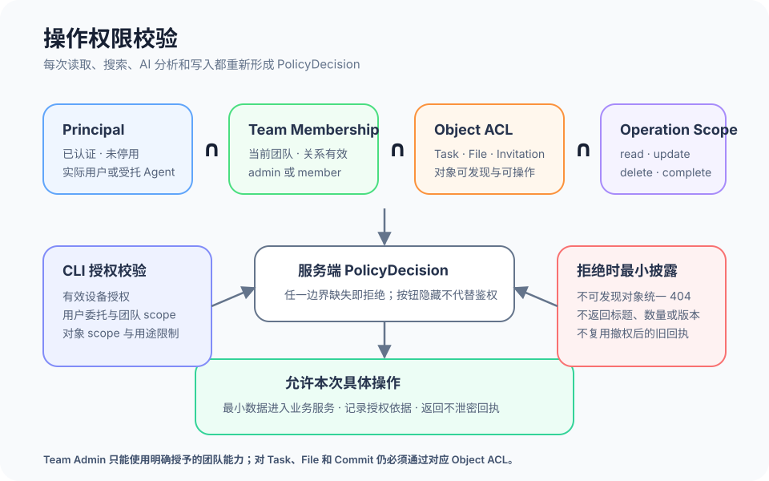

# 统一权限、异常与非功能要求

## 1. 目的

为注册后的全部 Web、CLI 和 AI 动作提供一致的权限判断、错误恢复和上线质量底线。用户看到的入口与服务端实际授权一致，但按钮隐藏不代替鉴权；发生冲突或服务失败时保留用户工作，也不以更详细的错误泄露隐藏对象。

## 2. 范围和边界

本模块定义管理员／成员团队动作矩阵、任务与文件对象权限、TaskDoor CLI 委托、统一错误、幂等与并发，以及可访问性、触屏与响应式、列表加载、文件上传、安全日志、敏感信息和数据隔离要求。各业务对象的具体步骤仍在对应模块内定义，本模块只提供共同约束。

当前 MVP 的局部校验见 3.0；3.1–3.8 全部是上线目标。以下能力、错误协议、保留限制和性能门禁不能作为当前生产保障或实测结论。

首版的正式 TeamRole 只有管理员 `admin` 和成员 `member`。团队角色不等于 Task Owner、Participant 或 Object ACL；Participant、创建者、历史作者和被推荐人都不自动获得权限。团队管理员不能仅凭 admin 身份绕过 Task ACL。系统不从客户端提交的 `currentUserId`、`memberId`、角色或 MCP annotation 推断授权。

## 3. 详细功能设计

### 3.0 当前 MVP：本地校验与正式治理边界

当前页面已有字段校验、存储失败提示、部分操作防重、焦点与键盘交互；邀请和团队设置根据本地成员状态限制部分动作，任务删除校验本地影响签名，部分多键写入使用可恢复的浏览器存储事务。它们只能约束当前原型行为，不能替代服务端身份、正式生产权限、对象 ACL、持久幂等或跨用户并发控制。

当前认证与邀请依赖预览／本地状态，AI 进度包含示例与 Mock 来源；文件字节和修订保存在浏览器。尚未实现统一服务端 PolicyDecision、CLI 设备委托、Task／File 回收站、账号停用、生产租户隔离、安全审计、扫描服务及容量／性能发布门禁；既有 UI 或局部测试也不证明全产品已经满足无障碍、移动端和安全要求。

证据：`src/lib/onboardingPreview.ts`、`teamInvitations.ts`、`workspaceSubtaskEditing.ts`、`taskAiAdjustmentStorage.ts`、`taskProgressAssessment.ts`，以及当前实现矩阵、intake audit；上线要求须逐项由正式服务与相应验证落实。

### 3.1 上线目标：权限判断模型

每次读取、搜索、聚合、AI 分析和写入都在服务端形成独立 PolicyDecision。有效权限是 `Principal ∩ Team Membership ∩ Object ACL ∩ Operation Scope` 的交集：Principal 必须已认证且未停用；Team Membership 必须属于请求团队并仍有效；Object ACL 必须允许读取或具体动作；Operation Scope 必须与本次命令一致。任一项缺失即拒绝，不用其他项补足。

CLI 与受托 Agent 还必须同时满足用户委托、有效设备授权、团队 scope、对象 scope 和用途限制。每次调用重新鉴权；设备撤销、成员移除或 ACL 变化后，旧访问令牌、缓存和幂等回执不能继续暴露内容。AI、搜索和统计只接收权限过滤后的输入，不能把完整集合送到客户端再隐藏。

*FIG-PERM-001 · 上线目标模型：授权是四项交集，不是角色相加；CLI 还需设备和用户委托，任何边界失效都拒绝操作。*

### 3.2 上线目标：管理员／成员矩阵

下表描述团队级默认能力。任务、文件、讨论、Commit 和回收站仍需对象 ACL 与具体 capability；表中的“可请求”不保证对任意对象获准。

| 操作 | 管理员 | 成员 | 额外约束 |
| --- | --- | --- | --- |
| 查看团队基本信息与公开成员 | 允许 | 允许 | 仅当前有效团队，敏感字段按最小披露 |
| 修改团队名称与基础设置 | 允许 | 不允许 | `team.settings.update`，记录审计 |
| 邀请成员、撤销团队邀请 | 允许 | 不允许 | `team.members.invite`，受邀邮箱不可用于跨团队探测 |
| 修改 admin／member 角色 | 允许 | 不允许 | `team.members.manage_role`，至少保留一名有效管理员 |
| 移除其他成员 | 允许 | 不允许 | `team.members.remove`，先完成模块 14 的责任检查 |
| 主动离开团队 | 允许 | 允许 | 只能操作自己的 Membership；唯一管理员和有效 Owner 受阻 |
| 读取某个 Task | 可请求 | 可请求 | 必须同时满足 Task ACL；admin 不自动允许 |
| 更新任务、邀请 Participant、转移 Owner、完成或删除任务 | 可请求 | 可请求 | 分别要求对应 task capability、版本和业务前置条件 |
| 恢复失联 Owner 死锁 | 仅可请求 | 不允许 | `task.assignment.recover` 仅用于模块 14 的死锁恢复；服务端确认正常转移无路径并要求 step-up、预览、理由、版本、幂等、目标同意和审计，不授予 admin 普遍 Task ACL 或任务正文读取权 |
| 读取 File／FileVersion 或作为 Commit 证据 | 可请求 | 可请求 | File ACL、Placement 和 Task ACL 取交集，引用不扩权 |
| 恢复逻辑删除的 File | 可请求 | 可请求 | 必须持有 `file.restore`，重验 File／Task ACL、配额与冲突；只恢复明确选择且仍合法的 Placement |
| 连接或撤销自己的 CLI 设备 | 允许 | 允许 | 只能委托本人已有权限；团队可撤销对应 scope |
| 查看安全审计 | 按明确授权 | 不允许 | admin 身份本身不自动开放原始安全日志 |

对象发现同样受控。无权对象在列表、搜索、数量、自动补全、通知、删除影响、冲突响应和 AI 摘要中均不可见。策略允许暴露对象存在但禁止某动作时可返回 403；对象不可发现时统一返回 404，不用响应时长或字段差异暗示真实状态。

### 3.3 上线目标：统一错误与用户恢复动作

错误使用稳定 code、HTTP 状态、可公开说明、request ID、是否可重试和恢复动作。错误详情只包含当前 Principal 有权读取的信息；客户端文案不能把“无权”写成“没有数据”，也不能把服务失败写成业务成功。

| 状态 | 适用边界 | 用户恢复动作 |
| --- | --- | --- |
| 400 | JSON、字段类型或请求结构无效 | 保留输入，定位无效字段并修改后重试 |
| 401 | 未登录、会话或设备凭据失效 | 重新登录或重新完成设备授权；不自动重放高影响写入 |
| 403 | 对已知对象缺少当前操作权限，且允许暴露其存在 | 返回安全页面；可请求对象 Owner 或管理员按正式流程授权 |
| 404 | 对象不存在，或因不可发现而隐藏 | 返回上一层有权页面并刷新列表，不区分不存在与隐藏 |
| 409 | 业务冲突、删除影响变化、依赖循环或幂等键载荷不同 | 刷新影响或业务状态，比较变化后重新确认；不得换键盲重试 |
| 412 | `If-Match`／`expected_version` 不是最新版本 | 读取最新版本、保留本地输入并显示差异，再由用户确认 |
| 413 | 文件或请求超过当前部署限制 | 保留文件选择，显示 upload-prep 或服务端公开返回的实际 `maxBytes`，允许重选或压缩后重试 |
| 422 | 请求结构正确但违反领域规则 | 定位阻断规则，例如唯一管理员、空完成标准或非法状态转换 |
| 428 | 修改请求缺少条件版本 | 读取最新资源与 ETag，保留本地输入，对比变化并重新确认后提交 |
| 429 | 超过频率或容量限制 | 展示可公开的等待时间，按 `Retry-After` 延迟后重试 |
| 5xx | 服务内部失败、依赖不可用或投影未就绪 | 保留草稿和 operation ID；先查询结果，未知时使用原幂等键安全重试 |

受控异步操作返回“已受理”而不是成功完成。部分投影延迟时显示 `projectionState=updating`；超时后页面查询 operation，不能根据按钮消失推断写入成功。错误摘要获得焦点并链接到具体字段，修复后不清空其他有效输入。

### 3.4 上线目标：幂等、并发与事务

所有创建、更新、删除、恢复、状态转换、邀请响应、正式提交、离开和停用动作携带幂等键。键绑定 tenant、实际 Principal、operation、规范化载荷摘要和业务结果；相同键相同载荷返回原资源与回执，相同键不同载荷返回 409。每次重放仍重新鉴权，撤权后只返回不含敏感内容的结果。

读取返回资源版本；Web 写入使用条件版本，CLI 使用 `expected_version`。并发写入只有首个符合版本的命令生效，后续返回 412，客户端保留本地编辑并展示可公开差异。Owner、状态、ACL、完成、删除和成员退出等高影响动作不自动合并。

业务对象、ChangeSet、领域事件与幂等结果在同一事务提交。Activity 可异步投影，但不能出现“对象失败、活动成功”或相反的半状态。非原子批量写入不进入首版；多对象领域命令要么完整生效，要么整体失败，并返回可定位的 operation ID。

### 3.5 上线目标：可访问性、触屏与响应式

- **键盘与焦点：** 所有按钮、菜单、Tab、Dialog、Popover、筛选、列表项和文件选择均可按标准键盘顺序操作；焦点始终可见。打开 Dialog 后焦点进入标题或首个字段，关闭后回到触发点；导航到详情后进入主标题，返回列表按 Task ID 恢复原项。
- **屏幕阅读器：** 图标按钮具有完整名称；标题层级、表格表头、字段错误、加载结果和异步状态具有语义。新增通知、上传进度和写入结果使用不过度打断的状态区域播报；隐藏 Tab 和未到达步骤不进入可访问树。
- **触屏：** 主要操作具有足够触控目标和间距，不依赖 hover 暴露唯一入口。置顶、更多菜单、恢复和删除均可通过点击与辅助技术触达；危险动作不因滑动误触立即执行。
- **响应式：** 窄屏采用单列阅读，长名称、状态和操作允许换行，不产生页面级横向滚动。表格可转为有标签的记录列表，固定按钮不得遮挡正文、键盘或错误提示。
- **动态与颜色：** 尊重减少动态设置；状态不只使用颜色、位置或动画表达。

### 3.6 上线目标：列表加载与文件上传

任务、通知、成员、Activity 和回收站列表使用稳定游标和明确加载状态。首次加载、加载更多、无结果、过滤后为空和失败分别表达；局部加载失败保留已成功内容并允许从失效游标刷新。列表不会一次把全团队数据下发到浏览器，也不因后台插入重复或漏掉当前页；返回详情时按对象 ID 恢复位置和焦点。

文件上传显示文件名、大小、阶段、进度和取消入口，并区分准备、传输、扫描、可用、隔离和失败。v1 默认单文件上限为 100 MiB；upload-prep 必须回传当前部署实际生效的 `maxBytes`，客户端以该值做预检查，413 错误也回传同一公开值。部署可以因存储或地区政策采用更严格上限，但必须在用户选择后、传输前明确展示，不能把限制藏成未知失败。

客户端只上传用户明确选择或 CLI 命令明确指定的路径；服务端校验大小、类型、存储范围、内容扫描和 File ACL。断线恢复使用同一上传会话或重新准备，不创建重复 FileVersion；扫描通过前文件不能作为可下载附件或 Commit 证据。失败与隔离不泄露服务内部路径、签名 URL 或扫描规则。

### 3.7 上线目标：安全日志、敏感信息与数据隔离

认证、设备授权、权限拒绝、高影响写入、角色变化、成员移除、删除清理和账号停用写入不可由客户端修改的安全日志。日志至少记录实际 Principal、代表成员、tenant／team、operation、PolicyDecision 摘要、request ID、结果和服务端时间；不得记录密码、令牌、验证码、完整签名 URL、文件正文或不必要的讨论内容。

敏感信息在传输和静态存储中按部署安全基线保护；日志、分析、错误、通知和 AI 输入只携带完成动作所需的最小字段。支持人员、团队管理员和 Agent 都不因身份方便而获得全局明文访问。密钥和设备凭据可撤销、可轮换且不在客户端永久明文展示。

数据隔离以 tenant 和 team 为服务端查询前置条件，再叠加对象 ACL；缓存键、搜索索引、向量检索、文件存储、通知和异步任务都包含同一隔离域。跨团队 ID 即使可猜中也不能命中对象；测试环境与生产环境使用独立凭据和数据域。备份、保留和删除作业保持相同隔离，不把一个团队的摘要、数量或错误混入另一个团队。

### 3.8 上线目标：性能与容量

以下数值是产品上线目标，不代表当前实测成绩。发布前在服务端稳定环境、正常授权链路、同地域调用且无故障注入的条件下验证；基准数据至少包含单团队 10,000 个 Task、500 名成员、100,000 条 Activity 和 50 个并发会话。每项持续采样不少于 30 分钟和 10,000 个有效请求，分别报告 P50、P95、P99、错误率和超时率；下表以服务端收到请求到返回完整响应计算 P95，不包含用户网络、文件字节传输和恶意流量限速时间。

| 能力 | v1 上线目标与口径 |
| --- | --- |
| 任务列表／搜索首屏 | 正常授权和索引就绪时 P95 ≤ 800 ms；默认 `limit=50`，服务端配置最大值并在响应中回显实际 limit；不一次下发全量结果 |
| 权限决策 | 单次服务端 PolicyDecision P95 ≤ 100 ms；批量列表按请求整体记录授权耗时，不能通过跳过 Object ACL 达标 |
| 删除影响预览 | 1,000 个以内后代与关系的同步预览 P95 ≤ 1,500 ms；摘要必须基于最新版本且包含权限过滤耗时 |
| 上传准备与状态反馈 | upload-prep P95 ≤ 500 ms；已受理阶段变化到客户端可查询的状态反馈 P95 ≤ 2 s，不把扫描完成时间计作准备成功 |

超出同步基准规模时采用异步与分页降级：列表和搜索继续以游标分页，删除影响改为异步 operation 并在完成前禁止确认，大型上传使用分段会话和可查询状态。异步／分页降级要显示覆盖范围、operation ID 与安全重试入口，不能截断后仍冒充全量或以超时表示成功。若连续窗口未达到 P95 目标，发布门禁失败；不能用平均值掩盖长尾。

## 4. 验收标准

当前 MVP 验收：局部校验和本地保存失败有明确反馈，演示与本地状态不被表述为真实鉴权、投递、跨端并发或性能达标；正式生产权限仍待实现。

以下为上线目标验收：

- Web、CLI 和 AI 的每次动作都按 `Principal ∩ Team Membership ∩ Object ACL ∩ Operation Scope` 重新判定；CLI 额外校验设备与用户委托。
- 管理员／成员矩阵只授予团队级默认能力；团队管理员不能仅凭 admin 身份绕过 Task ACL、File ACL 或具体 operation scope。
- `task.assignment.recover` 仅处理 Owner 失联死锁，不授予团队管理员普遍 Task ACL、任务正文读取或普通 Owner 改写能力；`file.restore` 也不能从角色或历史引用推导。
- 400、401、403、404、409、412、413、422、428、429 和 5xx 均返回稳定 code 与不泄密的恢复动作，并保留可继续使用的用户输入；413 返回实际 `maxBytes`，428 重新取得 ETag。
- 所有写入支持持久幂等和条件版本；并发冲突不静默覆盖，高影响字段不自动合并，事务不产生业务对象与 Activity 半状态。
- 键盘、焦点、屏幕阅读器、触屏和响应式路径可以完成主要流程；hover、颜色和动画都不是唯一信息或操作方式。
- 列表加载区分首次、更多、空、过滤无结果和失败；默认列表 limit 为 50。文件上传默认单文件 100 MiB 且 upload-prep 回传实际 `maxBytes`，并区分传输、扫描、可用、隔离和失败。
- 安全日志不记录凭据或正文；敏感信息最小化进入错误、通知、分析和 AI；撤权后旧缓存与回执不能回显内容。
- tenant、team、对象和操作边界共同隔离数据库查询、缓存、搜索、文件、通知、异步作业与备份恢复。
- 上线前在约定稳定环境按 P95 验证列表／搜索、权限决策、删除影响和上传反馈；超过同步规模时使用可观察的异步或分页降级，不宣称当前实现已经达标。
