# 产品全貌预览

## 1. 目的

快速预览当前演示产品；生成页以分类、缩略图和大图展示截图，每张大图下方提供一句场景说明，来源留在源文件。

## 2. 范围和边界

复用已登记的英文运行截图，保留截图内产品文案，保留分类与切换导航，并用简短图注说明当前场景与步骤。不以截图证明生产服务能力。

## 3. 详细功能设计

### 团队与账号

*FIG-PREVIEW-020 · 个人信息 Profile：头像、姓名与邮箱。*

*FIG-PREVIEW-021 · 团队信息 Team information：团队标识、名称与管理入口。*

*FIG-PREVIEW-022 · 成员管理：邀请入口、成员职责与角色。*

*FIG-PREVIEW-023 · 成员列表下半页：完整团队分工与角色。*

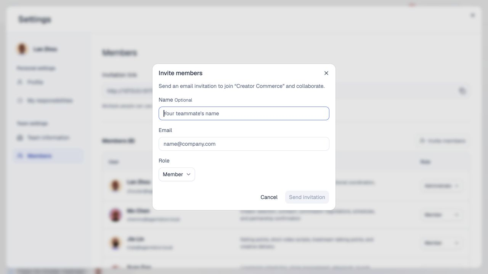

*FIG-PREVIEW-016 · 成员邀请表单：姓名选填、邮箱与角色；未发送邀请。*

*FIG-PREVIEW-017 · 个人设置与团队设置的导航入口。*

### 创建规划

*FIG-PREVIEW-027 · 单任务 · 1/2：输入会议纪要需求。*

*FIG-PREVIEW-003 · 单任务 · 2/2：审阅目标、完成标准与人员，准备确认创建。*

*FIG-PREVIEW-028 · 引导补问 · 1/4：输入尚不明确的活动需求。*

*FIG-PREVIEW-029 · 引导补问 · 2/4：确认活动目标。*

*FIG-PREVIEW-030 · 引导补问 · 3/4：选择需要交付的内容。*

*FIG-PREVIEW-031 · 引导补问 · 4/4：审阅由回答形成的任务草稿。*

*FIG-PREVIEW-032 · 复杂项目 · 1/4：输入完整项目需求。*

*FIG-PREVIEW-033 · 复杂项目 · 2/4：审阅主任务目标、完成标准与投入。*

*FIG-PREVIEW-034 · 复杂项目 · 3/4：查看商务、内容、发布与履约分工。*

*FIG-PREVIEW-035 · 复杂项目 · 4/4：查看广告、分析与合规分工，准备统一创建。*

*FIG-PREVIEW-036 · 多层级任务 · 1/5：输入分层拆解需求。*

*FIG-PREVIEW-004 · 多层级任务 · 2/5：审阅主任务与人员安排。*

*FIG-PREVIEW-005 · 多层级任务 · 3/5：展开内容制作、脚本规划与具体交付。*

*FIG-PREVIEW-006 · 多层级任务 · 4/5：查看视频、发布与复盘分支，共 10 个任务。*

*FIG-PREVIEW-007 · 多层级任务 · 5/5：展开末级任务，核对交付要求与责任。*

*FIG-PREVIEW-037 · 相似任务 · 1/3：输入新品发布复盘需求。*

*FIG-PREVIEW-038 · 相似任务 · 2/3：核对已有任务，选择查看或独立规划。*

*FIG-PREVIEW-039 · 相似任务 · 3/3：审阅独立规划的新任务。*

*FIG-PREVIEW-040 · 已有父任务 · 1/3：输入媒体邀请需求。*

*FIG-PREVIEW-041 · 已有父任务 · 2/3：核对父任务范围与现有子任务。*

*FIG-PREVIEW-042 · 已有父任务 · 3/3：审阅新子任务，确认父任务归属。*

*FIG-PREVIEW-043 · 未匹配负责人 · 1/3：输入办公室无线网络部署需求。*

*FIG-PREVIEW-044 · 未匹配负责人 · 2/3：保留未分配状态，提供成员邀请入口。*

*FIG-PREVIEW-045 · 未匹配负责人 · 3/3：打开邀请表单，尚未发送。*

### 任务协作

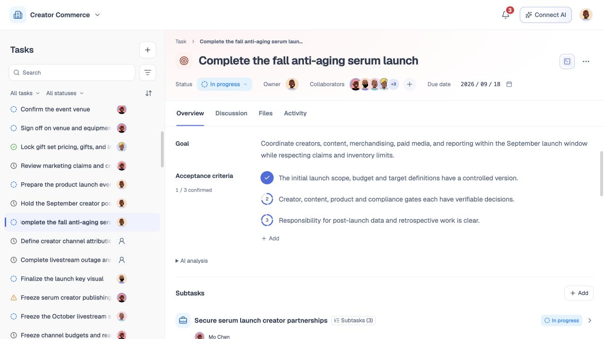

*FIG-PREVIEW-001 · 任务概览：查看目标、完成标准与子任务。*

*FIG-PREVIEW-046 · 完成标准 · 1/3：查看 AI 分段进度与当前人工确认数。*

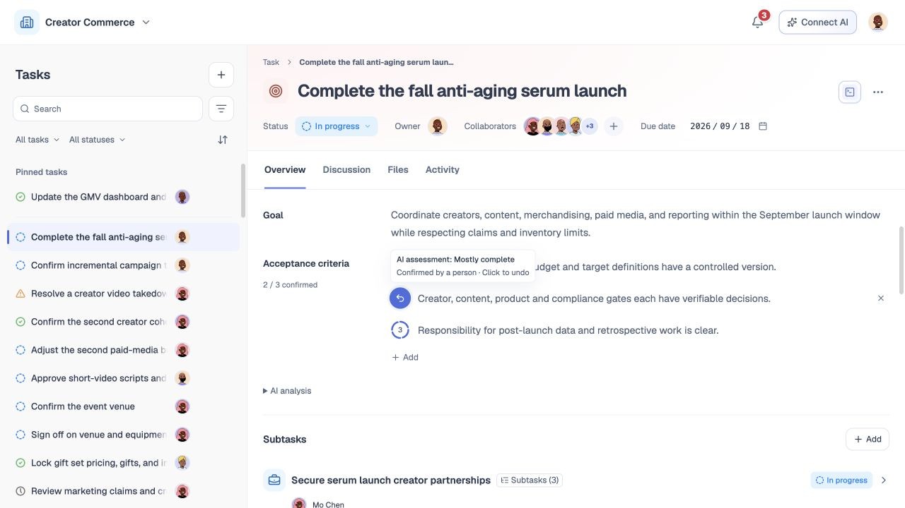

*FIG-PREVIEW-047 · 完成标准 · 2/3：人工确认第二条，确认数变为 2/3；提示支持撤销。*

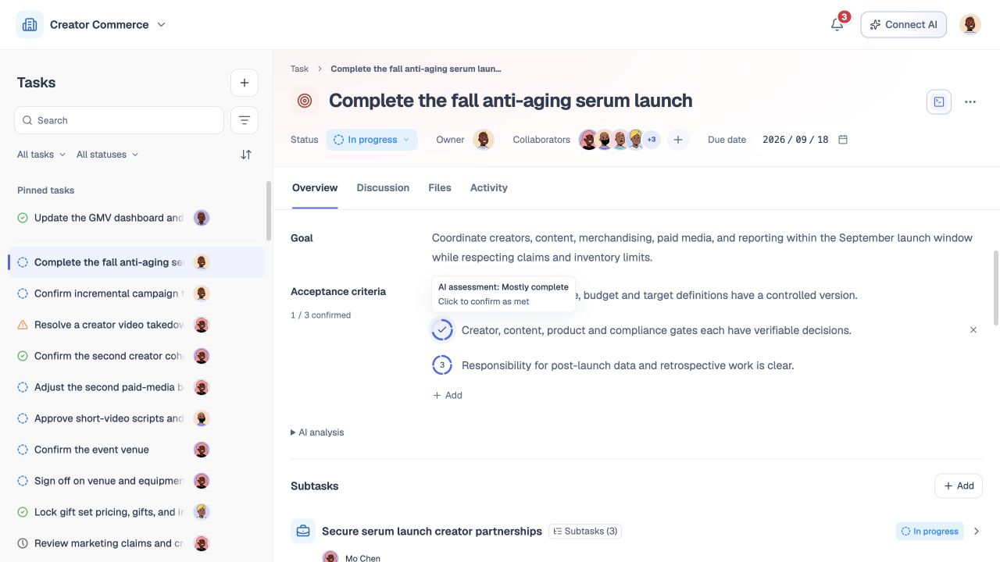

*FIG-PREVIEW-048 · 完成标准 · 3/3：撤销后恢复 1/3；提示区分 AI 评估与人工确认。*

*FIG-PREVIEW-015 · 常显搜索、范围、状态与高级筛选面板。*

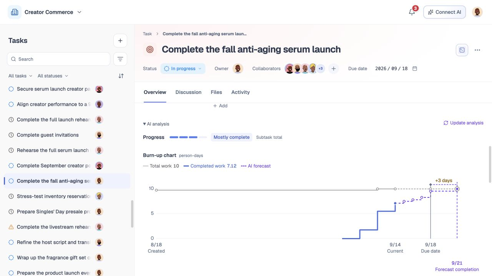

*FIG-PREVIEW-008 · AI 分析 · 1/2：展开进度梯度、累计完成工作量与预计完成时间。*

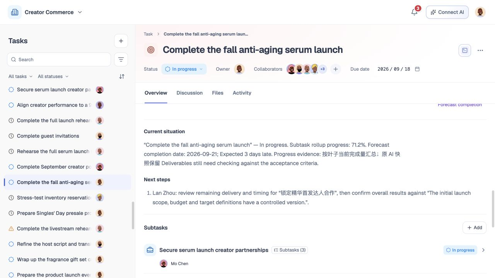

*FIG-PREVIEW-009 · AI 分析 · 2/2：查看当前情况与下一步建议。*

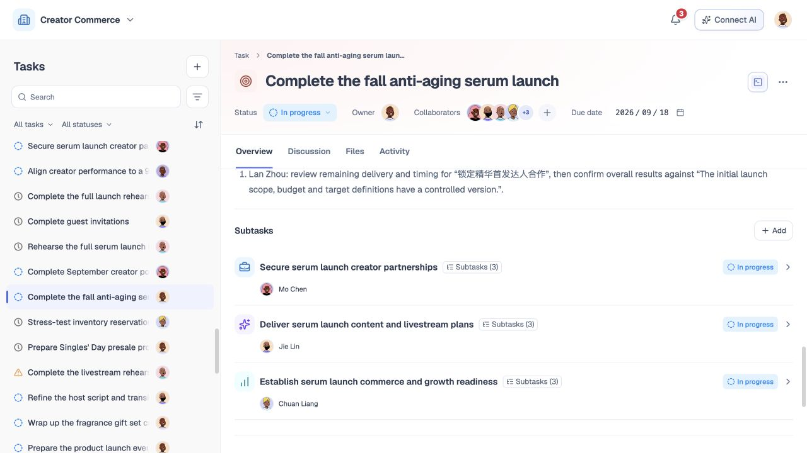

*FIG-PREVIEW-010 · 子任务及下级数量*

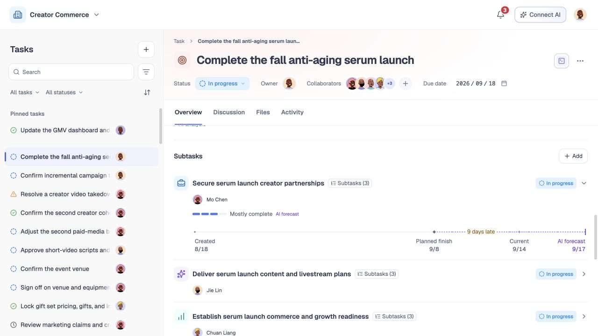

*FIG-PREVIEW-049 · 展开子任务：查看 AI 进度梯度、计划完成时间与预测完成时间。*

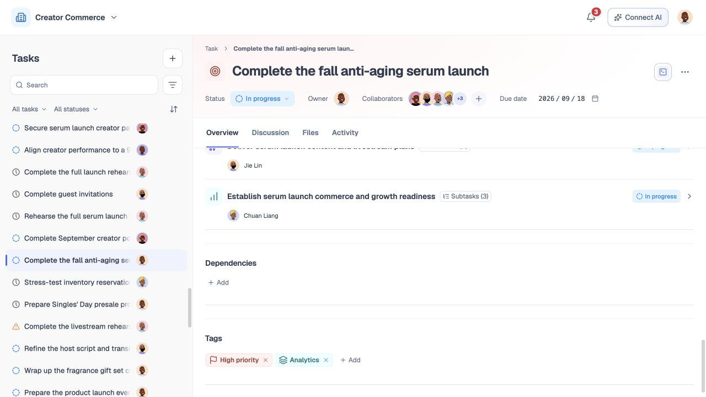

*FIG-PREVIEW-011 · 依赖与标签*

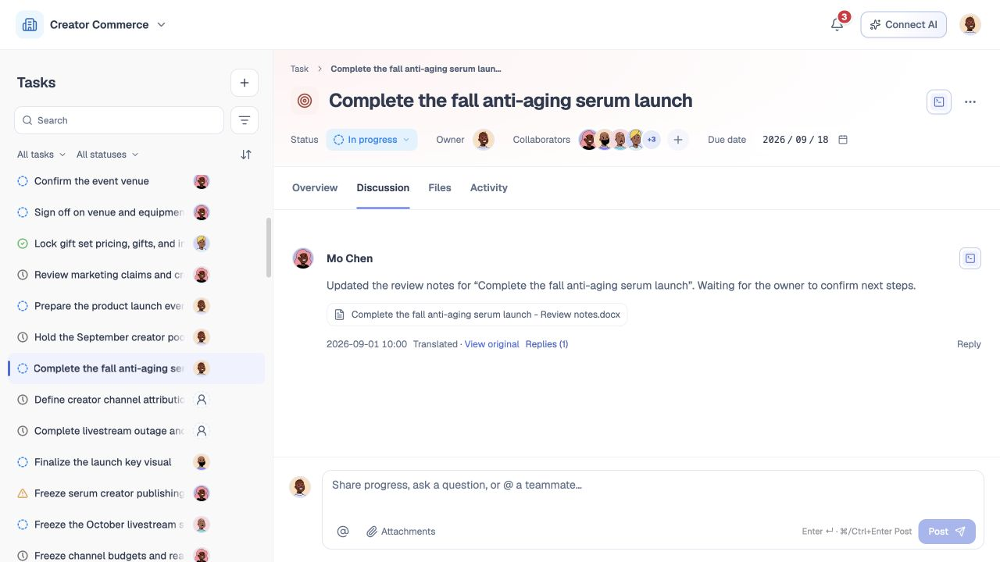

*FIG-PREVIEW-012 · 任务讨论：交流进展、回复成员并查看附件。*

*FIG-PREVIEW-013 · 任务文件：从文件树选择资料并预览正文。*

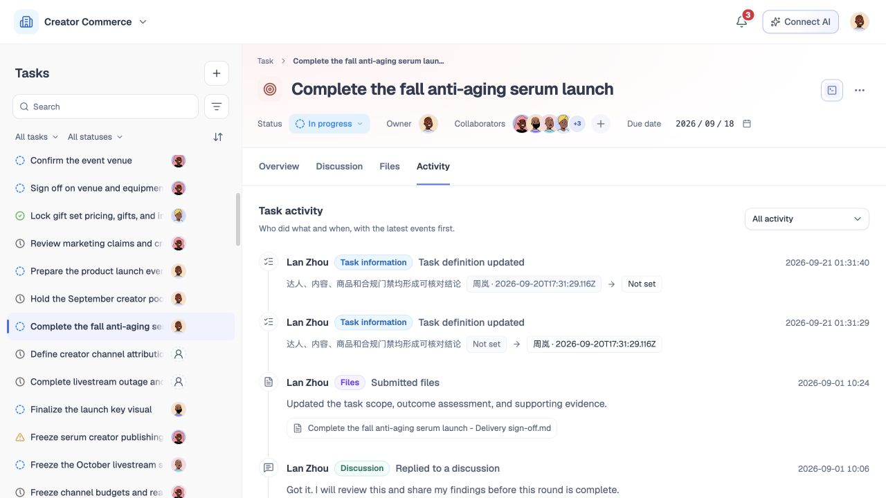

*FIG-PREVIEW-014 · 任务活动：按时间查看任务变更记录。*

### 连接 AI

*FIG-PREVIEW-024 · 连接 AI 弹窗：工具选择与 TaskDoor CLI 安装登录说明。*

*FIG-PREVIEW-025 · 连接 AI 下半页：任务命令示例，属于拟定语法。*

*FIG-PREVIEW-026 · 连接 AI 底部：文件上传、活动回复与删除命令示例。*

## 4. 验收标准

按分类切换缩略图，点击缩略图、顶部前后按钮或大图左右两侧的箭头查看完整大图，支持左右方向键。仅显示必要导航与当前图片说明，不展开长篇正文；打印时展开全部截图。
