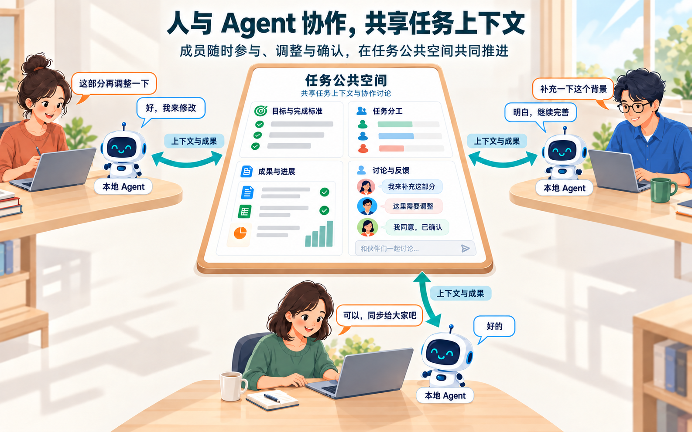

# 产品目标与核心流程

## 1. 目的

TaskDoor 承接任务规划与团队上下文，支持成员与本地 Agent 协作，以及成员之间基于任务上下文的协作，共同推进任务完成。

## 2. 范围和边界

- 新用户认证后先完成[首次设置](03-team-onboarding.md)，再创建团队或确认受邀加入。
- 已有用户不重复设置。
- 核心闭环为创建任务 → 任务协作 → 完成任务。

## 3. 详细功能设计

### 3.1 价值场景

| 典型场景 | 面临的问题 | TaskDoor 的作用 | 用户获得的价值 |
| --- | --- | --- | --- |
| 只有一句需求，不知道如何落地 | 目标不够清楚，任务、标准和人员难以一次确定 | 补问关键信息，形成可编辑的任务方案 | 将想法变成可审阅、可执行的任务 |
| 成员与 Agent 交替推进工作 | 上下文分散，每次接续都要重新说明 | 以任务保存目标、标准、文件、讨论和进展 | 共享同一上下文，减少重复沟通 |
| 多位成员分工与接力 | 工作边界和最新进展不清楚 | 在任务中明确分工，持续回填成果和反馈 | 后续成员可以直接继续工作 |
| 判断任务是否已经完成 | 结果和完成标准分散，难以核对 | 汇总成果并辅助分析完成标准，由用户确认状态 | 完成依据可追溯，最终决定仍由人作出 |

*FIG-LIFE-002 · TaskDoor 协作架构：任务从规划进入公共空间，成员与个人 Agent 共同推进，成果沉淀为团队资产，并为后续分析提供依据。*

*FIG-LIFE-003 · 人与 Agent 协作场景：成员可随时提出调整、补充背景和确认结果，个人 Agent 基于同一任务上下文继续工作。*

### 3.2 创建任务

1. **输入目标**，生成任务方案。
2. **审阅调整**任务拆解和人员建议。
3. **确认创建**任务。

后续将参考历史任务估算耗时，详见[任务创建](07-task-creation.md)。

### 3.3 任务协作

- **与本地 Agent 协作**：提供任务上下文，在本地执行、审阅，再回填成果和进展。
- **与成员协作**：围绕同一任务讨论、分工、反馈和接续工作，无需先连接 Agent。

两类协作可交替或并行。目标、标准、分工、文件、讨论和进展持续回到任务，供有权成员继续使用。

### 3.4 完成任务

- 任务成员参考成果与任务完成标准，自主设置**任务状态**。
- AI 分析、**人工确认**和状态分别保存，不以核对通过作为修改状态的强制门槛。
- 完成后保留协作记录并可继续修改内容。
- 历史数据支持后续规划，本期不据此承诺实际工时预测。

## 4. 功能验收标准

- 两类协作均可多轮进行，回填内容能被有权成员继续使用。
- 连接 Agent 或提交成果不代表完成；任务须由用户确认。
- 已完成任务新增完成标准后状态不变，AI 按新内容重新分析；历史规划属于后续范围。
