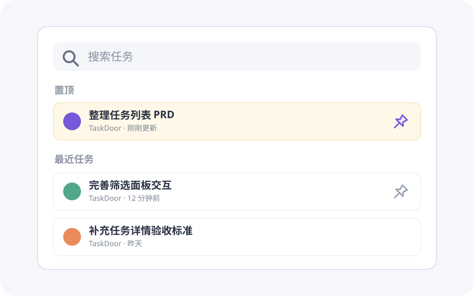

# 任务列表

## 1. 目的

任务列表是用户查找和进入任务的主要入口。它需要让用户快速看清近期任务、缩小查找范围，并把需要持续关注的任务固定在列表顶部，减少重复搜索。

## 2. 范围和边界

本模块覆盖任务列表页中的页面结构、搜索、筛选、排序、加载、打开任务和置顶管理。任务正文、任务内讨论、文件管理以及任务创建和编辑流程由各自模块定义；本模块只说明它们在列表中的入口和结果反馈。

## 3. 详细功能设计

### 3.1 页面结构

页面由搜索与筛选区、置顶区和普通任务列表区组成。系统先根据搜索、筛选和排序条件得到完整结果，再按是否置顶分区展示；同一个任务只出现一次。没有置顶任务时不展示空的置顶区，普通任务列表直接承接搜索与筛选区。

*FIG-LIST-001 · 置顶任务固定显示在当前结果顶部，右侧图钉是置顶与取消置顶的直接入口。*

### 3.2 搜索与筛选区

**展示内容。** 页面顶部展示搜索输入框和筛选入口；筛选入口显示当前生效的条件数量，已选条件在展开面板底部连续排列。用户在任何筛选分类中都能看到“清除全部”，位置固定在面板右上方。

**可用操作。** 用户可以输入关键词、选择或移除筛选条件、清除全部条件，以及调整排序方式。

**操作步骤与结果。** 用户输入关键词或改变筛选条件后，系统在短暂防抖后刷新结果，保留搜索焦点和已选条件。点击单个条件的关闭按钮只移除该条件；点击“清除全部”一次移除全部筛选条件，但不清空搜索关键词。结果刷新后重新从列表顶部开始加载。

### 3.3 任务列表区

**展示内容。** 每个任务项至少展示标题、所属项目或上下文、最近更新时间和可辨识的状态。补充信息只在能够帮助用户区分任务时呈现，避免把列表变成任务详情页。

**可用操作。** 点击任务项打开任务；悬停任务项时，右侧显示图钉和更多操作。键盘用户在任务项获得焦点时看到相同操作，触屏用户通过任务项右侧的常驻更多入口访问这些操作。

**操作步骤与结果。** 用户打开任务后进入对应任务页面，返回时恢复此前的搜索、筛选、排序和滚动位置。用户点击更多操作后，在原任务项附近打开菜单；完成操作后菜单关闭，并在原位置给出结果反馈。

**排序与分页或加载。** 初版采用连续加载：首次只加载一批结果，接近列表底部时继续加载下一批。排序对全部匹配结果生效，而不是只作用于已加载内容。加载失败时保留当前内容，并在列表底部提供明确的重试入口；重新搜索或筛选会取消尚未完成的旧请求。

### 3.4 置顶区

**展示内容。** 置顶区位于普通任务之前，显示当前搜索和筛选结果中已置顶的任务。区标题为“置顶”；置顶任务仍按当前排序规则排列，不再出现在普通任务区。

**可用操作。** 用户悬停或用键盘聚焦任务项时，可点击右侧图钉置顶或取消置顶。已置顶状态使用实心或高亮图钉，并提供可被辅助技术读取的状态名称。

**操作步骤与结果。** 点击未置顶任务的图钉后，任务立即移动到置顶区，并显示短暂成功反馈；点击已置顶任务的图钉后，任务回到普通任务区的正确排序位置。请求失败时任务恢复原位置和原状态，并提示用户重试。置顶是用户个人偏好，不改变任务本身，也不影响其他用户看到的列表。

## 4. 验收标准

- 搜索、筛选和排序后，置顶区与普通任务区共同构成完整结果，且不存在重复任务。
- 没有置顶结果时不显示空置顶区；出现首个置顶结果后，该区域位于普通任务区上方。
- 鼠标、键盘和触屏用户都能访问打开任务、置顶、取消置顶和更多操作。
- 置顶或取消置顶成功后，任务立即移动到正确分区；失败后恢复原状态并提供可理解的反馈。
- 连续加载失败不会清空已加载任务，列表底部提供可执行的重试入口。
- 从任务页面返回列表时，搜索、筛选、排序和滚动位置保持不变。

