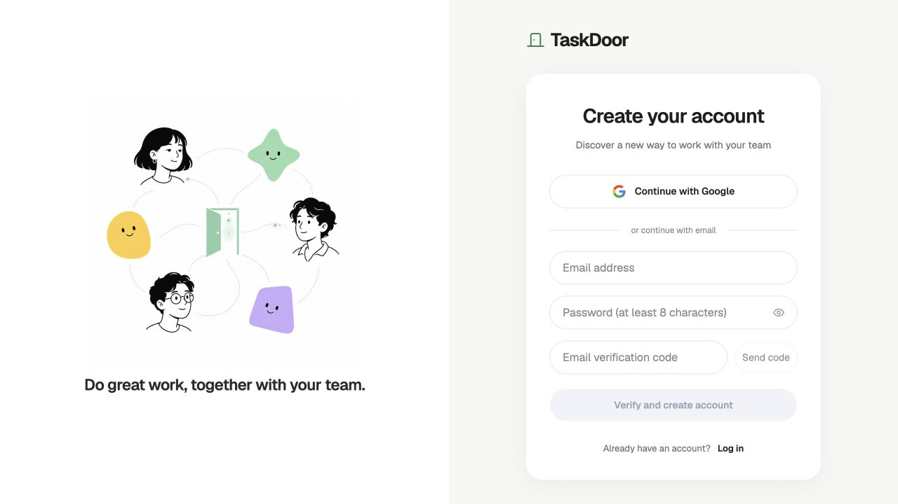
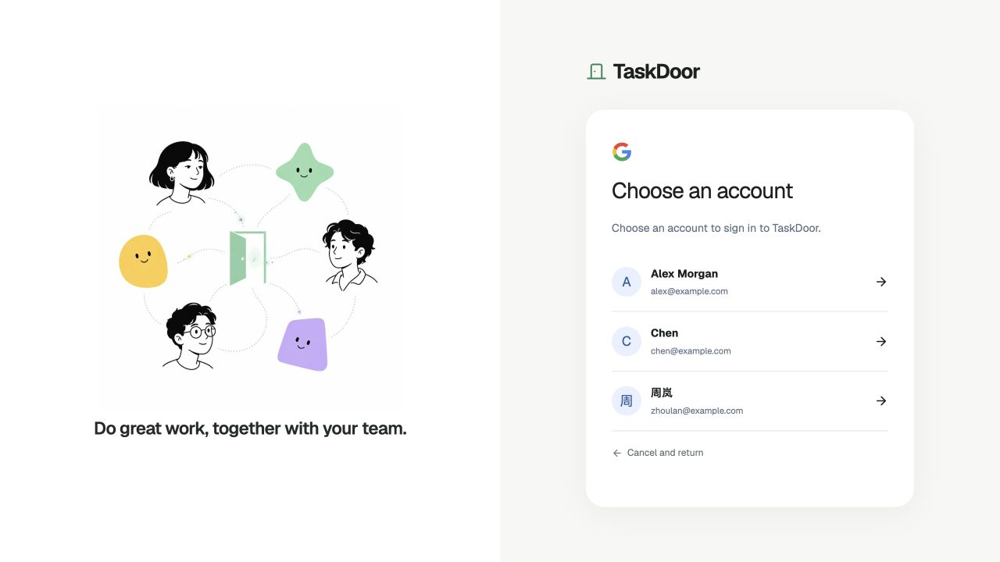
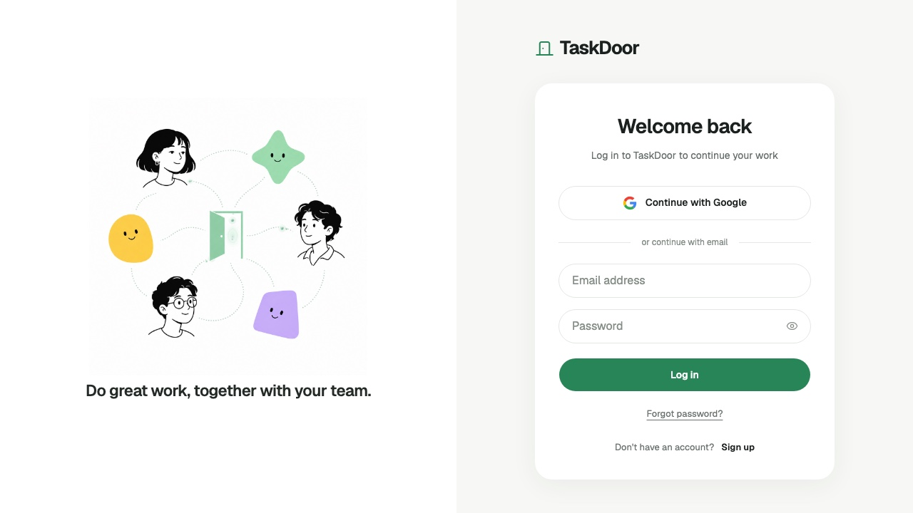
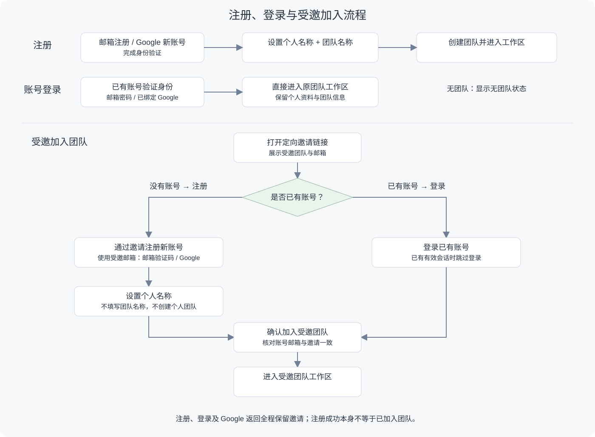
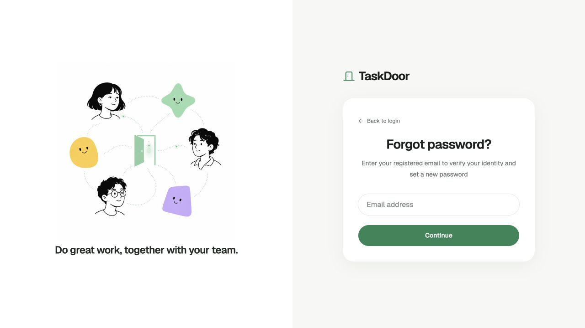
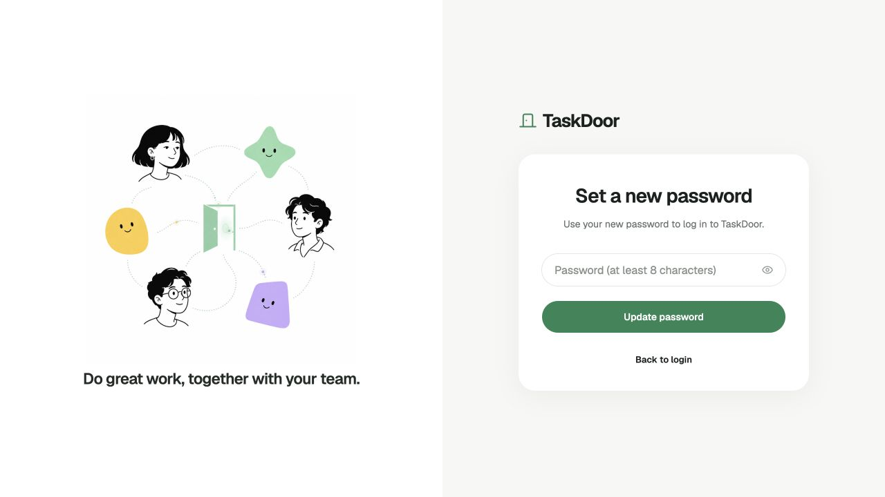

# 账号与个人资料

## 1. 目的

让用户完成注册、登录和个人资料维护，并在忘记密码时恢复访问。

## 2. 范围和边界

- **登录方式**：Google、邮箱＋密码，共用同一个账号的资料、团队和任务。
- **表单初始值**：TaskDoor 不主动预填登录或注册邮箱、密码、验证码及其他账号信息。
- **邮箱限制**：只读，不支持修改或换绑。

## 3. 详细功能设计

### 3.1 注册账号

#### 邮箱注册

1. 填写邮箱，获取验证码。
2. 在同一页填写密码和验证码，提交注册。
3. 验证成功后创建账号，进入首次设置。

**验证码规则**：6 位数字，**10 分钟有效**，**60 秒后可重发**。更换邮箱或重发成功后，旧码失效；验证码只能使用一次。错误次数及其他校验见[账号校验细则](../references/account-validation.md)。

*FIG-AUTH-003 · 注册入口。*

#### Google 注册

1. 点击“使用 Google 继续”，选择 Google 账号。
2. 通过 Google 身份验证后，首次使用时创建账号。
3. 进入首次设置：Google 姓名预填，可修改；没有姓名时由用户填写。

**无需设置 TaskDoor 密码。**之后如需用邮箱＋密码登录，通过 3.5“忘记密码”设置密码。

取消认证不创建账号；认证失败可重试。

*FIG-AUTH-005 · Google 账号选择。*

#### 注册后的首次设置

- **自行注册**：设置个人名称和团队名称，创建团队后进入工作区。
- **通过邀请注册**：设置个人名称，确认加入受邀团队。
- 详细规则见[团队管理](03-team-onboarding.md)。

### 3.2 登录已有账号

1. 选择 Google 登录，或输入邮箱和 TaskDoor 密码。
2. 验证成功后进入原团队；携带邀请时继续确认加入。
3. 没有团队时显示无团队状态，可创建团队或通过邀请加入。

**尚未设置密码的 Google 用户**：继续使用 Google，或通过“忘记密码”设置 TaskDoor 密码后再登录。

*FIG-AUTH-002 · 登录页。*

### 3.3 注册、登录与受邀进入流程

*FIG-AUTH-007 · 注册、登录与受邀加入流程示意。*

### 3.4 通过邀请链接加入团队

| 账号情况 | 操作流程 |
| --- | --- |
| **没有账号** | 使用受邀邮箱注册 → 设置个人名称 → 确认加入 → 进入受邀团队。 |
| **已有账号** | 登录原账号 → 确认加入 → 进入受邀团队；已有有效会话时跳过登录。 |

### 3.5 忘记密码

**用途**：已有密码的用户重设密码；Google 注册用户首次设置 TaskDoor 密码。

1. 在登录页点击“忘记密码”，输入账号邮箱。
2. 获取邮件验证码并完成验证。
3. 设置 TaskDoor 密码，成功后返回登录页。
4. 使用同一邮箱和新密码登录原账号。

*FIG-AUTH-008 · 填写账号邮箱。*

*FIG-AUTH-009 · 验证通过后设置新密码。*

**限制与异常**

- 验证成功后才能设置密码；失败或过期可重试，原账号不变。
- 此流程只更新原账号密码，**不创建新账号，不影响 Google 登录及原有数据**。
- 已注册邮箱再次提交注册时，引导登录或“忘记密码”。

### 3.6 个人信息与我的责任

**入口**：完成首次设置、进入工作区后，从设置进入个人信息或“我的责任”。

| 内容 | 用户操作 | 规则 |
| --- | --- | --- |
| 头像 | 查看、修改 | 未设置时使用默认头像。 |
| 个人名称 | 查看、修改 | 使用首次设置的名称校验；保存后更新协作身份显示。 |
| **邮箱** | 仅查看 | **只读，不支持修改或换绑。** |
| 我的责任 | 查看、编辑、保存 | 按团队保存，作为任务人员推荐依据。 |

**保存与限制**

- 名称、头像属于账号资料；责任属于当前团队，切换团队后分别展示。
- 头像和责任可后续补充；责任为空时显示未填写。
- AI 责任建议经用户确认后才写入，可忽略，不自动覆盖手动内容。
- 保存失败保留输入并允许重试；取消不改变已保存内容。
- 资料更新不改变邮箱、登录方式、绑定或成员关系；服务端与 CLI 同样限制邮箱修改。
- 退出登录只结束会话，保留团队和任务。

## 4. 功能验收标准

- **注册**：有效验证码只创建一个账号；无效、过期、已使用的验证码不能创建账号。
- **表单初始值**：打开普通登录或注册页面时，邮箱、密码和验证码均为空，不显示示例账号或其他账号信息。
- **首次设置**：邮箱和 Google 新用户均进入设置；中断后再次登录可继续。
- **登录**：已有用户进入原账号；认证取消或失败时原数据不变。
- **首次设置密码**：Google 用户通过“忘记密码”验证邮箱、设置密码后，可用邮箱密码登录；Google 登录仍有效，账号、团队和任务不变。
- **重复注册**：已注册邮箱进入登录或密码恢复流程，不创建第二个账号。
- **邀请**：注册、登录、Google 返回和密码恢复均保留原邀请；邮箱不符不能加入。
- **个人资料**：名称、头像保存后保留；邮箱在界面、资料接口及 CLI 中均不可修改。
- **我的责任**：不同团队内容隔离，忽略 AI 建议不改变原责任，未填写不阻断进入工作区。
