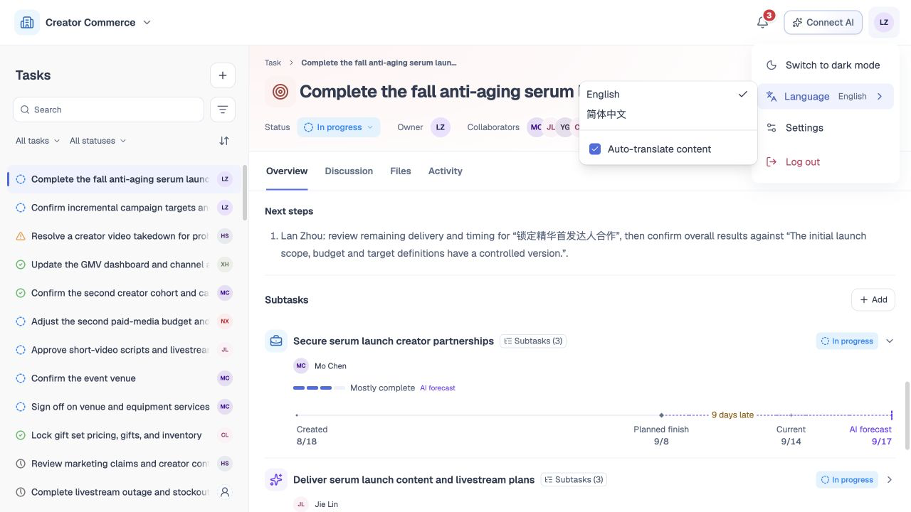

# 语言、翻译与时区

## 1. 目的

优先提供英文体验，同时支持简体中文。

## 2. 范围和边界

覆盖界面语言、协作内容翻译、日期与时区；业务原文独立保存。

## 3. 详细功能设计

### 3.1 切换语言

1. 认证页沿用语言偏好，默认英文。
2. 登录后打开账户菜单，选择 **English／简体中文**。
3. 更新界面语言，保留当前任务与草稿，术语保持一致。

### 3.2 内容呈现

界面按所选语言显示，用户原文不改写；讨论标记译文并提供原文入口，文件保持原文。

### 3.3 自动翻译协作内容

可开启或关闭协作内容翻译，也可单独查看任务和讨论原文。默认开启、按设备保存，不影响界面语言；编辑始终使用原文。

- 仅翻译用户有权查看的内容，按目标语言与原文版本缓存译文。
- 翻译时显示加载状态；失败保留原文并提示，可重试。
- 翻译不得改变金额、币种、身份或引用。

*FIG-INT-001 · 账户菜单：切换语言与自动翻译偏好。*

### 3.4 日期与时区

#### 日期显示

- 任务截止日期作为日历日期保存，例如 9 月 30 日在不同地区仍显示 9 月 30 日，不因时区偏移变成前一天。
- 消息、创建、修改等具体时间点统一保存，按用户浏览器当前时区显示，可查看时区信息。
- 界面语言不决定时区。

#### 团队时区

- 团队时区采用 IANA 时区标识，创建时默认取**创建者**浏览器时区，识别失败才回退 UTC 并提示。
- 团队管理员可在团队设置修改。
- 今天、逾期、日期筛选和截止提醒均按**团队时区**判断。
- 仅有截止日的任务在该日结束后的次日开始逾期。
- 截止日期不得早于创建时间在**团队时区**对应的日历日，允许同一天或不设置截止。

#### 时区修改后的处理

- 修改**团队时区**不改写已保存的日历日期和时间点。
- 从保存成功起按新时区重新计算相对日期及未来提醒，保留历史活动和已发送**通知**，不重复补发同一提醒。
- 跨夏令时按当地日历计算，不用固定 24 小时代替一天。
- **团队时区**不能随每位成员的设备设置自动变化。

## 4. 功能验收标准

- 切换语言不改变原文、人员关系或日期含义；无译文不冒充已翻译，编辑仍使用原文。
- 不同时区成员打开同一任务，其截止日一致；同一消息显示各自当地时间，但代表同一时刻。
- 团队当天截止的任务在团队次日才逾期，跨夏令时同样成立；改团队时区不改变历史时间点、不重复发提醒。
- 用户设备时区变化不改变团队的“今天”和逾期口径；服务器校验与 Web／CLI 一致。
