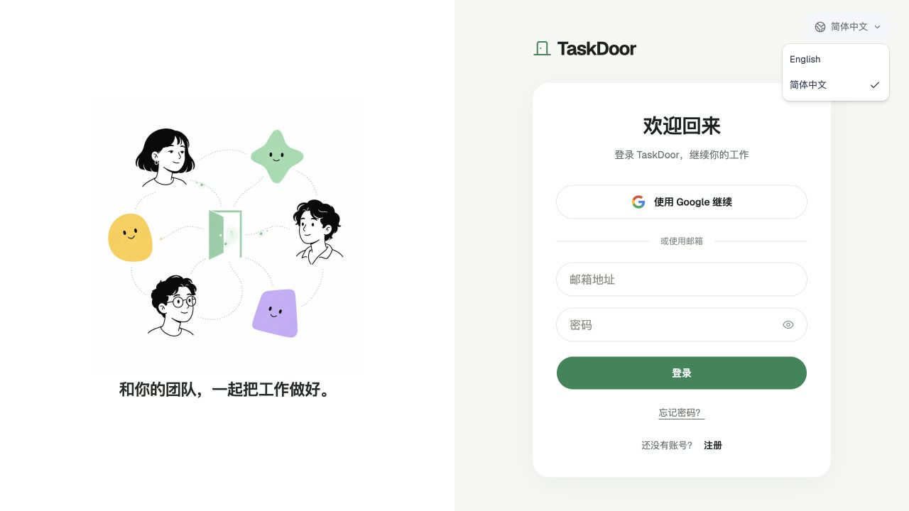

# 语言、翻译与时区

## 1. 目的

优先提供英文体验，同时支持简体中文。

## 2. 范围和边界

覆盖界面语言、讨论区消息翻译、日期与时区；业务原文独立保存。

## 3. 详细功能设计

### 3.1 切换语言

1. 登录、注册、Google 密码设置及找回密码页提供 **English／简体中文**切换入口，无需登录；沿用本设备偏好，首次默认英文。
2. 登录后打开账户菜单，选择 **English／简体中文**。
3. 立即更新界面语言并记住选择；切换认证页语言时保留已输入内容、校验状态、验证码倒计时与邀请上下文，切换工作区语言时保留当前任务与草稿。

*FIG-INT-002 · 认证页语言菜单：选择 English 或简体中文。*

### 3.2 内容呈现

界面文案按所选语言显示；任务标题、目标、任务完成标准及其他业务内容保持原文，语言切换和翻译偏好不改变这些内容。讨论区消息的阅读规则见下节。

### 3.3 自动翻译讨论内容

自动翻译仅作用于**讨论区消息正文**。默认开启，用户可在语言菜单关闭或开启，偏好按设备保存；每条消息标记译文并提供原文切换，编辑始终使用原文。

1. 用户阅读有权查看的消息时，系统按**原文版本和目标语言**查询已记录的译文词条。
2. 已有词条直接复用；仅在缺少对应词条时翻译并保存结果。再次打开、刷新页面或切回同一语言，不重复翻译同一原文。
3. 消息原文修改后按新版本匹配词条，不沿用旧版本译文；切换目标语言使用该语言对应的词条。

翻译不得改变金额、币种、身份或引用，也不改写消息原文、附件名或引用的原始内容。读取译文须沿用消息访问权限；关闭翻译时显示原文，保留已记录词条供再次开启时复用。生成译文时显示加载状态；失败保留原文并提示，可重试，无译文不得标记为已翻译。

### 3.4 日期与时区

#### 日期显示

- 任务截止日期作为日历日期保存，例如 9 月 30 日在不同地区仍显示 9 月 30 日，不因时区偏移变成前一天。
- 消息、创建、修改等具体时间点统一保存，按用户浏览器当前时区显示，可查看时区信息。
- 界面语言不决定时区。

#### 团队时区

- 团队时区采用 IANA 时区标识，创建时默认取**创建者**浏览器时区，识别失败才回退 UTC 并提示。
- 团队管理员可在团队设置修改。
- 今天、逾期、日期筛选和截止提醒均按**团队时区**判断。
- 仅有截止日的任务在该日结束后的次日开始逾期。
- 截止日期不得早于创建时间在**团队时区**对应的日历日，允许同一天或不设置截止。

#### 时区修改后的处理

- 修改**团队时区**不改写已保存的日历日期和时间点。
- 从保存成功起按新时区重新计算相对日期及未来提醒，保留历史活动和已发送**通知**，不重复补发同一提醒。
- 跨夏令时按当地日历计算，不用固定 24 小时代替一天。
- **团队时区**不能随每位成员的设备设置自动变化。

## 4. 功能验收标准

- 登录和注册页无需认证即可切换语言；密码设置页沿用同一偏好，切换不会清空表单或重置流程。

- 在英文界面开启或关闭自动翻译，任务标题、目标和任务完成标准的已保存内容均保持原文，任务详情没有整任务原文／译文切换入口。
- 对同一消息原文和目标语言再次打开、刷新或关闭后重新开启翻译，命中已有词条，不新增翻译请求；修改原文或更换目标语言后不得复用不匹配的词条。
- 无译文不冒充已翻译，消息编辑仍使用原文；失去消息访问权限后，已有词条也不能继续展示消息内容。
- 切换语言不改变人员关系或日期含义。
- 不同时区成员打开同一任务，其截止日一致；同一消息显示各自当地时间，但代表同一时刻。
- 团队当天截止的任务在团队次日才逾期，跨夏令时同样成立；改团队时区不改变历史时间点、不重复发提醒。
- 用户设备时区变化不改变团队的“今天”和逾期口径；服务器校验与 Web／CLI 一致。
