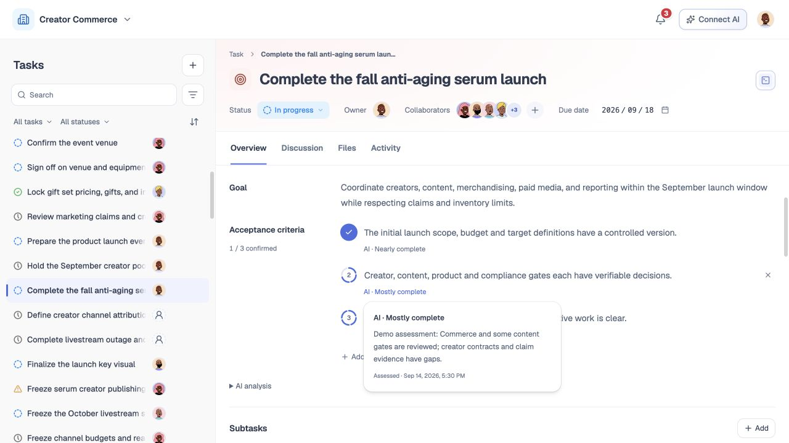

# 任务详情

## 1. 目的

用户在完整宽度的内容区查看任务信息或开展协作，减少左右分栏和额外收起操作。

## 2. 范围和边界

本模块定义任务详情组织方式及完成标准的逐条评估、人工确认。替代此前任务信息与协作双栏、收起偏好和窄屏二级切换。任务状态和工作量进度保持独立；完成标准新增独立确认记录，沿用当前原型任务编辑入口的权限范围。

## 3. 详细功能设计

标题、状态、负责人、参与人和截止日期位于常驻顶部。下方按顺序显示概览、讨论、文件、活动；英文为 Overview、Discussion、Files、Activity。

普通打开任务默认选择概览，包含目标、完成标准、AI 分析、子任务、依赖和标签。AI 分析仍默认折叠。讨论、文件和活动分别占用完整内容区。每次仅显示当前面板，概览、讨论和文件组件在切换时保持挂载，保留编辑状态、草稿和文件选择。

从通知、讨论附件或证据定位时，先打开对应 Tab 再定位具体记录；完成标准、子任务和任务信息定位到概览。记录失效时沿用现有提示，不显示另一任务的数据。空态、加载、失败、权限和过期提示沿用对应模块，不因布局改变而伪造结果。

桌面与窄屏共用同一组 Tab，移除原有分栏控制和“任务／协作”二次切换。Tab 与标题常驻，面板内部滚动。键盘方向键循环切换，Home 到首项、End 到末项；隐藏面板不进入键盘导航。

### 完成标准的编号进度环

每条标准左侧使用四段圆环及序号。AI 评估按与任务进度一致的“少量完成／部分完成／大部分完成／接近完成”梯度亮起，不显示精确百分比或连续百分比弧线。没有依据时圆环不亮，提示“AI 暂无评估”；有效零值表示未形成结果。已有数值记录仅用于兼容映射，不写回为人工确认。

编号环直接执行人工确认。默认展示序号及 AI 梯度环，悬停或键盘聚焦时中心序号变成勾，并以两行提示“AI 分析：当前梯度”和“点击人工确认达成”；已确认时第二行提示“已人工确认 · 点击撤销”，仍保留 AI 来源；点击或按 Enter／Space 直接保存。保存成功后变成实心勾，短暂显示“已人工确认 · 撤销确认”；再次点击已确认圆环可撤销。保存中显示加载标记并禁止重复提交，失败保留原状态并在该条下方提供错误提示，原入口可重试。标题附近按条数统计人工确认数量。

正文下方常驻轻量“AI · 梯度”文字，点击独立打开依据、观察时间；已确认项同时可查看确认人和时间。AI 浮层不承载确认操作，最高 AI 梯度不等于人工验收。行尾仅保留按需出现的删除入口。只读或标准编辑尚未保存时，圆环不能确认，依据仍可查看。

悬停圆环轻微放大，序号与勾交替淡入；按下轻微收缩，保存成功后实心勾与短暂光环反馈。减少动态效果设置下关闭过渡与动画。触屏及窄屏常显独立“确认达成／撤销确认”文字入口，圆环、依据及确认入口至少 44px，不依赖 hover。键盘可直接确认、撤销和独立查看 AI 依据，Escape 关闭依据浮层。

确认与撤销均保存确认人和时间并生成活动记录；保存失败保留原状态并提供重试提示。编辑未保存时不提供确认操作；标准文字变更后原确认及评估失效。当前字符串数组按位置与原文核验，删除或移动导致位置变化的条目需重新确认。只读入口显示环与依据，不提供确认操作。当前原型复用任务本地保存事务，跨设备服务及真实逐条 AI 分析尚未接入。

创建草稿使用编号而非装饰勾，不冒充已经验收。

完成标准示例覆盖全部 232 个内置任务（577 条标准）及防晒衣创建示例主任务、7 个子任务：逐条保存固定的合成评估、双语依据与观察时间，涵盖部分完成、AI 最高档未确认、人工已确认和未知。原有业务场景依据保留；新增覆盖使用明确标为模拟的固定梯度场景，不从任务状态或总工作量反推，也不代表已核验真实交付。示例依据明确标为“示例评估”，不代表真实 AI 服务结果；确认示例保留确认人及时间。GMV 等没有实际结果的数据保持未知，不使用准备工作进度替代。

旧 Mock 仅在任务名称、目标及完整标准与示例匹配且没有确认／评估字段时补齐。已有记录（含显式空数组）、用户编辑、未知任务和已删除任务保留；撤销示例确认后刷新不能补回。创建示例保存后使用同一匹配规则。

### 英文界面截图

*FIG-TD-001 · 当前页面截图：三条完成标准中一条已人工确认，另两条用分段圆环表示 AI 分析梯度，不显示百分比。采集于 2026-09-21，主工作区当前运行页面，1280 × 720。*

*FIG-TD-002 · 当前页面截图：点击 AI 梯度文案查看分析依据与分析时间；图中为演示数据，不代表真实 AI 推理结果。采集于 2026-09-21，主工作区当前运行页面，1280 × 720。*

## 4. 验收标准

- 普通打开默认概览，四个 Tab 均可点击和键盘切换。
- 详情无左右分栏收起按钮，历史折叠设置不影响信息可见性。
- 概览内容完整，讨论附件可自动打开文件 Tab。
- 切换保留草稿与文件选择，不改变任务事实或权限。
- 窄屏使用相同 Tab，中英文均可触达；当前面板独立滚动。

- AI 最高档与人工确认可区分；未知评估不生成数值，确认不修改任务状态或燃起图。
- 确认、撤销、刷新恢复与标准修改失效有效；过期标准不能提交确认。
- 键盘可查看依据和确认，移动端可触达，中英文呈现一致。

- 未修改的示例能显示不同进度弧线、最高档未确认序号与人工确认勾；双语依据可读，迁移不覆盖用户记录。
