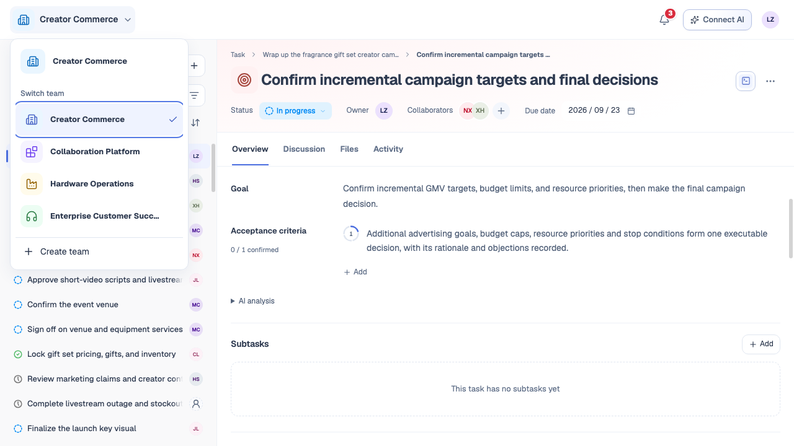
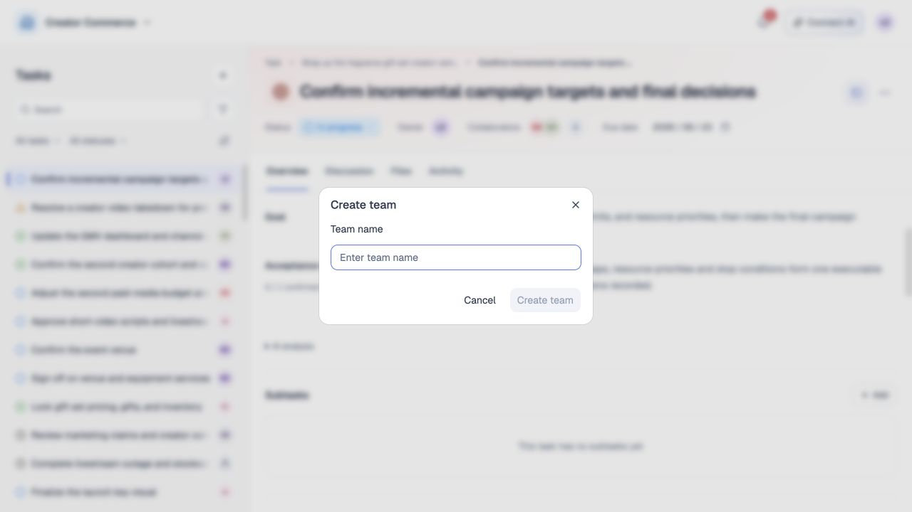
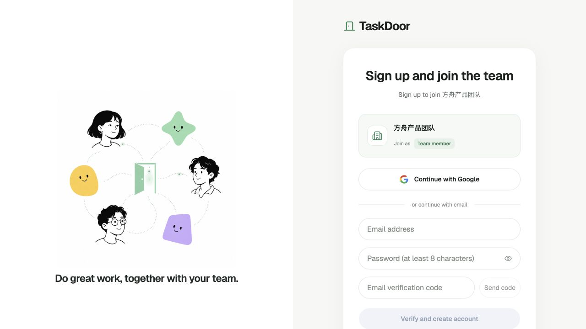
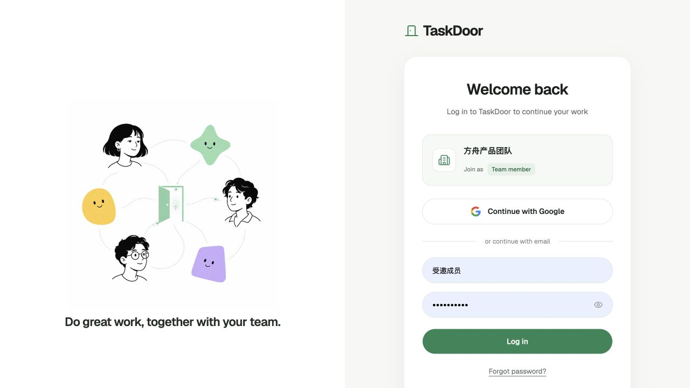
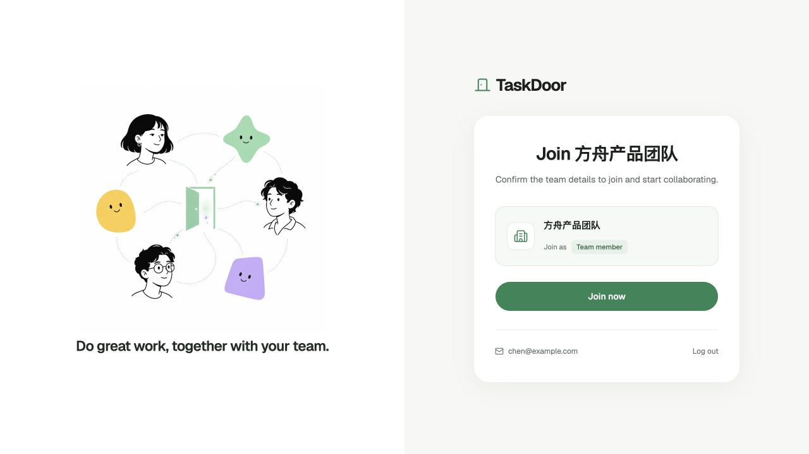

# 团队管理

## 1. 目的

让新用户完成个人设置，创建或加入团队，开始协作。

## 2. 范围和边界

- 支持首次设置、创建团队和邮箱定向邀请；受邀者通过专属邀请链接注册或登录，确认后加入团队。
- 邀请链接与目标团队、受邀邮箱和邀请角色绑定，不能用于加入其他团队或由其他邮箱接受。

## 3. 详细功能设计

### 3.1 新用户首次设置

| 进入情形 | 填写内容 | 提交结果 |
| --- | --- | --- |
| **自行注册** | 个人名称、团队名称 | 点击“创建团队并开始”，进入新团队，创建者为管理员。 |
| **受邀注册** | 个人名称；展示受邀团队名称 | 保存后确认加入，进入受邀团队。 |
| **已有用户** | 沿用个人资料 | 登录原团队，或确认加入其他团队。 |

**填写规则**

- **个人名称**：去除首尾空白后为 1–40 字符。Google 姓名预填、可修改，用户提交后才完成设置。
- **团队名称**：去除首尾空白后为 1–60 字符，由用户填写，不自动生成个人团队名。
- **资料归属**：个人名称按账号保存，加入其他团队沿用。
- **默认值**：头像使用名称首字母；团队时区按[语言、翻译与时区](02-internationalization.md)设置。

**提交结果**

- 创建成功后进入空团队。
- 保存失败保留输入，可重试；重复提交不重复创建团队。
- 移动端保持相同流程，键盘可完成填写、提交及错误定位。

### 3.2 创建更多团队

1. 打开左上角团队切换菜单，点击底部固定的 **创建团队**。
2. 填写团队名称，点击创建。
3. 成功后自动进入空团队，创建者为管理员。

- 每个账号最多创建 **10 个团队**；受邀加入的团队不占创建额度，管理员身份不等于创建者。
- 创建表单不常驻显示团队数量与成员上限说明。达到上限仍显示入口，在表单提示原因并禁用创建。
- 名称为去除首尾空白后的 1–60 字符；保存失败保留输入，不切换团队。
- 重复点击不重复创建；已有团队和资料保持不变。

*FIG-TEAM-005 · 团队菜单底部的创建团队入口。*

*FIG-TEAM-006 · 填写团队名称并创建。*

### 3.3 接受邀请

#### 没有账号：注册后加入

1. 使用受邀邮箱注册：邮箱方式验证邮箱；Google 方式选择同邮箱身份。
2. 设置个人名称，Google 姓名可修改。
3. 核对受邀团队和当前身份，确认加入。
4. 接受成功后成为团队成员，进入该团队工作区。

*FIG-TEAM-003 · 受邀注册页。*

#### 已有账号：登录后加入

1. 登录原账号；已有有效会话时跳过登录。
2. 核对并确认加入受邀团队。
3. 进入该团队，沿用已有个人资料。

*FIG-TEAM-002 · 受邀登录页。*

*FIG-TEAM-004 · 加入确认页。*

**限制与异常**

- 全程保留邀请；**注册或登录成功不等于已加入团队**。
- 受邀用户沿用团队名称和邀请指定的角色，确认后加入。
- 邮箱不符时切换账号；邀请失效时获取新邀请。
- 加入失败保留账号与已保存资料，可继续接受邀请。
- 加入后与待分配任务的衔接见[成员、邀请与任务分工](09-member-collaboration.md)。

### 3.4 中断恢复与无团队状态

- **首次设置未完成**：刷新、退出或再次登录后继续设置，保留有效邀请，不重复注册或自动建团队。
- **自行创建完成**：个人资料和团队均保存成功后，记录引导完成。
- **受邀设置完成**：个人资料保存成功后记录设置完成；确认接受邀请后才建立成员关系。
- **已有用户**：沿用原资料与团队，既有正常使用账号视为已完成设置。
- **没有团队**：显示无团队状态，可创建团队或通过定向邀请加入，个人名称无需重填。
- **邀请失效或邮箱不符**：按邀请错误处理，不自动创建或加入其他团队。

## 4. 功能验收标准

- **自行注册**：提交前没有团队，提交后仅一个空团队，本人为管理员。
- **受邀注册**：填写个人名称后加入指定团队，不出现团队名称输入或个人团队。
- **已有用户受邀**：沿用个人资料，不重复首次设置。
- **失败与恢复**：空白名称不能提交；设置中断后可继续；重试不丢输入、不重复建团队或成员关系。
- **加入权限**：只有受邀邮箱可接受邀请；任务关系按成员模块生效。

- **团队数量**：第 10 个自建团队可创建，第 11 个被阻止；受邀成为管理员不占创建额度。
