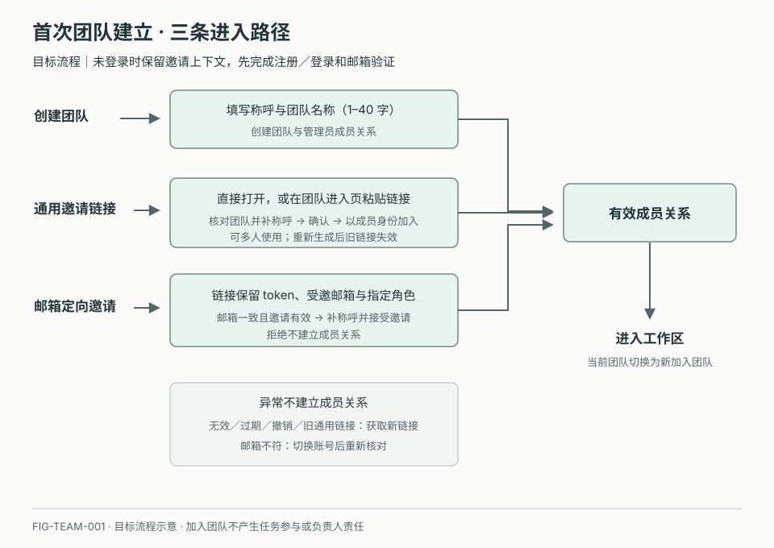

# 首次进入与团队建立

## 1. 目的

让用户明确在哪个团队开始工作。

## 2. 范围和边界

支持创建和受邀加入；当前流程在本地运行，真实投递与成员同步待接入。

## 3. 详细功能设计

### 3.1 创建团队

无团队 → 填写团队信息 → 创建 → 在空工作区新建首个任务。

### 3.2 接受邀请

打开邀请 → 邮箱登录、Google 登录或邮箱验证码注册 → 核对团队与身份 → 确认加入。邮箱注册验证正确后才创建账号，Google 身份验证成功后才登录或创建账号；两条路径均保留邀请上下文。定向邀请必须核对受邀邮箱，不符时切换账号，失效时提示获取新邀请；不会因认证成功自动加入团队。详见[账号与身份](02-account-identity.md)。

*FIG-TEAM-001 · 目标流程：创建者成为管理员；通用链接经登录确认后以成员加入；邮箱定向邀请还需核对受邀邮箱和指定角色。*

## 4. 验收标准

创建新团队不注入演示任务；加入团队不自动成为某项任务的负责人。
