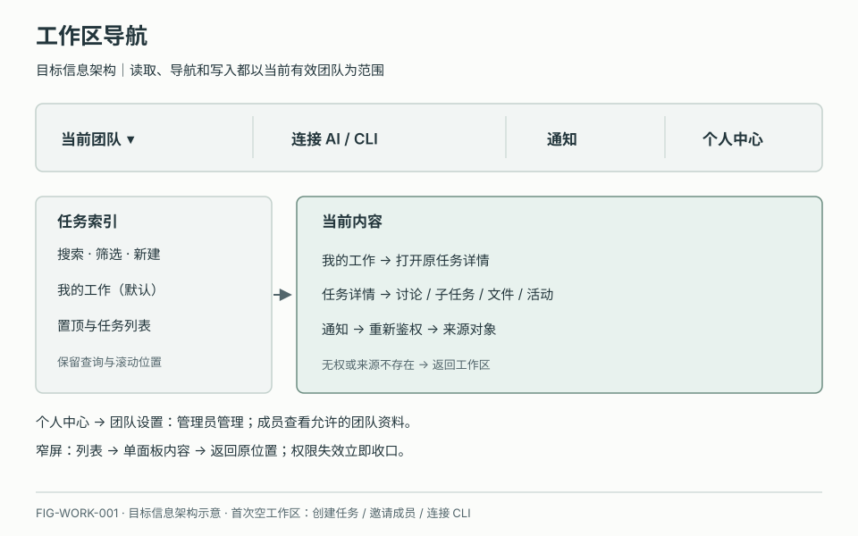
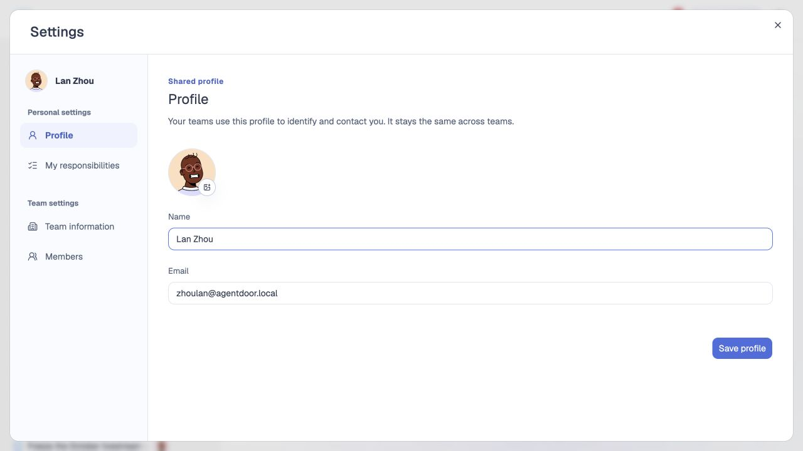
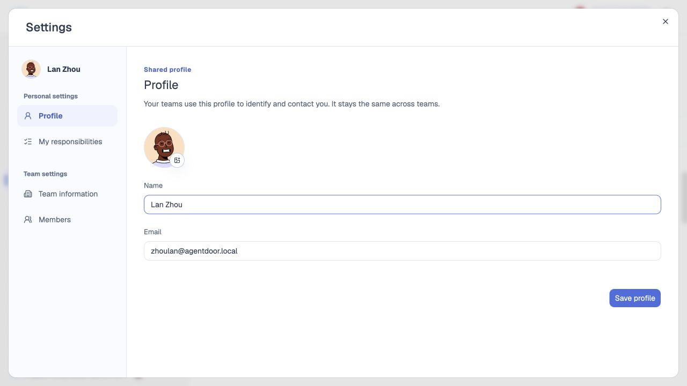
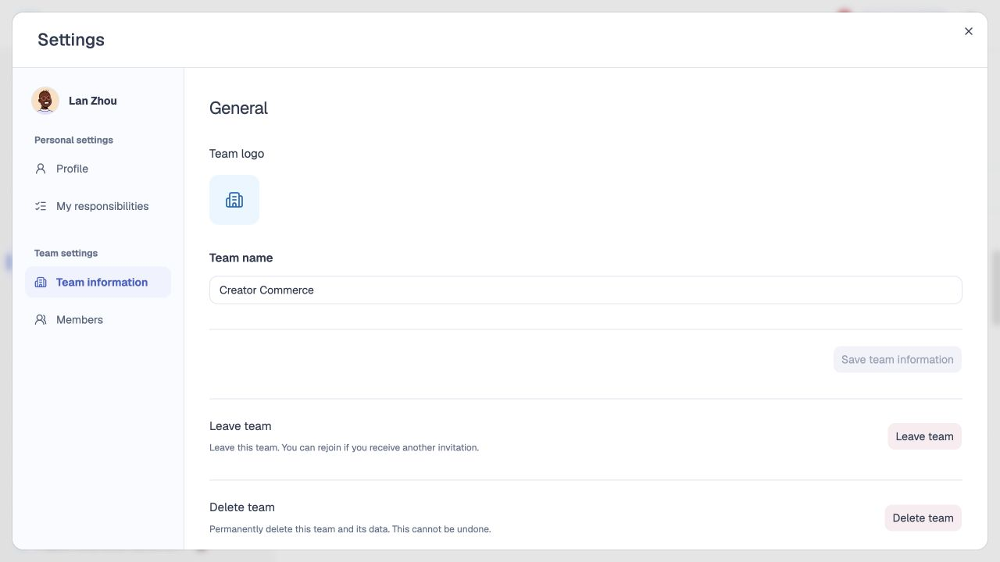

# 工作区与全局导航

## 1. 目的

提供稳定的团队、任务与个人设置入口。

## 2. 范围和边界

顶栏提供全局入口，列表与详情承载任务工作。

## 3. 详细功能设计

### 3.1 进入与切换

进入有效团队 → 查看任务；顶栏可切换团队，无团队则创建或加入。

### 3.2 个人与团队设置

账户菜单 → 设置 → 个人资料、我的责任、团队信息或成员。责任按团队保存，AI 建议确认后才更新。

*FIG-WORK-001 · 工作区导航设计。*

*FIG-WORK-003 · 个人设置与团队设置的导航入口。*

*FIG-WORK-004 · 个人信息 Profile：头像、姓名与邮箱。*

*FIG-WORK-005 · 团队信息 Team information：团队标识、名称与管理入口。*

## 4. 验收标准

切换团队不混入旧团队内容；空工作区提供明确的新建入口。
