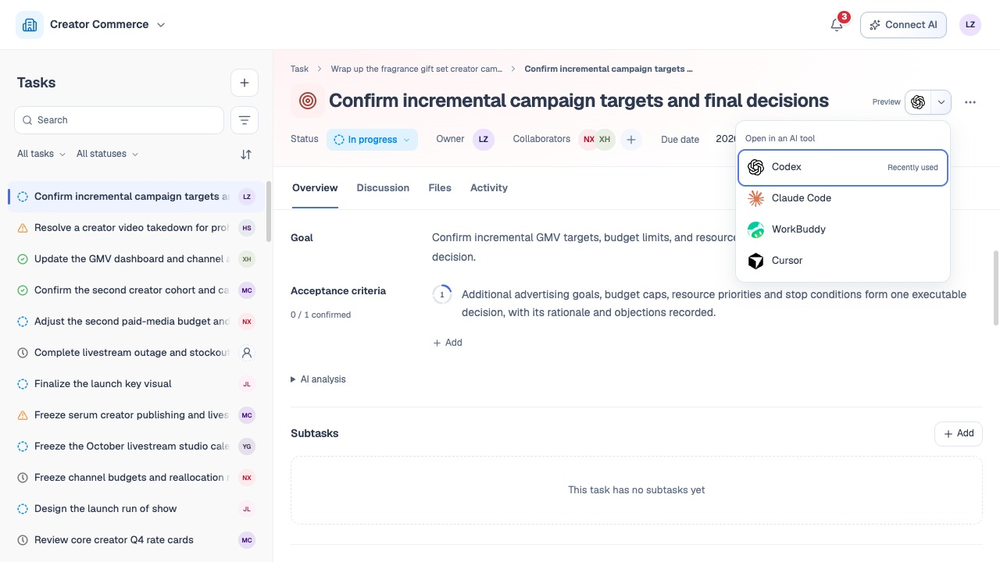

# Agent 与 CLI 连接

## 1. 目的

让用户在本地工具中继续处理同一个任务。

## 2. 范围和边界

支持 CLI 安装、登录授权、任务上下文读取与业务操作。

## 3. 详细功能设计

**命令设计预留**：待 CLI／MCP 整体结构确定后，再补充各命令的参数、返回结果与异常处理；现有示例不作为最终命令定义。

### 3.1 连接流程

1. 在任务中选择 **Codex、Claude Code、WorkBuddy 或 Cursor**；主按钮打开最近使用的工具，下拉菜单用于切换。
2. 通过顶部“连接 AI”查看安装说明，安装 TaskDoor CLI 并登录。
3. 核对带入的任务上下文，在所选工具中继续工作。

*FIG-CLI-005 · 任务内 AI 工具菜单：选择 Codex、Claude Code、WorkBuddy 或 Cursor。*

### 3.2 能力与权限

- 授权后，CLI 覆盖用户在界面中可执行的业务能力，包括读取、对话规划与确认创建、维护任务人员和状态、**人工确认**标准、讨论、文件版本及删除。
- Agent 代表授权用户执行，不因使用 CLI 增加或扩大权限。
- 具体能力以[权限、异常与质量要求](15-permissions-errors-nfr.md)为准，设备授权可撤销。

- 普通操作由用户命令执行，不增加“重要写入”专属审批。
- 创建仍须确认完整方案。
- 任务／文件删除同样先返回影响预览，再以明确确认执行，范围变化重新确认。
- 命令返回真实结果，最新覆盖、**失败**与同次重试规则与 Web 相同。
- 自动 AI 分析只能更新评估，不能借 CLI 自动改变用户状态。

*FIG-CLI-001 · 目标流程：用户在浏览器确认授权，CLI 领取设备凭据；后续每次 API 调用仍重新校验权限。*

*FIG-CLI-002 · 全局连接 AI 指南：Codex 与其他工具的 CLI 安装登录说明。*

*FIG-CLI-003 · 连接 AI 下半页：任务命令示例。*

*FIG-CLI-004 · 连接 AI 底部：文件上传、活动回复与删除命令示例。*

## 4. 功能验收标准

- 同一用户在 Web 可操作的业务均有 CLI 路径，普通参与者从两端均不能删除任务，负责人可确认后删除。
- CLI 与 Web 修改同一字段以后成功保存者为准，不影响其他字段；两端重读同一任务与文件版本。
- 删除未确认或范围变化时不能执行；撤销设备或团队权限后旧凭据不能继续读写。
