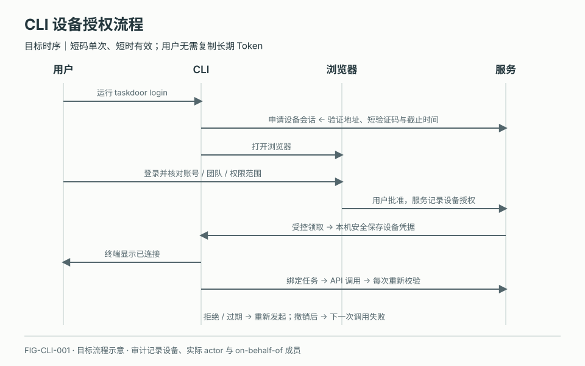
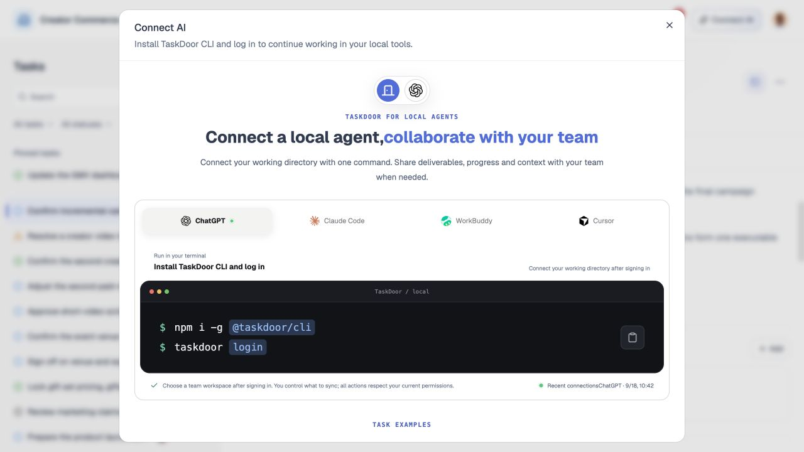
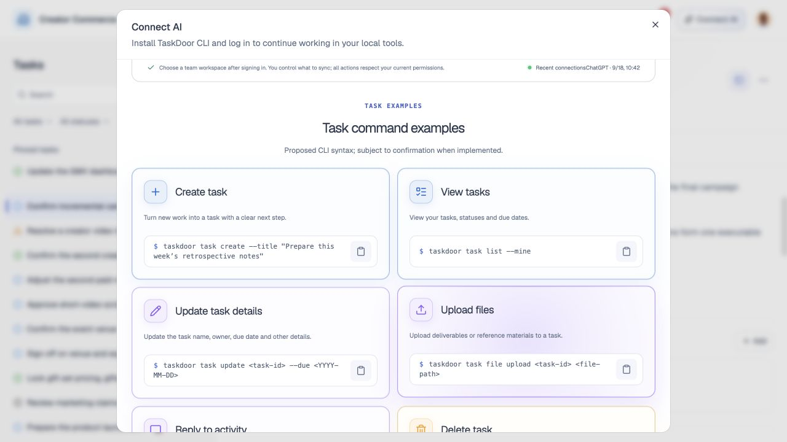
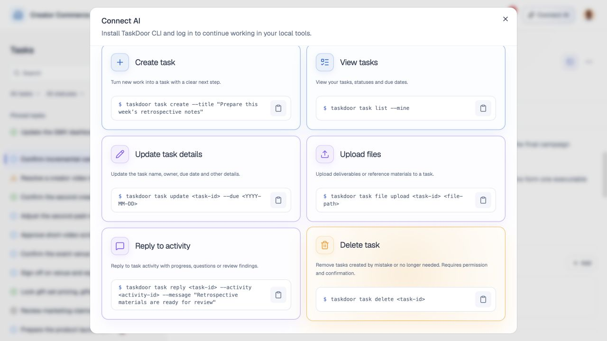

# TaskDoor CLI 连接

## 1. 目的

让用户在本地工具中继续处理同一个任务。

## 2. 范围和边界

当前可查看说明、预览上下文并尝试打开工具；CLI 登录、授权与执行待实现。

## 3. 详细功能设计

### 3.1 连接流程

Connect AI → 选本地 Agent 工具 → 查看安装登录说明 → 核对任务上下文 → 继续工作。

拟定命令：`npm i -g @taskdoor/cli`、`taskdoor login`，以正式发布为准。

### 3.2 正式接入目标

授权后，将成员有权访问的完整任务上下文提供给本地 Agent，包括目标、标准、分工、文件、讨论和进展。用户按需将产出物或需协作的内容回填 TaskDoor；其他成员连接时获取更新后的上下文，继续协作。设备授权可撤销。

*FIG-CLI-001 · 目标流程：用户在浏览器确认授权，CLI 领取设备凭据；后续每次 API 调用仍重新校验权限。*

*FIG-CLI-002 · 连接 AI 弹窗：工具选择与 TaskDoor CLI 安装登录说明。*

*FIG-CLI-003 · 连接 AI 下半页：任务命令示例，属于拟定语法。*

*FIG-CLI-004 · 连接 AI 底部：文件上传、活动回复与删除命令示例。*

## 4. 验收标准

授权与执行结果以实际回执为准；正式接入后 Web 与 CLI 的任务及版本保持一致。
