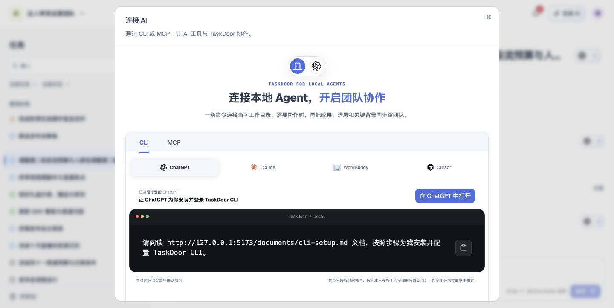
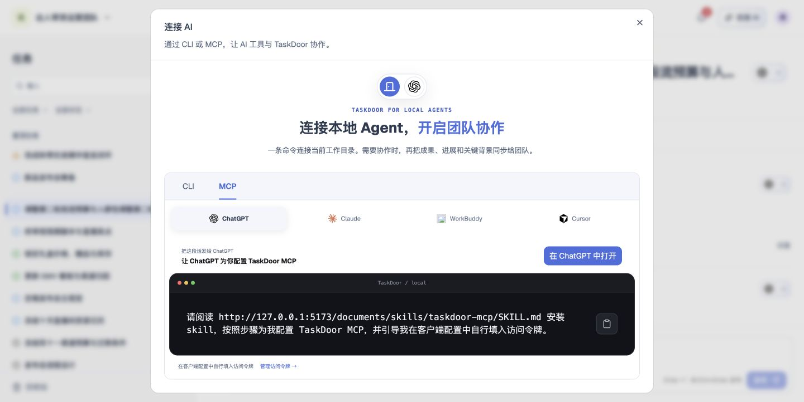
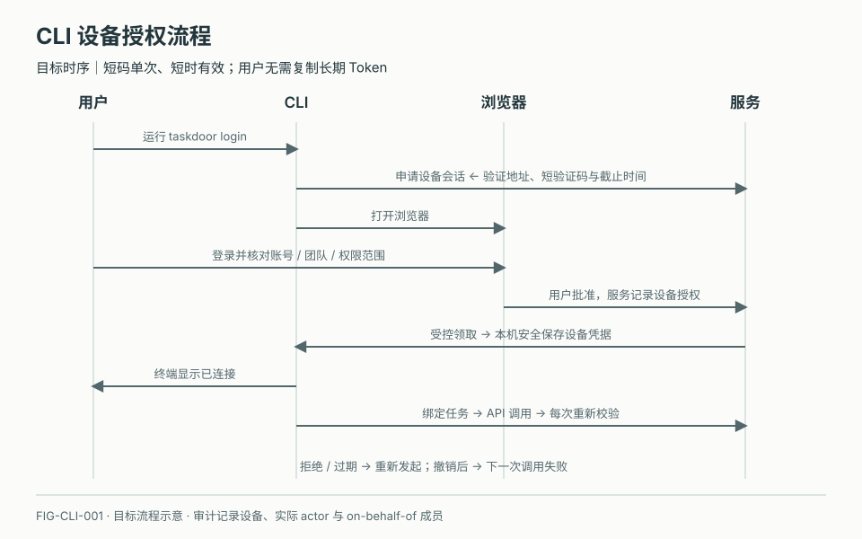

# Agent 与 CLI、MCP 连接

## 1. 目的

让用户通过 CLI 或 MCP，在 AI 工具中继续处理同一个任务。

## 2. 范围和边界

支持 CLI 安装与登录授权、MCP 配置与个人访问令牌认证，以及任务上下文读取与业务操作；两种连接方式共享连接 AI 入口，沿用本人及凭据权限。

## 3. 详细功能设计

**命令设计预留**：连接 AI 页面的常用命令只列出 CLI 已提供的账号与登录状态、工作空间、任务列表与详情、无浏览器设备登录和退出登录命令；其余业务能力的命令参数、返回结果与异常处理待 CLI／MCP 整体结构确定后补充。

### 3.1 连接流程

1. 在任务中选择 **ChatGPT、Claude、WorkBuddy 或 Cursor**；主按钮打开最近使用的工具，下拉菜单用于切换。
2. 通过顶部“连接 AI”选择工具，把安装提示词发给该工具，由它按 TaskDoor 的 CLI 安装文档为用户安装并登录 TaskDoor CLI；登录时在浏览器中确认。
3. 核对带入的任务上下文，在所选工具中继续工作。

*FIG-CLI-007 · CLI 连接：选择 AI 工具并使用安装提示词。*

#### MCP 连接

连接 AI 提供 CLI 与 MCP 两种方式，共用产品选择、安装配置提示词、复制及在工具中打开的布局。MCP 提示词指向当前部署的 `documents/skills/taskdoor-mcp/SKILL.md`，由所选工具按指南协助配置，并引导用户自行在客户端填入访问令牌；页面不展示真实令牌。指南提供服务地址、Bearer 认证和配置模板，令牌仅在创建时显示一次，未保存时需重新创建。连接成功需以客户端真实结果为准。

MCP 令牌提示提供“管理访问令牌”入口，在新标签页直接打开个人设置的访问令牌页面，保留原连接页面。

访问令牌页面说明 MCP 与 API 用途，并提供正式 API 文档入口。

*FIG-CLI-008 · MCP 连接：使用安装 Skill 提示词，并进入访问令牌管理。*

#### 任务与讨论上下文

- 任务入口带入任务 ID、名称、状态，以及已填写的任务目标、完成标准、负责人和截止时间；完成标准逐项编号，空目标或空标准省略，不附带参与人、标签或父任务详情。
- 讨论入口带入任务 ID、任务名称、已填写的任务目标与完成标准、当前记录的讨论 ID、作者和已保存的发布时间，以及当前记录内容；回复也使用自身的讨论 ID 获取信息，不另带回复 ID。回复草稿带入草稿内容，并明确未发送。
- 不预先带入整串回复或附件内容。工具按用户要求，通过 TaskDoor CLI 按 ID 获取最新详情，访问仍遵循用户权限。
- 带入内容是待分析材料，不自动发送、发布或写回，不预设用户要完成的操作。

#### 连接 AI 页面

- 每个工具使用同一条安装提示词，内容指向当前部署的 CLI 安装文档；可直接复制，或点击“在 {工具} 中打开”。
- “在 {工具} 中打开”先复制提示词，再尝试唤起该工具并带入提示词，不代为发送。结果如实提示：复制失败时不尝试打开；浏览器未能打开时提示手动粘贴；已尝试打开时说明无法确认客户端是否启动。
- 登录只授权用户本人账号，按其在各工作空间的权限访问；工作空间在后续命令中指定，工作空间参数不改变登录授权。
- TaskDoor 看不到用户本机的客户端，没有连接回执时不显示“已连接”或“未连接”。

### 3.2 能力与权限

- 授权后，CLI 覆盖用户在界面中可执行的业务能力，包括读取、对话规划与确认创建、维护任务人员和状态、**人工确认**标准、讨论、文件版本及删除。
- Agent 代表授权用户执行，不因使用 CLI 增加或扩大权限。
- 具体能力以[权限、异常与质量要求](15-permissions-errors-nfr.md)为准，设备授权可撤销。

- 普通操作由用户命令执行，不增加“重要写入”专属审批。
- 创建仍须确认完整方案。
- 任务／文件删除同样先返回影响预览，再以明确确认执行，范围变化重新确认。
- 命令返回真实结果，最新覆盖、**失败**与同次重试规则与 Web 相同。
- 自动 AI 分析只能更新评估，不能借 CLI 自动改变用户状态。

*FIG-CLI-001 · 目标流程：用户在浏览器确认授权，CLI 领取设备凭据；后续每次 API 调用仍重新校验权限。*

### 3.3 访问令牌

个人访问令牌的创建、范围、有效期和删除规则见设置分组的[访问令牌](21-access-tokens.md)。

## 4. 功能验收标准

- 同一用户在 Web 可操作的业务均有 CLI 路径，普通参与者从两端均不能删除任务，负责人可确认后删除。
- CLI 与 Web 修改同一字段以后成功保存者为准，不影响其他字段；两端重读同一任务与文件版本。
- 删除未确认或范围变化时不能执行；撤销设备或团队权限后旧凭据不能继续读写。
- 连接 AI 页面“在 {工具} 中打开”复制失败时不唤起工具；唤起成功或失败均如实提示，没有连接回执时不显示连接状态。
- 访问令牌只对本人可见；名称为空、未选操作范围、指定团队时未选团队、限定任务时未选任务或有效期超过 365 天时不能创建；令牌值只在创建成功时显示一次；删除后立即失效。
- 指定多个团队时不能限定任务；换选团队会清空已选任务。
