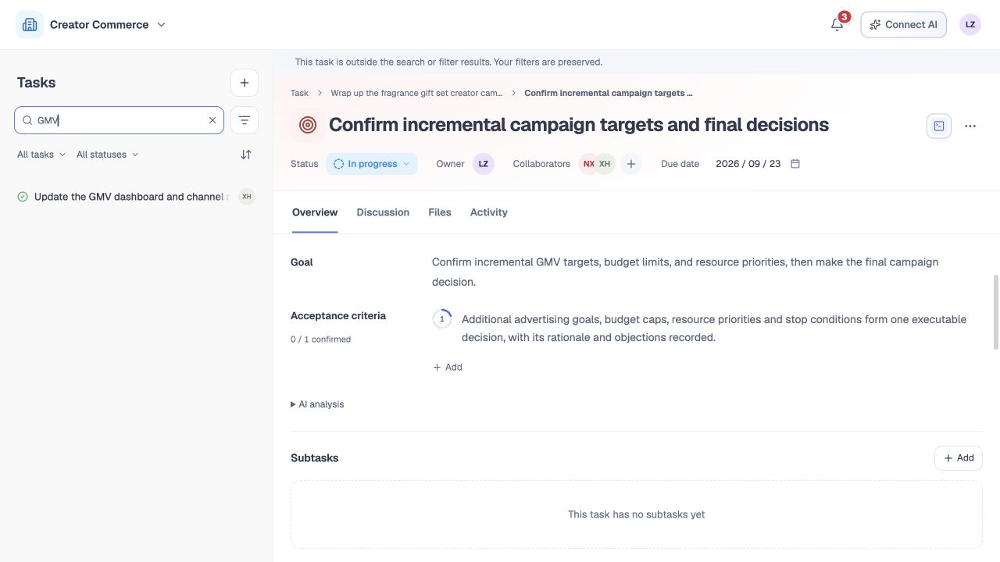
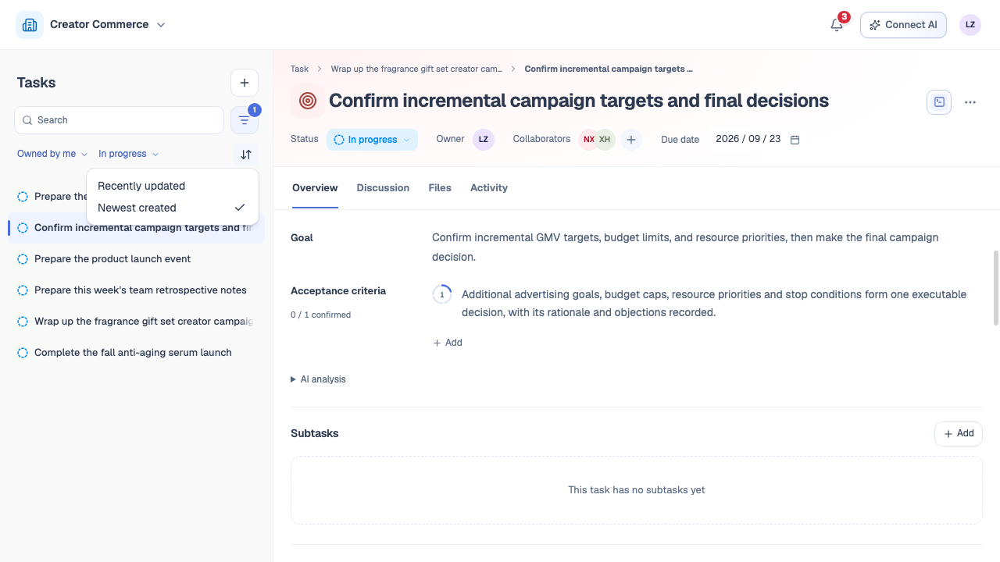
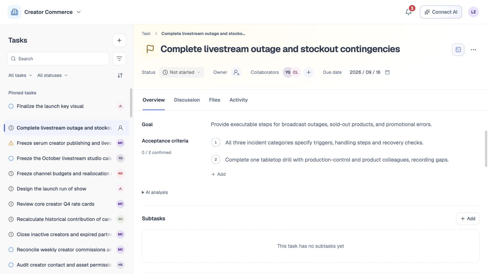

# 任务列表

## 1. 目的

快速找到并进入需要处理的任务。

## 2. 范围和边界

包含搜索、范围、状态、标签、日期、排序与个人置顶。

## 3. 详细功能设计

### 3.1 查找任务

| 操作 | 选项 | 结果 |
| --- | --- | --- |
| **任务范围** | 全部任务／我负责的／我参与的 | “我负责的”只显示当前用户为负责人的任务；“我参与的”显示当前用户为参与者的任务。 |
| **任务状态** | 待开始／进行中／待审核／已阻塞／已完成／已取消 | 支持多选；选择“全部状态”清除状态条件。 |
| **任务排序** | 最近更新／最新创建 | 默认按最近更新时间倒序；切换为最新创建后按创建时间倒序。 |

- 范围、状态、名称、标签和日期按交集筛选；排序只改变结果顺序。切换任一条件时保留其他条件，并立即更新结果和数量。
- 日期按团队时区解释；无结果时可清除筛选条件。

**当前详情不在结果中**

- 右侧继续显示当前任务并保留未保存内容，详情顶部提示“当前任务不在搜索或筛选结果中，筛选条件已保留”。
- 左侧按筛选条件刷新且不选中任务。打开左侧其他任务后，右侧切换到该任务；当前任务重新符合条件时，恢复列表选中状态。

*FIG-LIST-004 · 当前详情不在搜索或筛选结果中。*

*FIG-LIST-003 · 任务范围、状态与排序组合。*

从面包屑或关联任务切换详情时，左侧自动将选中任务滚动到可见位置；已在可见区域则保持位置。目标不在筛选结果中时，沿用上述范围外规则。

### 3.2 置顶任务

用户可将任务置顶。置顶任务显示在列表顶部的“置顶任务”区域；取消置顶后回到普通任务列表。置顶任务只出现一次，仍受搜索和筛选约束。

*FIG-LIST-002 · 置顶任务区域。*

## 4. 功能验收标准

- 可组合选择“我负责的”、一个或多个任务状态及排序方式；结果、数量和选中状态同步更新。
- 排序不清除范围、状态、搜索及高级筛选条件，也不改变任务数据。
- 当前详情不在结果中时，筛选条件、右侧详情和未保存内容保持，详情顶部显示提示，左侧无选中项。
- 置顶仅影响本人且不绕过筛选。
