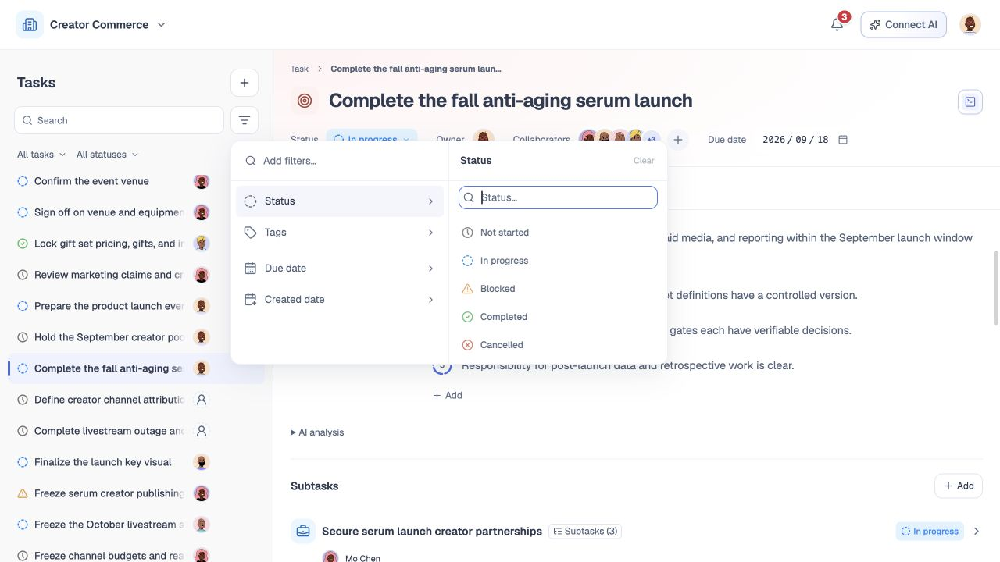

# 任务列表

## 1. 目的

快速找到并进入需要处理的任务。

## 2. 范围和边界

包含搜索、范围、状态、标签、日期、排序与个人置顶；当前使用本地任务集合。

## 3. 详细功能设计

### 3.1 查找任务

选范围（全部／我负责／我参与）→ 搜名称 → 按状态、标签、日期筛选 → 打开任务。

默认最近更新，可改最新创建；无结果可清除条件。

### 3.2 持续关注

悬停行可置顶或打开更多操作，长标题缓慢滚动。置顶只在顶部出现一次，仍受搜索与筛选约束。

*FIG-LIST-002 · 常显搜索、范围、状态与高级筛选面板。*

## 4. 验收标准

列表与详情一致；置顶仅影响本人。服务端分页、跨端偏好同步待接入。
