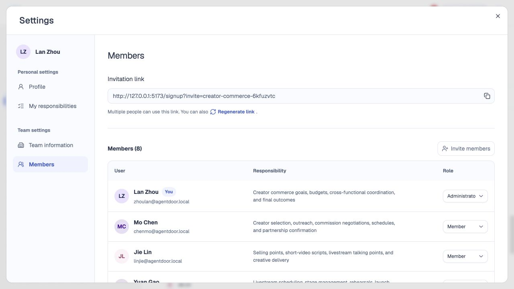
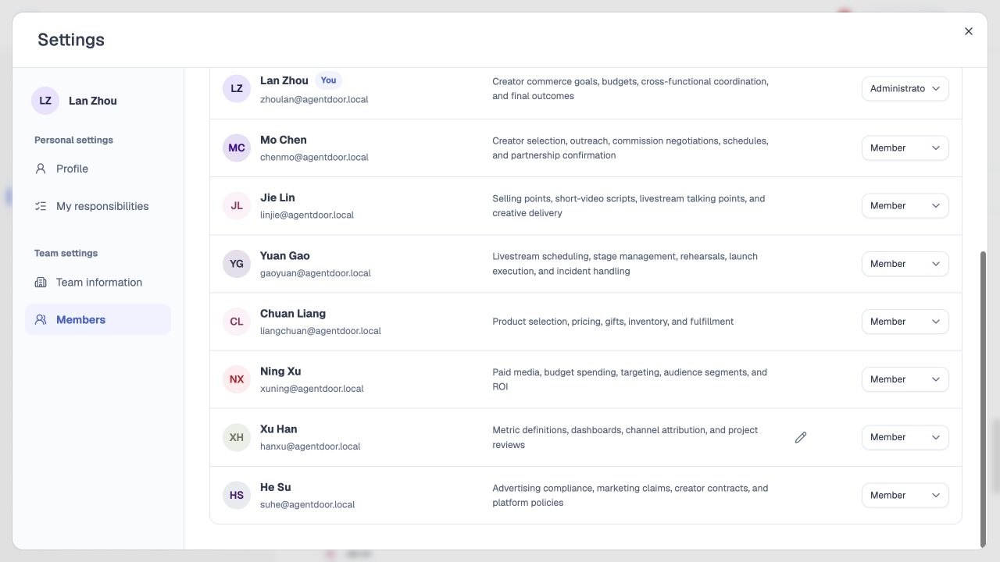

# 成员、邀请与任务分工

## 1. 目的

让合适的人加入团队，并明确各自的任务责任。

## 2. 范围和边界

- 支持邮箱定向团队邀请；团队设置、任务创建和任务详情均可发起，受邀者通过专属邀请链接注册或登录后确认加入。
- 邀请先建立团队成员关系；任务**负责人**和参与者按 3.2 的任务人员规则生效，不增加独立的任务邀请接受或接手审批。
- 团队管理权限与任务**负责人**身份分开，具体权限归模块 15。

## 3. 详细功能设计

### 3.1 邀请加入团队

- 团队设置、任务创建和任务详情使用同一邀请表单：填写邮箱、选填名称，选择**成员／管理员**，默认成员。
- 仅团队管理员可发起邀请并选择角色；受邀者接受后按所选角色加入。团队角色不代替任务负责人或参与者身份。
- 邀请状态使用待加入、已加入、已拒绝、已撤销、已过期。
- 界面上的“待接受”仅指团队邀请。
- 有效邀请默认保留 **7 天**，服务端返回到期时间。
- 受邀邮箱经登录或注册验证并确认后成为团队成员。

#### 人数上限

- 每个团队最多 **50 人**，管理员、成员和有效的待接受邀请共同占用名额。
- 已加入成员离开或被移除后释放名额；邀请被撤销、拒绝或过期后释放名额。
- 同一邮箱重复邀请不重复占位，接受有效邀请不额外占位。
- 达到上限保留邀请入口，提示人数限制并阻止新增邀请；团队设置与任务内邀请使用同一规则。
- 提交邀请和接受邀请时再次校验，不能因并发操作超过上限。

#### 重复邀请与失效

同一团队、同一邮箱只保留一份有效邀请；已是成员直接选择，不重复邀请。重新发送成功后旧链接失效，失败不撤销仍有效的旧邀请；拒绝、撤销或过期不能加入。重复接受返回原加入结果，不重复建立成员关系。

### 3.2 加入任务与维护人员

- 从团队有效成员中选择**负责人**或参与者，保存后直接生效，不要求对方再次接受。
- **负责人**至多一人，可未分配。
- **负责人**不在参与者列表重复出现。
- **创建者**的默认参与规则见[任务创建](07-task-creation.md)。
- 人员通过普通编辑维护，不提供独立的责任转交申请、接手审批或交接流程。

#### 待加入人员

- 从任务创建或详情邀请团队外人员时，记录其受邀邮箱及待加入的任务位置，不冒充正式成员或提前授予任务访问。
- 团队邀请接受后，若任务已创建、该选择仍有效且发起者仍有维护权限，则自动落实原**参与者**选择。
- **负责人**位置仅在仍未分配时生效，不覆盖期间已选的其他负责人。
- 选择已删除、任务已删除或发起者失权时，不再自动加入任务。

#### 邀请与任务创建顺序

邀请先被接受而任务尚未创建时，当前方案显示该人为团队成员，仍须确认方案才建立任务关系；方案已丢弃则只加入团队。加入团队本身不自动加入所有任务，只落实上述明确保存的选择。

### 3.3 按责任域推荐人员

根据任务目标、任务完成标准及所需工作，对照当前团队成员已填写或确认的责任域，推荐负责人和参与者。推荐程度使用高／中／低，并能查看具体匹配原因，例如“负责渠道投放，与本任务的投放执行匹配”。

#### 推荐限制

- 推荐不代表能力、绩效、可用时间或本人已同意。
- 不按在线时长或任务数量推断。
- 责任信息缺失时不编造匹配依据，允许人工选择或未分配。
- AI 推荐本身不保存人员关系。
- 只有用户确认后的责任更新才用于后续推荐，方案中的最终选择由用户决定。

*FIG-MEMBER-003 · 本地成员页；团队管理身份不等于任务权限。*

*FIG-MEMBER-004 · 团队成员分工。*

## 4. 功能验收标准

- 团队与任务内邀请均显示名称、邮箱和角色；角色默认成员，选择管理员后接受邀请以管理员身份加入。错邮箱、失效链接均不能加入。
- 选择有效成员并保存后直接进入任务，不出现任务待接受／接手按钮。
- 待加入人员在接受团队邀请前不能读取任务；加入后只落实仍有效的选择，已被占用的负责人位置不被覆盖。
- 推荐显示责任域依据，责任信息不足时允许未分配；推荐结果不自动写入任务。

- **成员数量**：49 人时可邀请 1 人，第 51 个名额被拒绝；过期邀请释放名额，接受有效邀请不重复计数。
