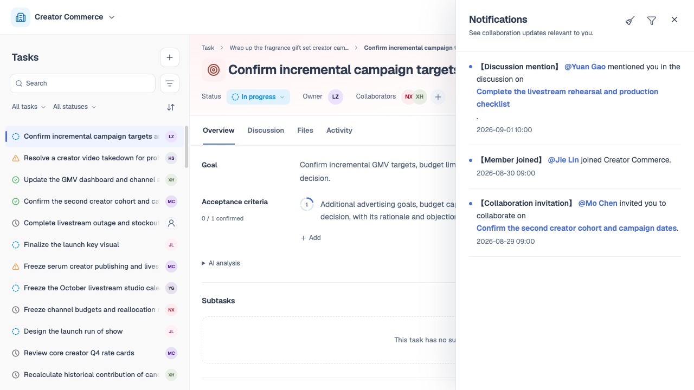

# 讨论、通知与活动

## 1. 目的

让团队沟通、待处理提醒和变更记录各有明确入口。

## 2. 范围和边界

讨论用于交流，通知提醒处理，活动追溯变化。

## 3. 详细功能设计

### 3.1 讨论与引用

- 任务成员可发讨论、回复、@ 提及和引用文件。
- 讨论作者可编辑或删除自己的发言，其他成员不能改写他人发言。
- 删除原消息后保留回复结构与“原消息已删除”提示，不提供恢复。
- 文件引用固定当时版本，按[文件与成果提交](11-files-local-commits.md)查看。

@ 只选择有权读取该任务的团队成员，不因提及扩大权限。活动是只读变更记录，不能由用户或 Agent 随意编辑删除。

*FIG-COLLAB-001 · 任务讨论：交流进展、回复成员并查看附件。*

### 3.2 通知事件与接收人

本期业务通知进入站内通知中心；团队邀请另发邮件，未注册者通过邮件继续加入。不新增其他事件邮件订阅。任务成员指负责人和参与者，下表接收人默认排除操作者本人。

| 事件 | 接收人 | 打开位置 |
| --- | --- | --- |
| 团队邀请发出／重发 | 受邀邮箱；账号存在时同时形成站内提醒 | 同一团队邀请确认 |
| 接受／拒绝团队邀请 | 邀请发起人；接受后的成员加入消息与下条合并 | 邀请结果或成员列表 |
| 成员加入团队 | 团队其他有效成员 | 成员列表 |
| 成员离开或被移出团队 | 团队其他有效成员；被移除者收到不含后续团队数据的结果说明 | 成员列表或结果说明 |
| 设置／修改负责人、加入／移出参与者 | 变更前后任务成员的并集；被移出者只看结果说明 | 任务或移出说明 |
| 任务状态改变 | 当前任务成员 | 任务及状态变更记录 |
| 目标、任务完成标准、截止日期改变 | 当前任务成员 | 任务中的对应内容 |
| 人工确认／撤销标准 | 当前任务成员 | 对应标准 |
| 发布讨论 | 当前任务成员 | 对应讨论 |
| 回复或 @ 提及 | 被回复者、被提及者；与同一条讨论提醒合并 | 对应消息 |
| 新增文件／文件版本或删除文件 | 受影响任务的成员 | 对应版本或删除结果 |
| 新增／删除子任务 | 父任务成员；删除时合并通知被删分支成员 | 父任务或删除结果 |
| 删除任务及后代 | 被删除范围的任务成员 | 删除结果说明 |
| AI 自动分析完成、只读访问、置顶、通知已读 | 不发通知 | 在原任务内更新即可 |

*FIG-COLLAB-002 · 通知中心：查看讨论提及、成员加入和协作邀请。*

### 3.3 合并与已读

- 同一次事件、同一人只生成一条提醒。
- 一次保存改多个字段合并，回复与 @ 合并，多层任务创建或删除按**同一次操作**汇总。
- 人员退出引起的批量关系清空合并提醒，避免按任务逐条轰炸。
- 重试不重复发**通知**，业务未成功不发成功通知。
- 投递**失败**不回滚已保存的任务或讨论。

通知可筛选全部、未读、已读，打开后标记已读，支持全部标为已读。已读不等于确认任务、接受责任或修改状态。打开时校验当前访问权；来源删除或失权只显示必要结果，不继续暴露正文。

### 3.4 活动记录

- 活动按时间和类型记录已保存的字段、人员、状态、**人工确认**、文件及删除等业务变化，可返回对应来源。
- 讨论在讨论区维护，不把 AI 建议或**通知**状态当成任务事实。
- 无实际变化不产生新活动。
- 活动与**通知**独立，通知清理不删除业务记录。

*FIG-COLLAB-003 · 任务活动：按时间查看任务变更记录。*

## 4. 功能验收标准

- 一条同时回复并 @ 同一人的消息只产生一条提醒；同次请求重试不重复消息或通知。
- 添加有效成员立即生效并通知，无需通过通知再接受任务；待加入人员在加入前不收到任务正文。
- 被移出后只能查看移出结果，不能通过旧通知读取任务；标为已读不改变任何业务状态。
- 发布讨论或修改任务成功但通知投递失败时，原内容仍保存；未成功写入不生成成功提醒。
- 删除他人讨论被拒绝；删除自己的原讨论不删除其他人的回复，也不提供恢复入口。
