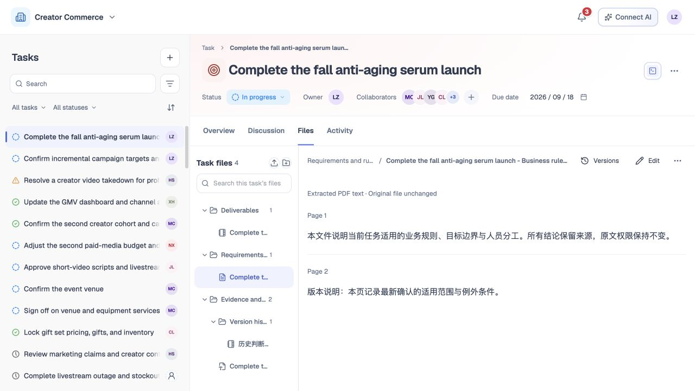

# 文件与成果提交

## 1. 目的

让任务资料与交付成果集中保存、查阅和讨论。

## 2. 范围和边界

覆盖文件上传、预览、编辑、版本管理及成果提交。

## 3. 详细功能设计

### 3.1 文件与版本

- **默认**打开文件最新可用版本。
- 编辑保存或上传新内容生成新版本，保留历史版本号、提交人和时间。
- 可以查看历史版本，但本期不提供版本回滚或已删除文件恢复。
- 上传／处理中的版本不覆盖当前可用版本，**失败**保留原版本。

- 讨论、任务完成标准依据和正式提交引用明确的文件 ID 与版本 ID，并显示引用版本号。
- 点击定位到当时引用的版本。
- 有新版时提供“查看**最新版本**”，不静默把引用改成新版。
- 文件版本可查看其在当前用户有权任务中的引用位置，不暴露无权任务。
- 删除文件或解除关联的影响归[删除与数据保留](13-deletion-recovery-retention.md)。

*FIG-FILES-001 · 任务文件：从文件树选择资料并预览内容。*

### 3.2 回填产出与正式提交

将 Agent 产出保存为任务文件，将进展和协作问题发到讨论，成员可继续使用。可分阶段回填；文件上传不是正式提交，也不自动完成任务。

- 正式提交前核对说明与固定文件版本，成功后保持不可改写。
- 更正通过新增提交并关联被替代提交完成，不能修改旧提交引用的版本。
- 暂存的正式提交说明与创建对话中的待确认方案是不同对象，不由“退出创建对话即丢弃方案”规则混同处理。

## 4. 功能验收标准

- 保存文件 v2 后默认显示 v2，先前引用 v1 的讨论仍打开 v1，并提示存在新版。
- 新版本上传失败时 v1 仍可用；同次重试不产生重复版本，处理中文件不能作为成功提交证据。
- 历史版本只读；正式提交保留固定引用，不被后续文件编辑或“最新覆盖”改写。
- 文件删除后不显示恢复／撤销入口，失效引用按删除规则显示缺口。
