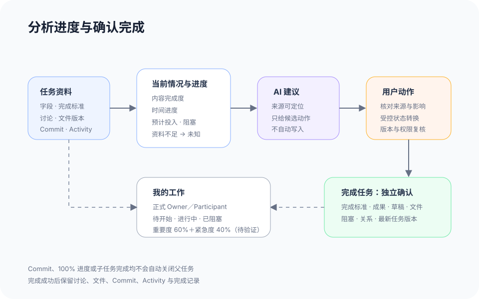

# 任务推进与结果收口

## 1. 目的

帮助用户判断还差什么，并由人确认结果是否达成。

## 2. 范围和边界

当前提供演示评估与历史；AI 不自动改状态或完成任务，完整完成核对服务待接入。

## 3. 详细功能设计

### 3.1 查看进度

展开 AI 分析 → 查看进度、现状、下一步 → 结合标准、讨论、文件核对；无依据则未知。

### 3.2 确认结果

标准确认与状态修改分开。当前直接更新本地状态；上线目标：核对标准、成果、遗留事项 → 完成 → 保留历史。

### 3.3 个人工作安排

目标能力：按本人负责／参与的工作建议优先顺序、分析责任；责任变更须用户确认。

*FIG-PROGRESS-001 · 进度分析与完成确认流程（上线目标）。*

## 4. 验收标准

AI 评估、人工确认和时间进度不混淆；文件提交或子任务完成不自动关闭父任务。
