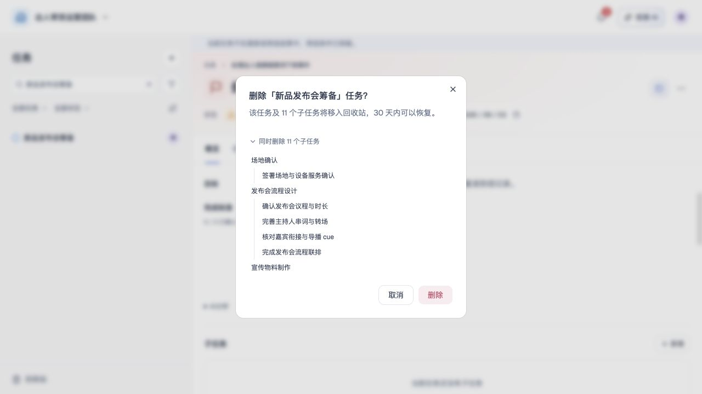
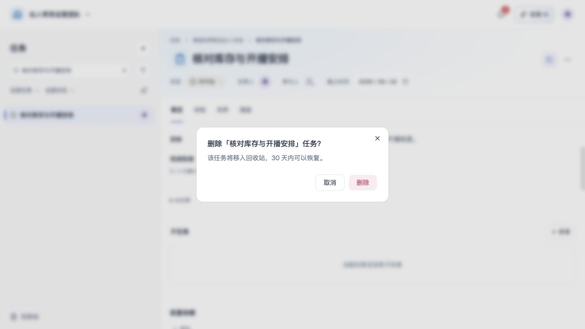
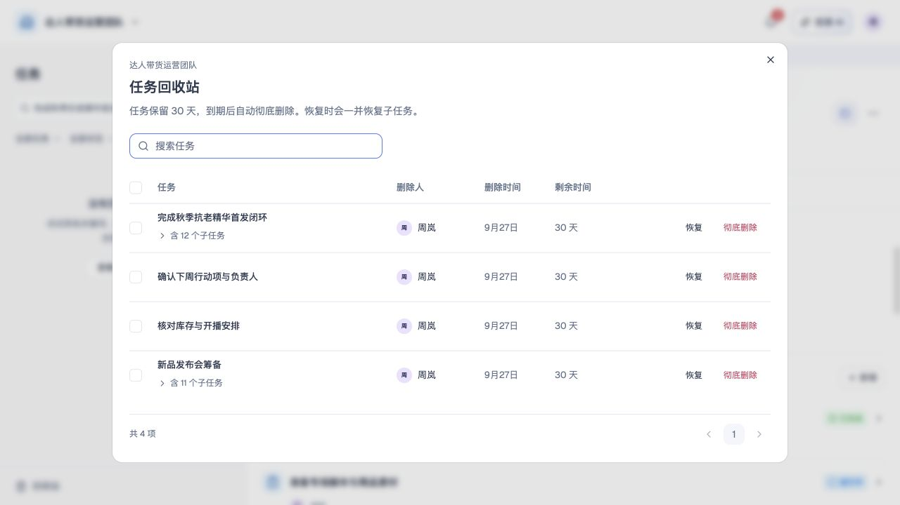
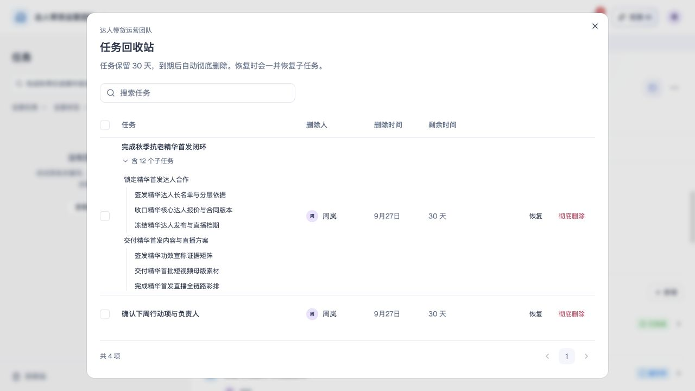
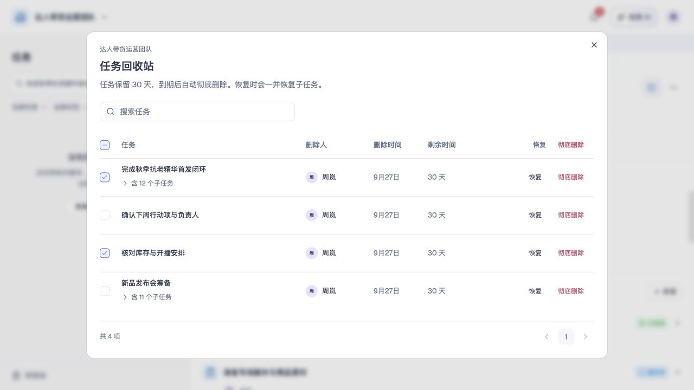
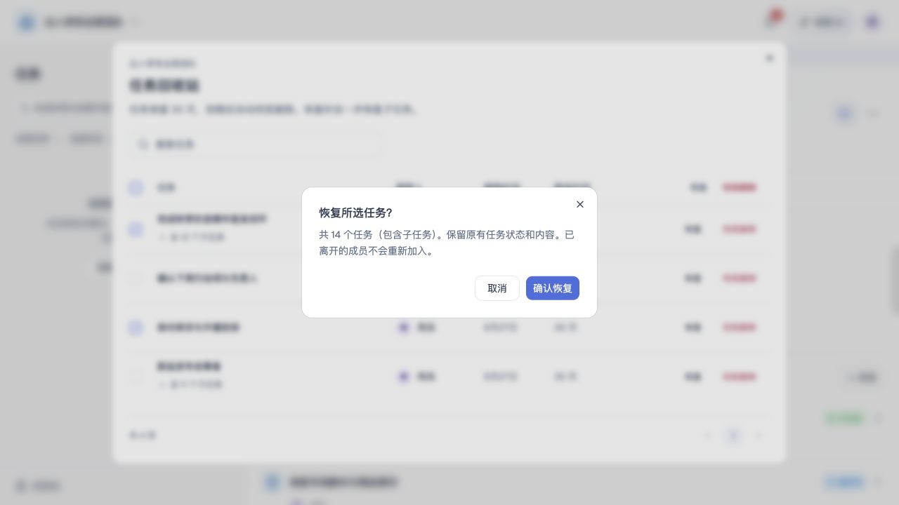
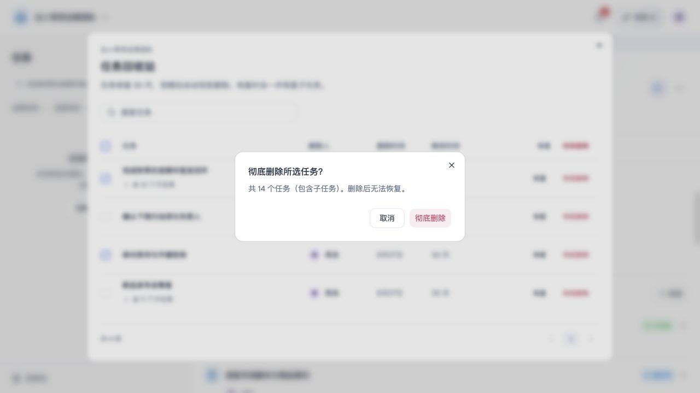
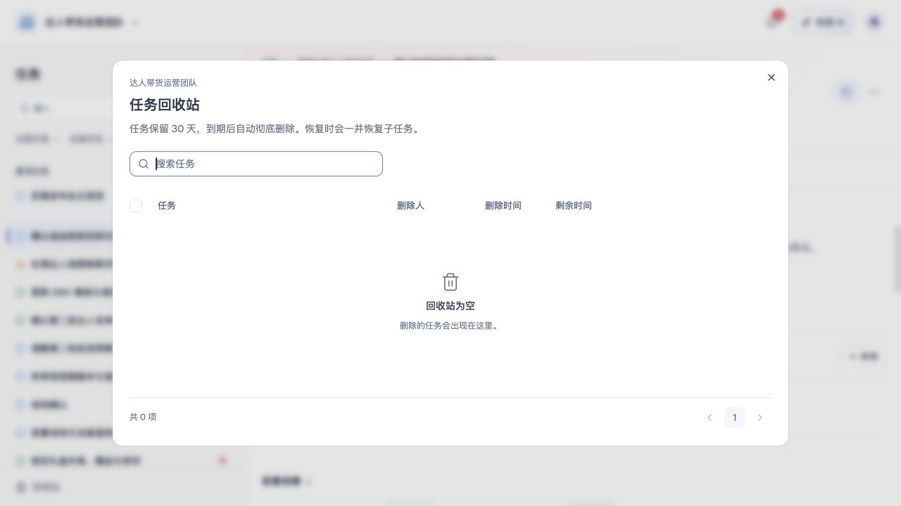

# 删除与数据保留

## 1. 目的

让误删的任务和团队可以找回，同时清楚告知保留期限和彻底删除的影响。

## 2. 范围和边界

- 任务删除后进入所属团队回收站，保留 **30 天**；到期或主动彻底删除后不可恢复。
- 团队删除后保留 **30 天**，期间拥有者可在个人设置的“我的团队”中恢复；超过 30 天永久删除，不可恢复。
- 文件删除不可恢复。
- 任务删除不是完成任务或删除团队；团队删除不删除个人账号及其他团队。

## 3. 详细功能设计

### 3.1 删除任务分支

#### 删除权限

- 只有待删除任务的当前**负责人**可发起。
- **删除主任务时，同时删除其下所有层级的子任务**，不只包含直属子任务；即使子任务由其他成员负责，也随主任务一并进入回收站。
- 单独删除某个子任务时，操作者必须是该子任务的当前**负责人**；仅作为主任务负责人，不能单独删除他人负责的子任务。
- **参与者**不能直接删除子任务。
- 无**负责人**时，先由现有任务成员在人员编辑中设置负责人，再由负责人操作。
- 若已无任务成员，保留未分配记录，本期不增加管理员代删或责任恢复流程。

#### 删除流程

1. 查看根任务、**全部后代名称与数量**、关联文件及引用影响。子任务数量可展开为按层级排列的名称清单，默认收起；长清单内部滚动，没有子任务时不显示展开入口。
2. 确认移入回收站及 30 天保留期限后，执行删除。
3. 权限或分支范围变化时，刷新影响并再次确认；取消则保持原状。

#### 执行结果

确认成功将主任务及其全部层级子任务作为**一条分支记录**放入回收站，从正常任务列表、详情及个人范围移除，终止待加入任务的选择并通知受影响成员；任一写入失败则整体保持原状。网络结果未知时查询原操作，重试不重复删除。

#### 删除界面

*FIG-DELETE-003 · 删除主任务：展开确认本次一并移入回收站的子任务层级。*

*FIG-DELETE-004 · 单独删除子任务：确认将当前子任务移入回收站。*

### 3.2 任务回收站

从左侧任务栏底部的固定入口直接打开当前团队回收站，入口不随任务列表滚动。每条记录展示根任务名称、包含的子任务数量、删除人、删除时间和剩余保留时间，按最近删除排序；不展示父任务路径或已删除任务的正文。点击子任务数量可展开名称与层级，默认收起；子任务仅供核对范围，不单独选择或操作，恢复和彻底删除仍作用于整个分支。

- 有效团队拥有者可查看、恢复及彻底删除本团队全部回收站记录；其他有效成员（包括管理员）仅可查看和处理自己删除的分支，以实际删除人身份判定。管理权限仅提供必要摘要与恢复／彻底删除能力，不赋予任务正文、讨论或文件读取权。
- 支持名称搜索、分页、单项和批量操作。批量操作只处理**当前页已勾选记录**；翻页或搜索后清除勾选。当前页勾选至少两项时才展示表头的“恢复”和“彻底删除”；零项或一项时隐藏，单项沿用行内操作。
- 恢复前显示包含子任务的任务总数，整支恢复原状态、目标、完成标准、讨论、活动及有效文件引用，不自动重开已完成任务。
- 原父任务仍存在时回到原位置；不存在时明确提示恢复为顶层任务。恢复不突破四层限制，不覆盖同标识现有任务。
- 原负责人已离开时，必须为其任务选择本团队有效成员作为新负责人；离开的参与者不重新加入。已删除文件不复活，外部任务已移除的依赖不自动补回。
- 彻底删除前二次确认包含子任务的总数及不可恢复后果；到期清理不延长原保留期。已过期或已处理记录不能重复恢复。
- 提交重新检查成员资格、权限、期限和任务冲突；整批保存失败不修改任何记录并保留当前选择。加载失败不能显示为空，提供重试；无权限明确说明，空列表与无搜索结果分别表达。

#### 回收站界面

*FIG-DELETE-001 · 回收站列表：主任务分支与单独删除的子任务分别列为记录。*

*FIG-DELETE-005 · 展开主任务分支：核对包含的子任务名称与层级。*

*FIG-DELETE-006 · 本页多选：同时选择主任务分支和单独删除的子任务。*

*FIG-DELETE-007 · 恢复确认：汇总所选分支及子任务的总数。*

*FIG-DELETE-008 · 彻底删除确认：展示任务总数与不可恢复提示。*

*FIG-DELETE-002 · 任务回收站：搜索入口、保留期限与暂无删除记录时的页面。*

### 3.3 文件与关联

- 解除当前任务中的文件关联只移除该处引用，不删除被其他任务使用的文件。
- 删除规范文件前显示有权查看的引用影响，跨任务共享文件只有操作者对受影响任务均有编辑权限时才可**整体删除**，否则仅允许解除本任务关联。

#### 删除后的保留内容

- 任务删除只解除其文件关联，不连带删除共享文件。
- 文件删除后不再供普通打开、下载或新引用，已有普通引用显示“文件已删除”，不提供恢复。
- 正式提交引用的**固定版本**与必要活动保留为历史记录，不作为文件恢复入口。
- 保留不扩大原有读取权限。

### 3.4 删除与恢复团队

#### 删除流程

1. 仅团队拥有者可在团队设置发起删除。确认界面说明：所有成员立即失去访问；团队及其任务、讨论、文件保留 30 天，期间可在“我的团队”中恢复；超过 30 天永久删除，无法恢复。
2. 输入当前团队名称后确认。提交时重新校验拥有者身份及团队名称；不匹配或身份已转让时禁止执行。
3. 成功后团队从团队切换器和工作区移除，撤销所有成员访问、待加入邀请与对应 CLI 授权范围；团队回收站记录随团队一并保留。操作者进入其他可用团队，没有其他团队时进入无团队状态。

删除团队无需逐项交接，可以删除最后一个团队；不影响成员账号及其他团队。失败保持团队与原关系，结果未知先查询原操作，不能显示虚假成功或部分删除。

#### 我的团队

个人设置中的“我的团队”列出本人作为有效成员加入的全部团队，每项展示团队名称、本人角色、加入时间和有效成员人数。加入时间未知时显示“—”，不以邀请时间代替。

删除后仍在保留期内的团队排在列表末尾，原有效成员均可看到，并显示剩余保留天数；剩余不足 1 天时显示“今天到期”。超过 30 天的团队不再出现，也不能恢复。

#### 恢复团队

- 仅删除时的团队拥有者可以恢复；其他成员看到“仅拥有者可恢复”，不能操作。
- 恢复后团队带着原成员关系、任务、讨论、文件、活动及团队回收站记录重新出现在团队切换器中，并留下团队操作记录。已过期的邀请不会因恢复而重新生效。
- 提交时重新校验拥有者身份和保留期限；已过期或已恢复时提示刷新，不重复恢复。保存失败时团队仍处于删除状态，不出现部分恢复。
- 本人已没有其他团队时，无团队状态页同样列出可恢复的团队。

## 4. 功能验收标准

- 参与者直接删除任务被拒绝；负责人删除父任务时，确认界面包含所有后代，成功后整支只出现在回收站。
- 预览后新增子任务时，旧确认不能直接执行；刷新范围并再次确认后才删除。
- 无负责人任务不出现可执行的删除动作，不能用团队管理员身份绕过负责人限制。
- 删除任务不删除其他任务正在使用的共享文件；解除关联不伪装为删除文件。
- 30 天内恢复整支；父任务丢失、负责人离开和层级冲突按上述规则处理，不恢复离开者资格或已删除文件。
- 本页勾选零项或一项时不展示表头操作，至少两项时显示并只作用于本页已选记录；失败不移除任何半个分支，同次重试不重复通知。
- 任务彻底删除或到期后不能恢复；管理员和普通成员不能查看或处理他人回收站记录；拥有者降级或成员退出后按最新身份重新校验。

- 仅拥有者输入正确团队名称后可删除团队；管理员不能执行，最后一个团队删除后进入无团队状态，旧邀请与旧授权失效。
- 删除后的团队在保留期内出现在原成员的“我的团队”中并显示剩余天数；只有拥有者能恢复，恢复后任务、讨论、文件、活动和回收站记录与删除前一致。
- 超过 30 天的团队不再显示，恢复请求被拒绝；重复恢复或保存失败不产生重复或半恢复的团队。
