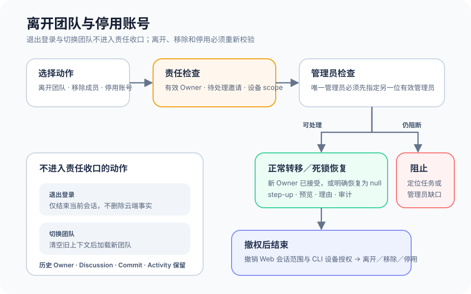

# 个人与团队生命周期结束

## 1. 目的

让用户安全结束当前使用，并保留团队协作历史。

## 2. 范围和边界

登录退出、切换团队、离开和停用分别处理；当前仅有本地退出与团队移除。

## 3. 详细功能设计

### 3.1 日常退出

退出登录结束当前会话；切换团队只改变工作上下文，不删除任务。

### 3.2 离开与停用目标

交接任务与唯一管理员身份 → 确认离开／停用 → 撤权；讨论、文件、活动保留贡献者归属。

*FIG-EXIT-001 · 上线目标流程：离开团队、管理员移除和账号停用共享责任检查，但分别终止 Membership 或 Account；阻断项不会被自动跳过。*

## 4. 验收标准

不留下无人处理的责任或无管理员团队；正式跨端撤权与账号停用仍待接入。
