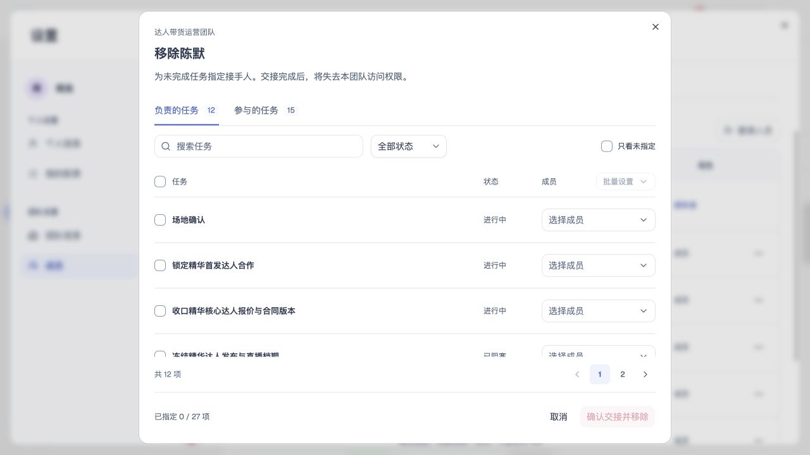
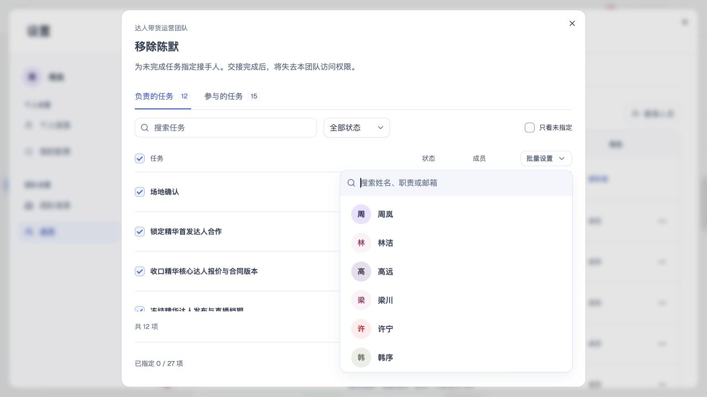
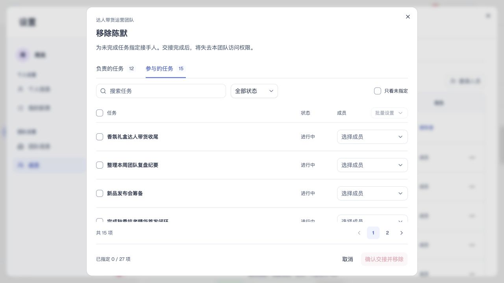

# 成员退出与移除

## 1. 目的

让成员离开时有人继续负责未完成的工作，并保留团队协作历史。

## 2. 范围和边界

支持成员主动退出团队，以及拥有者或有权限的管理员将成员移出团队。离开或移除成员前必须交接其未完成任务，不增加接手审批或独立交接工作台；团队角色与转让规则见[权限](15-permissions-errors-nfr.md)和[团队管理](03-team-onboarding.md)。

## 3. 详细功能设计

### 3.1 退出团队与移除成员

1. 成员主动退出时，从团队入口选择离开团队；由拥有者或有权限的管理员移除时，从成员菜单选择移除成员。拥有者本人退出前须先转让团队所有权。
2. 同一交接弹窗按“负责的任务”和“参与的任务”列出待开始、进行中、已阻塞任务，列表展示任务名称、状态和成员，不展示父任务路径。父子任务各自检查，不因交接父任务而自动改动子任务人员。
3. 从本团队有效成员中逐项选择接手人；可搜索任务、按状态筛选、只看未指定项，或对明确勾选的任务批量指定后逐项调整。清单每页 10 项，可通过页码或前后翻页浏览，全选只作用于本页，跨页保留勾选和接手人；批量指定仅作用于当前页已勾选任务，本页未勾选时禁用批量设置。切换分类、搜索、状态或未指定筛选回到第一页，保留勾选和接手人；隐藏任务不参与当前批量操作。筛选结果减少时自动退回有效页，底部始终统计两类全部任务的已指定数量及总数。
4. 全部指定后，确认交接并离开或移除；提交期间禁止重复点击。没有未完成任务时只确认退出，不展示空清单。
5. 交接与成员退出全部成功后更新成员列表及任务关系；失败保留输入和原关系。接手人收到汇总通知，可从现有“我负责的／我参与的”范围继续工作。

*FIG-EXIT-001 · 负责的任务交接：筛选待交接任务，逐项指定接手人。*

*FIG-EXIT-002 · 批量指定接手人：勾选本页任务后，从团队成员中选择。*

*FIG-EXIT-003 · 参与的任务交接：单独核对参与关系，底部汇总全部交接项。*

### 3.2 任务关系与历史

| 离开者身份 | 交接结果 |
| --- | --- |
| 负责人 | 接手人成为负责人，其余参与者保留；接手人原为参与者时从参与者列表去重 |
| 参与者 | 接手人成为参与者，负责人保持；接手人已是负责人或参与者时复用已有关系 |
| 已完成／已取消任务成员 | 无需指定接手人，保留原人员字段作为历史归属；其访问资格仍以有效团队成员关系判断 |

- 接手人不能是离开者、待加入者或已失效成员，不默认分配给管理员，也不能将未完成任务责任留空。
- 交接不改变任务状态、进度、任务完成标准和文件；历史讨论、文件贡献与操作记录仍署原作者。
- 取消离开者未生效的待加入任务选择；活动记录操作者、原成员、接手人与变更身份。
- 管理者办理他人交接时仅能查看必要的任务摘要并替换离开者的人员关系，不因此获得正文、讨论、文件读取或任务删除权。

### 3.3 团队访问撤销

- 退出团队或被移除成功后，撤销对应团队的 Web、CLI 和 Agent 访问；不影响其他团队及个人账号。失去最后一个团队的成员资格后进入无团队状态。
- 历史记录保留不授予已退出或被移除成员继续访问团队的权限。

### 3.4 异常与可用性

| 情况 | 系统响应与下一步 |
| --- | --- |
| 没有有效接手人 | 提示先邀请成员加入，保留交接页，阻止提交 |
| 加载失败 | 明确失败并允许重试，不能按没有任务处理 |
| 提交前任务状态、人员关系或接手资格改变 | 刷新受影响项，保留仍有效的选择，要求重新核对 |
| 提交失败或结果未知 | 不允许部分交接后退出；保留输入，超时先查询原操作结果 |
| 操作权限失效 | 停止提交并提示无权限，服务端同样拒绝 |

窄屏使用纵向任务行，保持批量操作和确认可用；键盘可选择人员、切换分类、提交、取消和定位错误。

## 4. 功能验收标准

- 非终态任务中负责和参与关系均纳入交接，父子任务无遗漏；缺少一个有效接手人就不能退出。
- 交接给已有负责人或参与者不会产生重复关系；退出者不再具有有效团队访问，终态任务的历史归属和历史作者不被替换。
- 没有待交接任务可确认退出；加载失败不能被当作空结果；任务或接手资格过期需重新核对。
- 交接与退出共同成功或共同失败；失败后重试不重复活动和通知，不改变其他团队。
- 拥有者未转让不能退出，管理员不能移除拥有者或其他管理员；旧页面和旧 CLI 凭据不能读取失权团队。

- 翻页后勾选与接手人保留，本页全选不影响其他页；批量仅修改当前页已勾选任务，当前页未勾选时即使其他页已有勾选也不能批量设置，筛选或分类切换不会漏掉最终提交对全部任务的校验。
