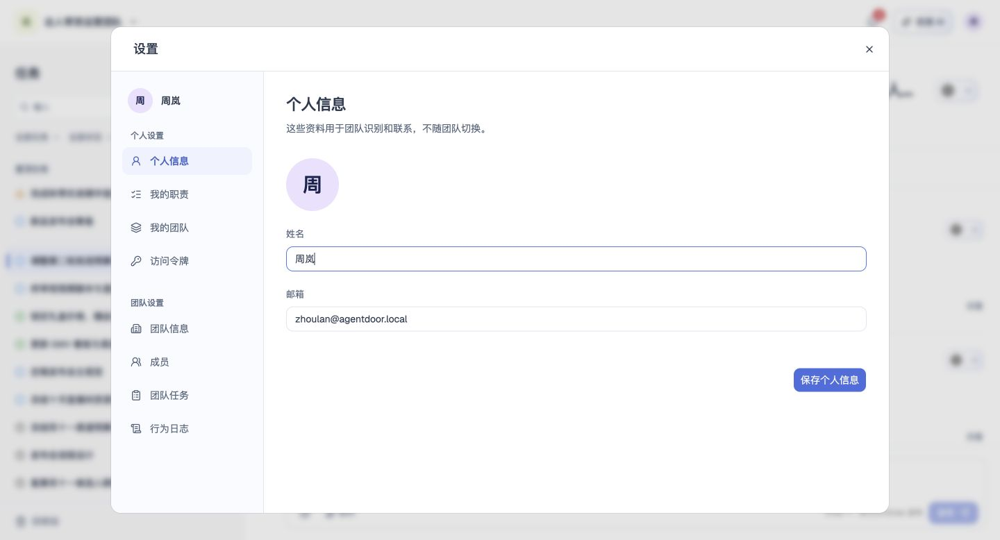

# 个人信息

## 1. 目的

账号资料跨团队共享，邮箱只读。

## 2. 范围和边界

从账户菜单进入设置，在对应页面处理个人信息；操作权限沿用账号及当前团队权限。

## 3. 详细功能设计

设置中的个人信息用于维护跨团队的协作身份。

- 可查看和修改头像、个人名称；未设置头像时使用默认头像，名称沿用首次设置的校验。
- 邮箱只读，不支持修改或换绑；资料更新不改变登录方式或成员关系，CLI 与接口同样限制邮箱修改。
- 保存后更新协作身份显示；失败保留输入并允许重试，取消不改变已保存内容。

*FIG-PROFILE-001 · 个人信息：维护头像和姓名，邮箱只读。*

## 4. 功能验收标准

- 页面按本人身份展示可访问的数据与操作，无权限时不能执行写入。
- 页面结果与上述规则一致；失败不得显示成功，保留可重试的信息。
