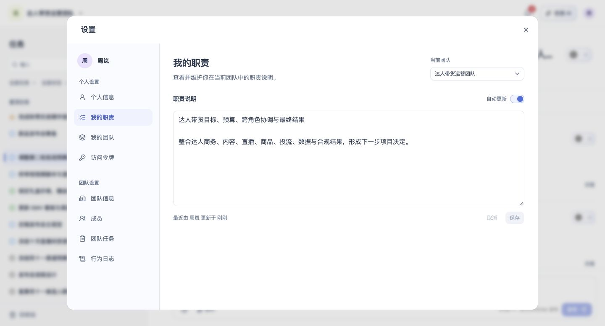

# 我的职责

## 1. 目的

按当前团队维护职责说明。

## 2. 范围和边界

从账户菜单进入设置，在对应页面处理我的职责；操作权限沿用账号及当前团队权限。

## 3. 详细功能设计

我的职责按团队保存，作为任务人员推荐依据；切换当前团队后查看对应内容。

- 用户可查看、编辑和保存职责说明，未填写不阻断进入工作区。
- AI 职责建议需用户确认后写入，可忽略，不自动覆盖手动内容。
- 保存失败保留输入并允许重试；取消保持已保存内容。

*FIG-RESP-001 · 我的职责：查看当前团队职责说明。*

## 4. 功能验收标准

- 页面按本人身份展示可访问的数据与操作，无权限时不能执行写入。
- 页面结果与上述规则一致；失败不得显示成功，保留可重试的信息。
