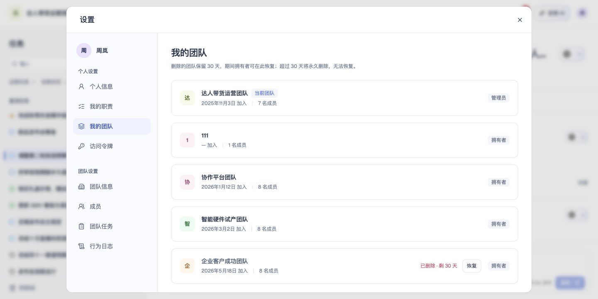
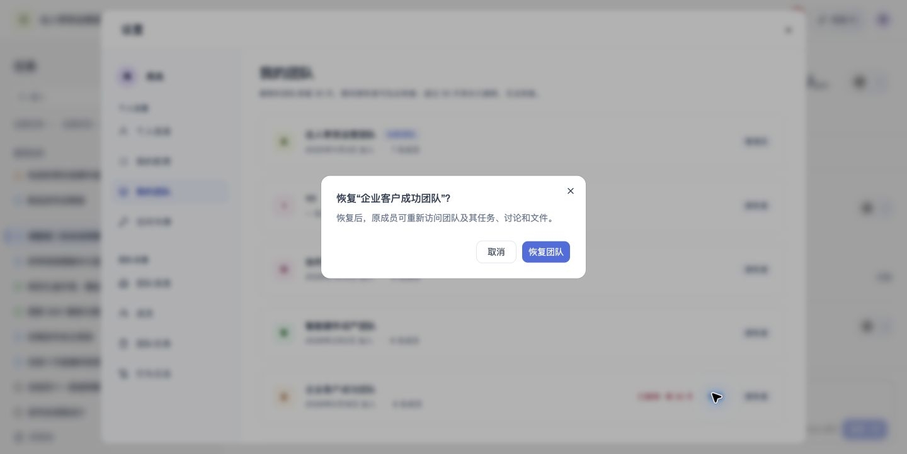

# 我的团队

## 1. 目的

查看已加入团队、当前团队与恢复入口。

## 2. 范围和边界

从账户菜单进入设置，在对应页面处理我的团队；操作权限沿用账号及当前团队权限。

## 3. 详细功能设计

个人设置中的“我的团队”列出本人作为有效成员加入的全部团队，每项展示团队名称、本人角色、加入时间和有效成员人数。加入时间未知时显示“—”，不以邀请时间代替。当前正在使用的团队显示“当前团队”标识，随工作区切换更新；已删除团队不显示该标识。

“我的团队”的已删除团队区域说明：“删除的团队保留 30 天，期间拥有者可在此恢复；超过 30 天将永久删除，无法恢复。”

删除后仍在保留期内的团队排在列表末尾，原有效成员均可看到，并显示剩余保留天数；剩余不足 1 天时显示“今天到期”。超过 30 天的团队不再出现，也不能恢复。

*FIG-DELETE-009 · 我的团队：识别当前团队，查看已删除团队的剩余保留天数与恢复入口。*

恢复的确认、权限及结果见[删除与数据保留](13-deletion-recovery-retention.md)。

*FIG-MYTEAMS-001 · 恢复团队：确认原成员恢复访问的影响。*

## 4. 功能验收标准

- 页面按本人身份展示可访问的数据与操作，无权限时不能执行写入。
- 页面结果与上述规则一致；失败不得显示成功，保留可重试的信息。
