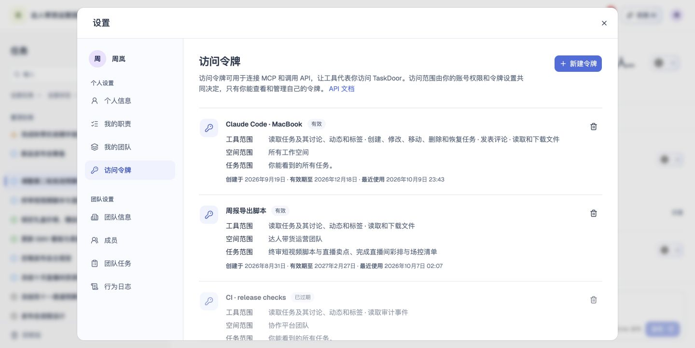
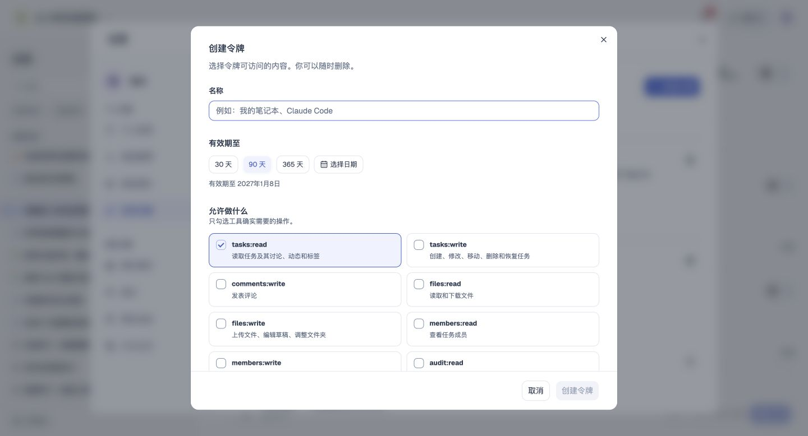
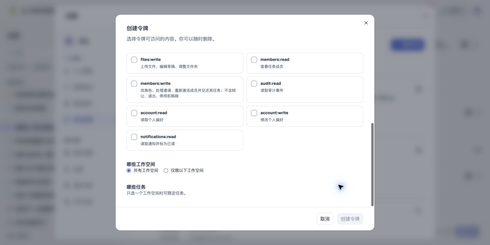
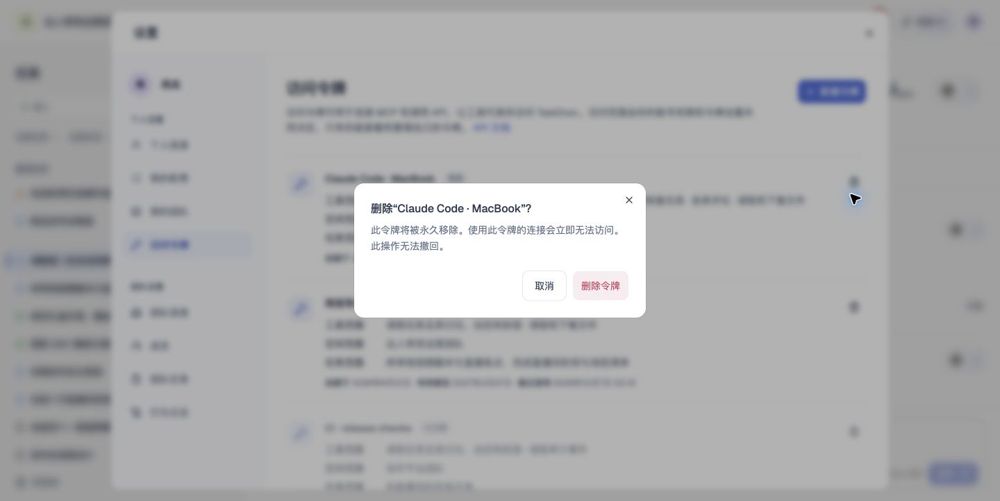

# 访问令牌

## 1. 目的

管理用于 MCP 与 API 的个人访问令牌。

## 2. 范围和边界

从账户菜单进入设置，在对应页面处理访问令牌；操作权限沿用账号及当前团队权限。

## 3. 详细功能设计

用户在个人设置的“访问令牌”中管理自己的个人访问令牌，供工具通过 API 或 MCP 代表本人操作。页面说明这两种用途，并提供 [API 文档](https://sand.taskdoor.com/documents/openapi/v1) 入口，在新标签页打开。令牌属于账号，不属于某个团队；只有本人能看到自己的令牌。

#### 创建流程

1. 点击新建令牌，填写名称（最多 120 个字符）。
2. 选择有效期：30、90 或 365 天，或在日历中指定日期，默认 90 天，最长 365 天，令牌在所选日期当天结束前有效。
3. 勾选允许的操作范围（读写任务、发表评论、读写文件、读写成员、读取审计事件、读写账号设置、读取通知等），至少选一项。
4. 选择团队范围：所有团队（含以后加入的），或指定团队（最多 50 个，团队较多时改为搜索挑选）。
5. 只指定了一个团队时，可以进一步限定到该团队的部分任务（最多 100 个）；指定多个团队时不能限定任务，换选团队会清空已选任务。
6. 创建前要求用户最近验证过登录；超时则先重新登录，回来后继续原来的创建，不丢失已填内容。
7. 创建成功后令牌值只显示一次，可复制；关闭后无法再次查看，丢失只能删除后重建。

#### 列表与删除

- 每个令牌展示名称、状态（有效、已撤销、已过期）、工具范围、空间范围、任务范围、创建日期、到期日期和最近使用时间；从未使用时如实显示。
- 指定的团队全部被删除或退出时，显示为没有可访问的团队，不再列出任务范围。
- 删除前二次确认；删除后立即失效，正在使用的连接随即无法访问，不可撤回。

列表中的工具范围表示允许的操作，空间范围表示可访问的团队／工作空间，任务范围表示在空间范围内可访问的任务。连接 MCP 使用用户创建时保存的令牌；连接页面不读取或再次显示已有令牌值，配置文档使用令牌占位符，由用户在客户端自行填写。

#### 规则

- 令牌的权限永远不超过持有者本人在各团队的权限，操作范围、团队和任务只会进一步收窄。
- 团队关闭个人访问令牌时，不出现在可选团队中。

*FIG-CLI-006 · 访问令牌：查看操作和访问范围，并打开 API 文档。*

*FIG-TOKEN-001 · 创建令牌：填写名称并选择有效期和操作范围。*

*FIG-TOKEN-002 · 创建令牌：查看工作空间与任务范围。*

*FIG-TOKEN-003 · 删除令牌：确认立即失效及不可撤回的影响。*

## 4. 功能验收标准

- 页面按本人身份展示可访问的数据与操作，无权限时不能执行写入。
- 页面结果与上述规则一致；失败不得显示成功，保留可重试的信息。
