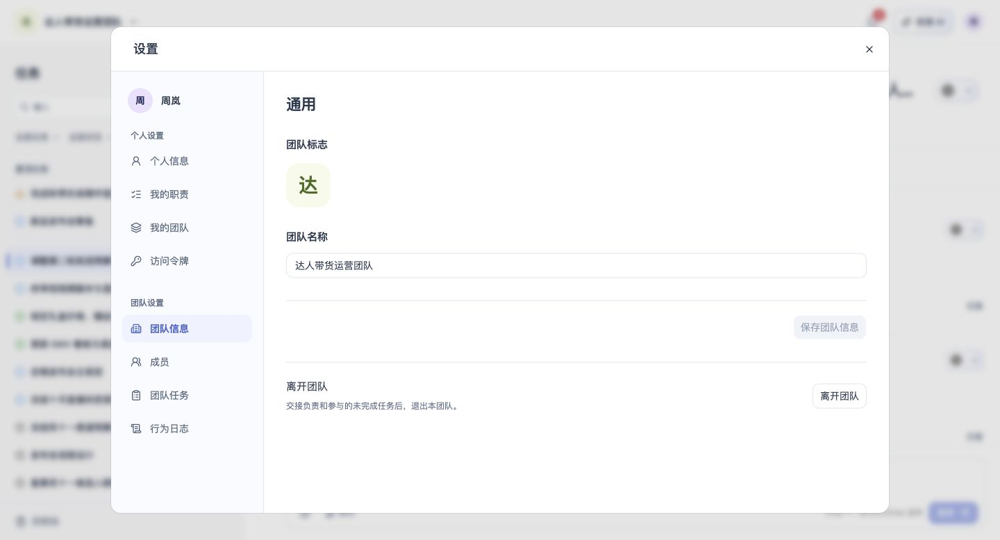

# 团队信息

## 1. 目的

维护团队标志、名称和所有权。

## 2. 范围和边界

从账户菜单进入设置，在对应页面处理团队信息；操作权限沿用账号及当前团队权限。

## 3. 详细功能设计

- 团队标志支持上传 JPG、PNG 或 WebP 图片，文件不超过 2 MB；处理或保存失败时保留原标志并提示重试。保存后团队切换器与设置中的团队标志同步显示。
- 团队信息仅拥有者可编辑和保存。管理员与普通成员只读查看团队标志和名称，团队信息页仅提供离开团队操作；成员管理权限仍按权限模块执行。

- 每个团队只有一名拥有者，创建者默认成为拥有者；拥有者可在成员管理中设置或取消管理员，权限矩阵见[权限](15-permissions-errors-nfr.md)。
- 拥有者可在团队设置将所有权转让给另一名有效成员。确认后接手人成为唯一拥有者，原拥有者成为管理员；转让不改变任务分工。
- 拥有者不能被其他成员移除；本人离开前先转让所有权，再按[成员退出](14-membership-account-exit.md)办理任务交接。
- 无有效转让对象时先邀请成员加入。提交时重新校验身份和成员资格；失败保留选择，团队仍保留原拥有者。
- 删除与恢复团队仅限拥有者，删除后保留 30 天；流程和结果见[删除与数据保留](13-deletion-recovery-retention.md)。

离开团队与任务交接见[成员退出与移除](14-membership-account-exit.md)，团队删除与恢复见[删除与数据保留](13-deletion-recovery-retention.md)。

*FIG-TEAMINFO-001 · 团队信息：查看团队标志、名称与离开团队入口。*

## 4. 功能验收标准

- 页面按本人身份展示可访问的数据与操作，无权限时不能执行写入。
- 页面结果与上述规则一致；失败不得显示成功，保留可重试的信息。
