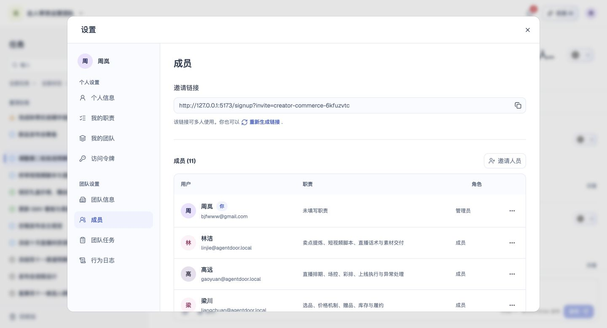

# 成员

## 1. 目的

查看与管理当前团队成员。

## 2. 范围和边界

从账户菜单进入设置，在对应页面处理成员；操作权限沿用账号及当前团队权限。

## 3. 详细功能设计

查看当前团队成员及身份，并根据本人权限邀请成员、设置或取消管理员、移除成员。

- 团队仅有一名拥有者，成员权限按[权限](15-permissions-errors-nfr.md)执行，拥有者不能被其他成员移除。
- 邀请绑定邮箱、团队及角色，确认加入后建立成员关系；完整流程见[成员、邀请与任务分工](09-member-collaboration.md)。
- 移除或本人退出时处理未完成任务交接，完整规则见[成员退出与移除](14-membership-account-exit.md)。

*FIG-MEMBERS-001 · 成员：查看团队成员、职责与角色。*

## 4. 功能验收标准

- 页面按本人身份展示可访问的数据与操作，无权限时不能执行写入。
- 页面结果与上述规则一致；失败不得显示成功，保留可重试的信息。
