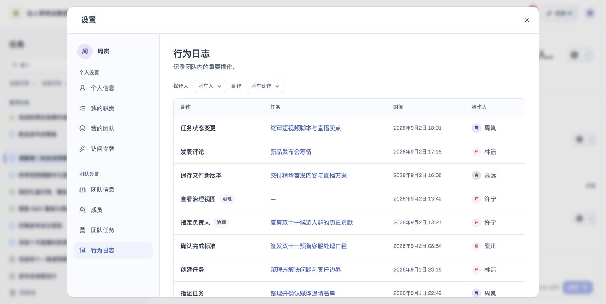

# 行为日志

## 1. 目的

筛选并查看团队重要操作记录。

## 2. 范围和边界

从账户菜单进入设置，在对应页面处理行为日志；操作权限沿用账号及当前团队权限。

## 3. 详细功能设计

- 与团队任务采用一致的表格列表和分页栏，每页 10 条，通过上一页、下一页切换；修改操作人或动作筛选后回到第一页，首页及末页禁用对应翻页按钮。

- 按时间倒序列出团队内的重要操作：成员、邀请、团队、凭据、任务、治理、文件等动作，展示动作、关联任务、时间和操作人；操作人显示头像和姓名；系统执行的动作使用系统图标并标为系统。
- 来自某个任务的记录（包括该任务的评论和文件）在“任务”列显示任务名，点击后关闭设置并打开该任务；任务已被彻底删除时显示“任务不可用”，不可点击；与具体任务无关的记录（成员、邀请、凭据、批量归档等）显示“—”。
- 可按操作人（包括已离开的成员，只显示姓名或“前成员”，不显示邮箱）和动作筛选；动作可选单一类型，或一次筛出全部治理写操作。治理类动作带“治理”标记。
- 记录只读，不可编辑或删除。

*FIG-TEAM-008 · 行为日志：筛选并查看重要操作及关联任务。*

## 4. 功能验收标准

- 页面按本人身份展示可访问的数据与操作，无权限时不能执行写入。
- 页面结果与上述规则一致；失败不得显示成功，保留可重试的信息。
