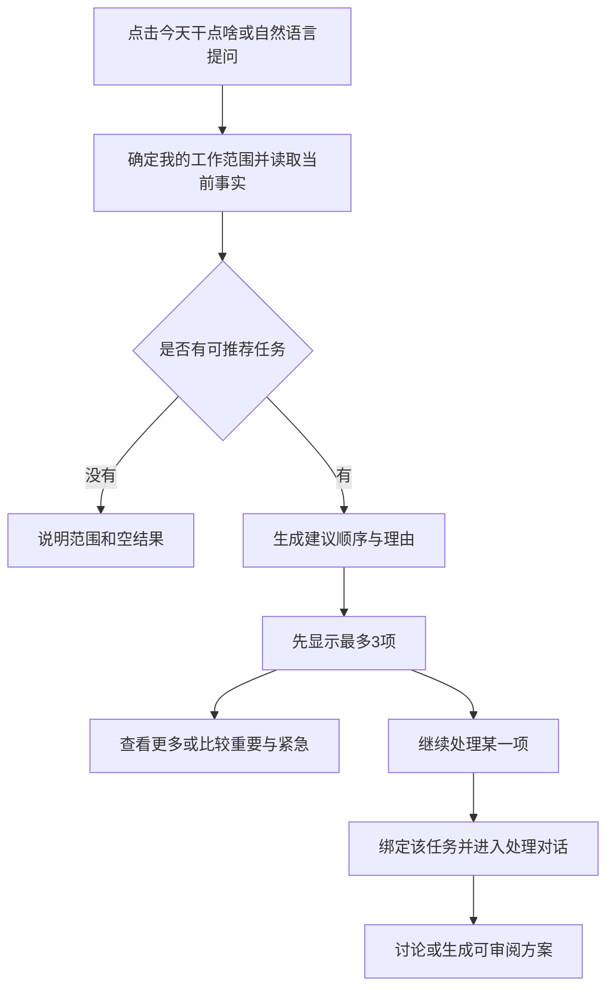
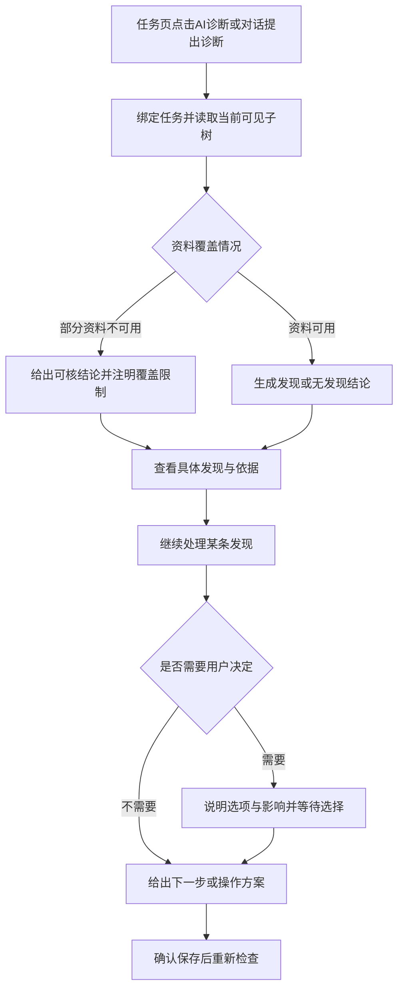
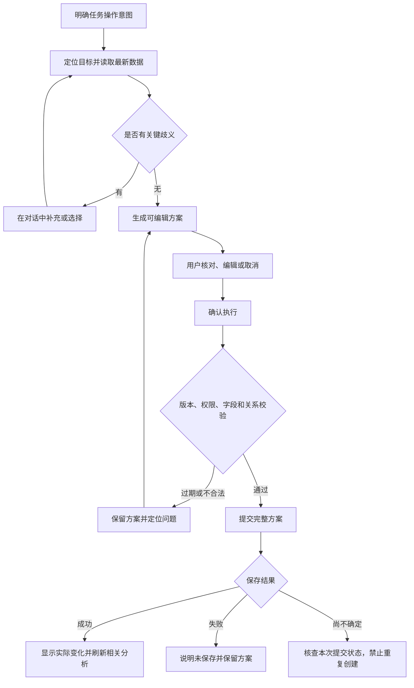

# TaskDoor 助手交互流程、规则与视觉规范

> 2026-09-16 补充：任务模板功能已移除，交互稿同步移除模板推荐与选择案例；第 16—18 节相关内容仅为历史记录。当前决定见 `D-REMOVE-TASK-TEMPLATES-2026-09-16`。

> 历史方案，已于 2026-09-16 撤回。独立 AI 助手模块已移除，创建任务恢复此前的需求输入与方案确认流程；下文及交互稿仅保留为历史参考。当前决定见[产品决策台账](../../product-v2/09-decision-register.md)中的 `D-RESTORE-TASK-CREATION-2026-09-16`。

日期：2026-09-08。版本：交互设计 v1.4，统一小窗口内的方案卡片与创建完成态，保留六类案例与可点击交互稿。状态：可用于设计评审与开发拆解；独立流程稿可体验，正式助手尚未接入本轮新增交互。

本文件细化「助手内的任务诊断与个人工作建议」，覆盖常驻入口、个人建议、重要／紧急分析、任务诊断、增删改、文件、会话与异常。以下流程和尺寸是本次设计建议，不把未开发行为描述为已上线。个人推荐范围沿用已确认规则；60%／40% 等排序参数仍待验证。

可直接体验[六类创建交互稿](../../../public/assistant-creation-interactions.html)，逐屏说明与演示边界见第 15 节。

## 1. 用户目标与统一约定

用户在浏览任务时，既需要知道「我现在先做什么」，也需要围绕一个任务查明问题、采取行动。成功标准是：用户始终知道助手正在处理哪个范围，能理解建议依据，能在确认具体变化后完成任务更新，并看到真实结果。

| 约定 | 确定行为 |
| --- | --- |
| 一个助手 | 诊断、推荐、查询、创建和更新使用同一个右侧入口，不新增独立诊断对话产品 |
| 分析与任务事实分开 | 分析结果、今天的安排、未执行方案属于个人会话；确认保存后的任务变化进入原任务数据与活动 |
| 先读后写 | 查询、诊断、生成建议、起草方案直接执行；首版所有任务写入先展示预览，再由用户确认 |
| 一个事实来源 | 助手与任务详情读取同一组 Task ID、资料和状态；同一诊断发现不复制为互不相干的报告 |
| 一个进行中的请求 | 同一会话同一时刻只处理一个请求；可继续输入下一条，但不排队、不自动发送 |
| 分清实际与未知 | 未读取、缺失、受限、过期、处理中、已保存分别表达；分析不展示模型内部思考链 |

### 1.1 三个范围的含义

- **我的工作**：当前团队内，本人负责或参与、状态为待开始／进行中／已阻塞的可见任务，用于推荐与安排。任务列表的搜索、标签和状态筛选不暗中缩小此范围。
- **当前任务**：明确绑定一个任务，按需要读取自身、有权查看的后代及相关资料。推荐白名单不限制用户对已完成／待审核任务进行显式诊断。
- **团队范围**：当前用户有权查看的团队任务，用于明确的团队查询和批量管理。不能把「团队可见」当作「本人负责」，不能把可读权限当作可写权限。

「我的工作」和「团队范围」是两个不同会话。范围名称常驻显示；团队切换不把旧团队材料带入新团队。

## 2. 面板结构与入口行为

### 2.1 布局骨架

```text
┌ TaskDoor 助手                  历史  收起 ┐
│ 团队名（所有页面统一的标题次级文字）      │
├──────────────────────────────────────────┤
│                                          │
│ 首次欢迎 / 用户消息 / 分析结果 / 操作方案  │
│                   此区域独立滚动          │
│                                          │
├──────────────────────────────────────────┤
│ [本次参考文件，可逐项移除]                │
│ ┌ 描述任务或继续追问…                  ┐ │
│ │ 附件  快捷操作                 发送 ↑ │ │
│ └─────────────────────────────────────┘ │
│      私人对话 · 任务变更需确认            │
└──────────────────────────────────────────┘
```

面板只分为标题与范围、正文、输入三部分。依据和方案在正文原位展开，不再嵌套第二个聊天面板。

### 2.2 进入、关闭与恢复

| 用户动作 | 系统行为 | 是否发起分析 |
| --- | --- | --- |
| 首次点击常驻入口，正在看任务 | 打开该任务的空会话，显示任务名称并聚焦输入框 | 否 |
| 首次点击常驻入口，非任务页面 | 打开当前团队的「我的工作」空会话 | 否 |
| 再次点击常驻入口 | 恢复本团队最后使用的会话、输入、展开项和滚动位置；有待处理结果时给出到最新消息入口 | 否 |
| 点击「今天干点啥」入口 | 打开「我的工作」，写入可见请求，读取当前事实并生成建议 | 是；有同日同版本结果时复用，并定位结果 |
| 点击任务详情「AI 诊断」 | 明确绑定该任务，打开助手并诊断；已有同版本结果时定位该结果 | 是／复用 |
| 点击收起或按 Escape | 隐藏面板，保留会话与草稿；焦点回到原入口。已发出的分析继续在原会话完成 | 否 |
| 点击面板外部 | 桌面保持打开，可继续使用页面；不因失焦丢失输入 | 否 |
| 刷新页面 | 恢复已保存会话；未完成读取标记「上次分析已中断」，用户可重试 | 否 |

收起不是取消。需要取消读取时使用「停止」。已进入任务提交的操作不可用「停止分析」假装撤回。

### 2.3 快捷动作

空会话显示三个动作：我的工作为「今天干点啥／值得关注／创建任务」；任务范围为「任务情况／诊断任务／拆分任务」。开始对话后欢迎区退出，输入工具栏中保留一个「快捷操作」菜单。

快捷菜单按当前范围展示上述动作；也允许直接切换至我的工作、当前页面任务或团队范围。点击查询／分析动作立即发送一条可见请求；点击创建／拆分意图后，如缺少目标，助手在对话内询问所需内容，不生成无业务意义的空任务。

菜单是轻量 Popover，桌面和手机均可键盘操作。每次只展开一个菜单，选择后关闭并将焦点移至输入或新增结果。

## 3. 范围切换和上下文规则

| 场景 | 会话变化 | 页面变化 | 草稿处理 |
| --- | --- | --- | --- |
| 页面从任务 A 浏览到 B | 仍绑定 A，标题统一显示团队名，任务对象在请求与结果中明确，不额外显示页面切换提示条 | 主区域显示 B | A 的草稿留在 A |
| 点击推荐结果的任务名称 | 保持个人会话 | 桌面打开任务详情；手机收起助手后打开详情 | 保留个人会话和滚动位置 |
| 点击推荐结果的「继续处理」 | 进入该 Task ID 的会话，并显示来自哪条个人建议 | 桌面同时打开该任务详情；手机继续显示助手 | 只带入该条建议引用，不复制整份个人对话 |
| 在任务会话明确问「我今天先做什么」 | 切换到「我的工作」，显示一条范围变更提示并执行请求 | 页面不强制跳转 | 原任务方案保留 |
| 只说「这个怎么改」但没有明确对象 | 留在原范围，给出候选任务／发现供定位 | 不跳转 | 不生成猜测性写入 |
| 切换团队 | 终止未完成读取，恢复新团队自己的会话 | 按工作区现有切换规则 | 旧输入、附件、方案隔离保存 |
| 切换账号／退出登录 | 清理当前内存会话，按新身份重新读取允许范围 | 按登录流程 | 不展示上一身份的历史 |

「第二项」绑定发出这句话前最近一份明确可见推荐的结果 ID 和 Task ID。若用户正在讨论另一份报告、或旧结果已不可用，先列出候选确认目标，不只凭当前数组位置猜测。

显式切换到另一会话时，停止原会话尚未完成的读取／分析，并保留可重试请求；迟到结果不能写入新会话。普通页面导航或收起面板不属于切换会话。已经提交的写入继续按原会话核查结果，不因切换而重新提交。

从个人建议进入任务后，范围栏下方显示一次「来自：今天的建议 · 返回」。返回恢复原消息及滚动位置，不生成重复推荐。长期会话中的来源条目可以继续追溯，但不重复常驻多行面包屑。

## 4. 流程 A：今天干点啥与值得关注



### 4.1 分步行为

| 步骤 | 用户看到什么 | 可执行动作 | 数据副作用 |
| --- | --- | --- | --- |
| 发起 | 用户请求气泡、当前团队和个人范围 | 停止；编辑下一条输入 | 保存个人会话请求，不写任务 |
| 读取与分析 | 一条真实进行中的反馈，不展示假百分比或虚构检查步骤 | 停止；浏览既有消息 | 无任务变化 |
| 完成 | 一句总体判断、实际分析截至时间、推荐条目 | 查看其余、展开依据、继续处理 | 保存结果快照 |
| 查看其余 | 同一条结果展开更多任务，每次最多增加 10 项；显示已展示数／结果总数 | 收起、打开任务 | 不重新调用模型、不重新排序 |
| 追问原因 | 针对所指任务解释重要性、紧急性及来源 | 返回原推荐、继续问 | 不修改任务或权重 |
| 继续处理 | 任务会话中出现所选任务与建议引用，以及「请围绕这条建议给出下一步方案」的可见请求 | 回到建议；继续讨论 | 只读取并起草，不保存任务 |

不足三项按实际数量显示。三项是首次返回的展示数量，不是今天必须做三项，也不是今天能做完三项。正文允许滚动，不压缩文字强行把三项塞进一屏。

### 4.2 推荐条目的固定结构

```text
① 任务名称                              [打开详情]
  优先原因：为什么现在建议把它排在这里。
  重要性：影响什么目标或交付。
  紧急性：现在不处理会发生什么。
  下一步：你可以执行、协调或核对的具体动作。
  查看依据 ▾                              继续处理 →
```

- 顺位为推荐结果内的相对次序，不是任务永久编号；全部顺位同样式，不给第一项增加另一套巨型卡片。
- 一句优先原因只做总判断，下面两种程度说明各讲一个最关键事实，避免三行重复同一句话。
- 下一步必须与当前用户的责任相关；参与任务不等于本人承担其全部工作或获准更改负责人。
- 不额外铺状态、完整日期、人天、标签列表。只有影响当前判断的事实进入说明；详细字段留在任务详情。
- 每项只有一个推进动作「继续处理」；任务名称负责浏览，依据负责解释。三者行为不能混用。
- 每条结果可折叠具体说明，仅留下顺位、名称和一句原因；默认前三项完整展示，历史结果恢复用户上次展开状态。

### 4.3 「值得关注」与「今天干点啥」的区别

两者共用候选池和排序依据。「值得关注」强调需要留意的影响、变化或待核对事项；「今天干点啥」强调下一步安排。相同快照下，二者对同一任务的重要／紧急判断一致，不维护两套分数。已完成／待审核任务不混入推荐池，用户显式查询这些状态时按普通查询回答。

### 4.4 用户调整安排

| 用户表达 | 处理规则 |
| --- | --- |
| 今天先做 A | 更新本次个人安排，在 A 旁标明「按你的安排」；保留原分析理由，不改任务字段 |
| A 今天先放后面 | 本次建议顺序调整，范围只到本团队当天；明确风险事实仍保留，可随时恢复建议顺序 |
| 按重要性／紧急性排序 | 使用同一批事实，分别按对应维度排序；缺依据标待判断；说明当前排序视角，不修改综合权重 |
| 我只有两小时 | 将时间作为本次安排约束；有可靠剩余投入时给出估算范围，无数据时说明无法保证做完并建议先确认范围 |
| 这不归我 | 展示当前与本人的负责人／参与关系；用户要更正正式关系时另起变更方案，不直接移出数据 |
| 明天再做 | 默认调整个人安排意图；如果语义可能表示改任务期限，简短询问「只调整安排，还是修改截止时间」后再生成对应方案 |

个人当日偏好跨刷新保留，跨日不自动沿用。若原任务有新风险或权限变化，更新相应解释；不以个人偏好覆盖事实。

## 5. 重要性与紧急性的计算和展示规则

计算依据沿用 `PERSONAL-PRIORITY-2026-09-03-v4`，详见[现行全流程 PRD 第 7.6 节](../../product-v2/PRD-AgentDoor-协作任务全流程.md)。实现只能维护一份规则定义，不能让工作台、助手或模型各自计算。

| 项目 | 规则 |
| --- | --- |
| 重要度 I | 目标影响 B（0～50）＋已确认协作影响 C（0～30）＋标签参考 P（0 或 20）；每项依据条件取最高一档 |
| 紧急度 U | max（期限压力 D、当前损失／风险 H、当前待本人处理 Q）；同一问题不重复累加 |
| 综合顺序 | 候选 W＝0.6I＋0.4U；同分依次比较 I、U、可比较截止时间、稳定 Task ID |
| 参数状态 | 60%／40% 和分档仍是待验证初始建议，不在本轮文档中伪装成已确认算法 |
| 标签 | 明确重要性标签可辅助；普通分类、颜色、标签数量和上级标签不代替影响证据 |
| 依赖 | 参考关系不证明停工。协作影响需证明交付被需要，紧急等待还需证明现在已在等本人 |
| 缺失 | 没依据的分项暂不加分，保存未知原因；不因缺失或过期加分，不放大剩余维度 |
| 父子任务 | 各按本人的实际责任和行动判断，不累加传递链，不复制同一执行动作 |
| 不使用 | 聊天活跃度、提交次数、任务历时、未核实效率、EWD 大小不直接作为优先理由 |

前台用事实表达程度，例如「影响关键交付／支撑例行维护／重要性待判断」和「需今天处理／当前有等待／暂无已证实的紧迫信号」。不把未知叫作低重要性，不新增任务优先级字段，不把内部评分直接变成新的彩色任务标签。

用户要求解释时展示命中的事实与规则；默认不展示小数分数、权重仪表盘或未定义阈值的高／中／低评级。若以后需要四象限，必须先定义程度阈值和未知分组，不用视觉布局替代判断规则。

## 6. 流程 B：任务诊断



### 6.1 报告结构

首段只说明本次发现和覆盖，例如「当前发现 2 项需要核对的记录；已检查本任务及 5 个可见子任务。更新于 14:32」。数量、时间和范围均来自本次实际检查。部分资料不可用时写清限制，不补完整覆盖率。

单条发现结构：

```text
[决策冲突] 实际受影响任务／相对任务路径
结论：两份执行文件的预算上限不一致。
影响：继续按不同口径推进可能造成错误安排。
建议：核对生效版本，再统一相关记录。
查看依据（2）▾                         继续处理 →
```

- 执行阻碍需有实际阻塞／等待事实；单纯前置未完成只写「建议核对」。
- 决策／记录冲突展示两侧可定位事实，不用一条模型判断充当证据。
- 每条发现绑定实际 Task ID 与稳定发现标识。父级只聚合同一发现，先自身问题、再按子任务路径分组；无问题子任务不逐个占位。
- 先展示最多 3 条发现，并显示完整总数；「查看其余 N 项」在同一结果中展开，不能只读前三条后宣称已诊断全树。
- 类型用小标签，完整结论作为标题，影响和建议用正文；类型不再重复为多个章节。

### 6.2 依据展开与来源导航

「查看依据」在原条目下展开，名称变为「收起依据」。每条显示完整事实、来源名，以及确实存在的版本／时间。未知时间不补「刚刚」。依据之间用留白分隔，不再给每条套一层卡片。

用户只有查看权限时，可打开来源但不能编辑。来源权限重新校验后才显示内容；失效来源显示「当前无法访问这条依据」，不暴露其受限标题或缓存正文，也不把不可用判断为冲突已解决。

桌面打开任务／文件时使用主内容或现有文件预览，助手保持在原发现。手机打开来源时进入可返回的预览；返回恢复原发现、展开状态与滚动。打开依据不触发重新分析或任务写入。

### 6.3 点击「继续处理」后的行为

用户动作本身授权助手读取和起草。系统在任务会话中附上所选发现引用，并发送可见请求「针对这条发现，给出可执行的处理方案」。如果发现属于子任务，明确切到该子任务会话并保留返回父级报告的入口。

- 信息足够、目标明确：生成具体动作预览。
- 需要判断采用哪份业务要求：列出候选、相关依据和影响，用户选择后再起草；助手不能替用户认定哪个冲突版本应生效。
- 缺关键事实：只问会改变处理方案的必要信息；保留已生成内容。选项点击只补充意图，不同时提交任务变化。
- 用户只想了解：继续解释，不为了产生操作而强行生成写入方案。
- 需要修改尚不支持的文件／外部系统：明确能力边界，提供原文件入口或可复制的修改建议。不能把「创建跟进任务」冒充修改了原文件，更不能宣称源冲突消失。

### 6.4 无发现与更新

无发现时显示「当前可见范围内未发现上述问题」，并说明检查范围；不展示全绿健康评分，不等于完成或通过验收。没有足够资料时显示「资料不足，暂无法判断」，不能用同一个无问题空状态。

用户确认相关修改并保存成功后，重新读取相关源事实再检查。原发现退出、仍存在或因资料不足无法复核，分别说明；不设置任意手工「标记已解决」。其他任务发生变化不直接清除该发现。

## 7. 流程 C：任务情况汇报

「任务情况」回答现在如何，「诊断任务」回答哪些记录或执行条件需要处理，二者共用上下文但不互相替代。

汇报默认顺序：当前状态与负责人 → 有依据的进度及截至时间 → 最近有效变化 → 关键阻碍或未决事项 → 下一步。没有进度依据显示未知；人工状态、正式验收、AI 候选进度、演示账本不可混成一个百分比。

有诊断发现时摘要最多列 2 条，并提供「查看诊断」；点击进入该任务的诊断结果，不把同一完整报告再贴一次。若诊断数据已过期，先重新分析再呈现。没有变化记录时不编造趋势。用户提出周报或跨任务汇报时先明确其团队／个人范围与期间，再按同样来源约束输出。

### 7.1 普通任务查询

「找出我本周到期的任务」「搜索名称包含发布的任务」先按表达确定范围与条件，随后给出可打开的任务列表。结果只附与查询有关的字段，并显示实际匹配数量；空结果说明所用条件。当前范围足够明确时直接查询，只有跨团队、同名目标或期间歧义会影响结果时才询问。

查询结果不自动套用个人推荐排序。例如用户查「我负责的已完成任务」，可以返回已完成任务；只有「今天干点啥／值得关注」使用个人推荐状态白名单。查询后的「修改第二项」绑定该查询结果内的任务标识，再进入变更预览。查询本身不改状态、不标记已读，也不通知负责人。

## 8. 流程 D：增删改、批量拆分与确认

本节规定所有写入共用的流程；单任务、复杂项目、需求澄清、相似任务、关联父任务、无合适负责人六类创建分支详见第 14 节。不能仅实现通用「输入 → 草稿 → 确认」就算覆盖原创建体验。



### 8.1 各类操作的预览内容

| 操作 | 确认前必须能看到 | 确认按钮 |
| --- | --- | --- |
| 创建单任务 | 名称、目标、完成标准、负责人、开始／截止、父任务；未指定负责人时明示创建者兜底 | 确认创建 |
| 批量创建／拆分 | 实际总数、每项名称／负责人／日期、父子关系；展开查看完成标准和依赖 | 确认创建 N 项 |
| 更新 | 精确任务、逐字段原值与新值；多任务逐项列出 | 确认更新 N 项 |
| 删除 | 将删除的任务、全部后代数量与名单、受影响依赖；同名候选先定位 | 确认删除 N 项 |
| 混合操作 | 创建／更新／删除各自数量与完整影响范围 | 确认执行 N 项 |

N 指界面明示的计数：创建／更新是目标任务数；删除是含后代的实际任务总数；混合方案标题分别列出各类任务数，按钮 N 表示方案操作数。不得用「1 项操作」隐藏会删除一整棵任务树的影响。

对话删除支持输入完整任务名，或在消息前后 @ 选定任务后说“删除这个任务”“把它删除”。按引用绑定的任务识别，不将代词和任务 ID 拼成名称。未指定对象或名称不唯一时引导 @ 选择；创建草稿中途提出明确删除请求时单独生成删除方案。处理步骤为定位任务、核对删除范围、生成删除方案，完成后可展开回看。预览展示任务名称、负责人、状态、实际删除总数；子任务名单与依赖影响可展开，主子任务重叠引用去重计数。点击“确认删除 N 项”后执行，取消不变更任务；成功回执保留已删除任务名称和实际数量。

单项默认展开；多项显示全部摘要行，逐项可展开，缺少必填信息的行默认展开并标记。只用正文一个滚动区域，不在卡片里再套长滚动框。不存在逐项认领／inbox 二次确认，也不要求每项单独审批。

批量生成时先在原会话保留草稿，未确认的任务不出现在接收者列表。用户确认并保存成功后，按已确认负责人直接进入对应任务列表；新增提示沿用列表的「new」标识，不新增个人收件箱。没有可确认负责人的新任务明确兜底创建者，用户可在预览中调整；人员离职造成的已有无负责人任务属于交接场景，不能由助手悄悄改归自己。后台生成、列表新任务提示和提醒服务需分别按实际接入情况呈现，不能仅保存草稿就显示「已下发」或「已通知」。

### 8.2 编辑和提交规则

- 方案内编辑立即更新个人草稿，失焦不提交任务。删除草稿行使用「移除这项操作」，与业务「删除任务」明确区分。
- 用户继续对话调整同一方案后，只保留最新版本可执行；旧方案显示「已被新方案替代」，可展开回看但按钮失效。
- 名称、真实日期、截止早于开始、成员有效性、父子关系及循环依赖在预览中校验；不合法时禁用确认，并说明具体字段。未知负责人不猜测跨团队人员。
- 点击确认后，按钮变为「正在保存…」，编辑和重复确认禁用。取消方案在提交前可用，提交中不提供假撤回。
- 提交时再次校验团队、权限、数据版本和完整影响范围；整批先校验再保存。本地首版失败全部回滚，不把部分成功说成全部成功。
- 版本过期时保留草稿，并提供「重新核对」。此动作读取最新事实、显示最新原值和影响变化；用户仍须再次确认，不能只刷新版本号就覆盖别人刚保存的数据。
- 删除包含多个任务时在此预览中一次确认，不再弹第二层重复确认。危险主动作使用删除色，范围必须先看得见。

### 8.3 成功、失败与结果不确定

保存成功后显示实际创建／更新／删除数量、任务入口和简短变更结果；同步列表、详情、活动，再重新检查相关诊断。回看旧方案显示「已执行」，不能重复提交。提供「查看任务／继续分析」，首版不提供没有完整逆操作能力的通用「撤销」按钮。

保存明确失败时显示「未保存，方案已保留」，标出原因并可重试；原任务和内存视图保持一致。网络中断且无法确定服务端是否已提交时显示「正在核查保存结果」，冻结该次提交，按同一操作标识查询／重试；未核实前不声称失败、不允许修改载荷重发导致重复创建。浏览器本地事务按实际可确认结果处理，不伪装存在生产事务服务。

关闭助手或切页不会撤销已经提交的任务变更。提交回执归属原团队／原会话，返回后可看到结果；切换团队不把回执写到新团队。

## 9. 文件、输入与会话历史

### 9.1 参考文件

点击附件选择文件 → 检查格式／大小 → 读取成功显示文件条目 → 发送时纳入请求 → 明确生成了什么建议或方案。选择文件本身不自动生成任务，不自动发布为共享任务文件。

首版继承当前限制：Markdown、TXT、CSV、JSON、HTML 文本；每文件不超过 150,000 字节、最多 10 个文件、合计文本不超过 300,000 字符。不支持或超限逐项说明，保留原有可用附件；移除一份不影响其他资料。PDF、Office、图片内容提取另行接入，不能只拿到文件名就说已阅读正文。

附件归属会话范围，切换任务不自动复制到另一任务。分析开始后冻结本次文件版本；可给下一次请求添加材料，但不能悄悄改变正在运行的输入。上传与读取期间显示真实进度状态，失败可重选；未发送文件以「参考资料」显示，不暗示已被模型处理。

### 9.2 输入行为

- 输入框 Enter 发送，Shift+Enter 换行；中文输入法组合态的 Enter 只用于选词。
- 工具栏依次为 @ 引用任务、附件，移除“＋”创建入口。点击 @ 或在正文光标处输入 @ 均打开同一任务下拉列表。列表显示当前团队可见任务的图标、名称、负责人、状态和可用的主任务名；支持名称、负责人和主任务搜索。邮箱中的 @ 不触发。
- 列表打开时，方向键选择，Enter 仅插入引用、不会发送；Escape 仅关闭列表，Tab 离开列表。点击入口可在搜索框筛选，正文中可在 @ 后直接输入关键词；中文选词不选任务、不发消息。列表在输入框上方显示，长列表内部滚动，移动端限制高度；无匹配与无任务分别展示明确空态。
- 选中后以 @任务名 插入光标位置，不加「」，保留前后文字，可以引用多项任务。选中的引用在输入框和发送后的消息中以主题色文字、浅色背景高亮，普通文本中的 @ 不高亮。内部绑定所选 Task ID；修改引用内文字或删除引用会解除绑定，并恢复普通文字样式。旧引用移除括号时同步迁移字符位置并保留绑定。引用随输入草稿、历史消息和失败重试保存；同名任务使用具体 ID 识别。过期或跨团队引用提示重新选择，不回退为当前页面任务；选择引用本身不发通知、不执行变更。
- 本地演示中，单任务引用支持原有任务汇报和字段变更方案；多任务查看先列出引用对象，需要具体分析或修改时再明确对象。未指定需求而只发送引用时询问用途，不自动创建任务。
- 空文本禁用发送；只有附件、没有处理意图时，保留附件并提示输入希望如何处理。
- 输入可达 16,000 字符；超限在本地提示，不截断后发送。
- 分析时可编辑下一条，发送与快捷分析禁用；停止后由用户自行发送，不隐式排队。
- 发送后显示用户气泡并清空已发送输入；失败／停止保留可重试请求，不能覆盖用户后来输入的新内容。
- 重试复用原请求及附件版本，在该次请求下新增尝试状态，不重复追加相同用户气泡。修改请求后发送视为新的请求。
- 不清空整段历史来解决过长上下文；上下文压缩保留范围、目标引用和最新有效方案，界面历史仍可回看。

### 9.3 会话与滚动

历史按用户／团队／范围隔离，一项显示任务／个人范围名称与最后一句摘要。选择历史只恢复内容，不自动重新分析；旧任务失效时显示不可用，并禁用关联操作。重新读取权限后才呈现受限任务引用或来源内容。

每条历史在范围信息右侧显示最近活动时间，使用浏览器本地时区；今天／昨天附时分，同年较早记录显示月日和时分，跨年显示完整年月日和时分。时间随发送、回复或草稿编辑保存；打开历史、切换对话与归档本身不刷新活动时间。旧记录仅有归档时间时标注“保存于”，恢复后继续保留原保存时间；没有有效记录时显示“时间未记录”，不补造聊天时间。当前对话置顶，其余按已知时间倒序排列，小屏可换行。

发送自己的请求后滚动到新消息；回复到达时，只有用户仍在底部才跟随。用户正在读前文时保持位置，显示「有新回复 ↓」。展开依据、展开方案和收到普通状态更新不把阅读位置拉回底部。

跨日保留昨天的建议，但标注其日期并提示「生成今天的建议」，不把旧列表改个日期当作新分析。主动刷新生成新的分析版本，旧结果收起保留，不悄悄覆盖历史。

## 10. 可见状态与按钮矩阵

| 状态 | 可见反馈 | 允许 | 禁止 |
| --- | --- | --- | --- |
| 首次空会话 | 欢迎语与三个动作 | 输入、选文件、选择范围 | 自动发起无意图分析 |
| 无推荐任务 | 明确当前个人候选范围与空结果 | 查询其他范围、创建、刷新 | 表述为所有任务完成 |
| 分析中 | 一条轻量工作反馈和停止按钮 | 停止、阅读历史、编辑下一条 | 假进度、重复发送、执行未完成结果 |
| 已停止 | 中性提示「已停止，可继续补充或重试」 | 重试、调整输入 | 把半成品方案作为可执行内容 |
| 读取／模型失败 | 内联失败原因，保留历史与输入 | 重试、更换资料 | 自动用演示内容冒充模型成功 |
| 分析资料不全 | 在受影响结论处标明缺口 | 补充资料、查看已有事实 | 用 0%／健康／低重要性代替未知 |
| 无访问／修改权限 | 不可用说明或只读结果 | 操作有权范围、返回 | 泄露受限缓存或提供可点的越权写入 |
| 结果已过期 | 「资料有更新 · 重新分析」 | 回看旧报告、更新 | 用旧结论直接覆盖新事实 |
| 方案待确认 | 清晰预览和明确主动作 | 编辑、取消、确认 | 未确认写入 |
| 方案无效／过期 | 字段错误或影响变化 | 修正、重新核对、取消 | 继续启用确认 |
| 正在保存 | 按钮加载、方案冻结 | 收起或返回后查看回执 | 重复确认、假撤回 |
| 保存成功 | 实际结果及任务入口 | 查看、继续分析 | 同一方案重复执行 |
| 保存失败／不确定 | 明确未保存，或正在核查结果 | 按实际状态重试／查询 | 未核实就重新生成操作标识重复写入 |

同日同范围同版本命中缓存时，仍展示原检查时间；可显示「使用最近一次结果」，不伪造正在运行的动画。任何部分结果都要说明已完成范围，完整结构和校验完成前不提供执行按钮。

## 11. 视觉和组件规范

### 11.1 容器与尺寸

| 元素 | 桌面规范 | 窄屏规范 |
| --- | --- | --- |
| 常驻入口 | 右／下距 24px，白色胶囊，浅蓝图标，轻阴影 | 右／下距 16px，避开安全区和系统键盘 |
| 助手面板 | 宽 420px，右／下距 12px，顶栏下留 10px，圆角 20px | ≤760px 全宽、全可用高度、无外边距和大圆角 |
| 页面关系 | ≥1200px 主区域让出 432px；761～1199px 作为右侧覆盖面板，不遮暗整页 | 背景不可交互，焦点限制在面板；查看详情时收起并保留返回上下文 |
| 标题栏 | 高约 76px，左右 18px；长名称不挤掉历史和收起 | 相同层级，按钮触达区至少 44px |
| 标题内团队说明 | 所有页面统一在标题下以 11px 灰字和 12px 团队图标显示团队名；单行省略，悬停与读屏可读全名；不显示任务名或“返回团队” | 保留相同团队说明，新建对话、历史与收起按钮不受长名称挤压 |
| 正文 | 左右 20px，消息间距 24px，单一纵向滚动 | 左右 16～18px，禁止横向滚动 |
| 输入框 | 高度随内容在 60～160px 增长，圆角 16px，底部固定 | 随可用视口／软键盘收缩，保证输入和发送可达 |

桌面字号：正文 13px、卡片标题 13px／600、助手标题 14px／600、空状态主标题 22px、说明与按钮 12px、次级元数据至少 11px。正文行高约 1.7～1.85。手机不通过将主体文字缩到 10px 塞下内容。

### 11.2 色彩与层级

- 白色表面与浅蓝强调沿用当前 TaskDoor 风格。使用 `--ad-surface`、`--ad-route`、`--ad-route-soft`、`--ad-ink-*`、`--ad-border-*`，不另建页面私有品牌色。
- 用户消息右对齐浅蓝气泡，最大宽度约 90%；助手正文左对齐，开放白底，来源说明弱化显示。
- 推荐条目为连续列表，统一顺位圆标、细分隔和 12～16px 留白。重要／紧急是两行解释，不用两排彩色大徽章抢占正文。
- 诊断发现使用浅边框或分隔的紧凑内容块。真正危险动作与明确风险才使用危险色；「待核对」用中性／提醒色，不全屏标红。
- 创建方案按助手小窗口独立排布：一份方案对应一个浅蓝至白色渐变、浅边框、12px 圆角的完整卡片，任务内容与操作共用边界。单任务以任务名称为主标题，不加「创建任务方案」大标题栏或「1 项」徽章；批量数量放在卡片内的轻量首行，主／子任务用细分隔的连续展开行。底部在同一边框内显示「待确认」、取消和唯一确认按钮，以细线与内容相接。已执行显示真实结果，取消／替代保持中性。
- 依据默认收起，展开后用浅色竖线或留白组织事实；不嵌套多层阴影卡片。
- 加载使用项目已有活动指示器；不增加模型头像墙、思考步骤时间线、统计面板或装饰性健康分。

### 11.3 组件和交互反馈

沿用已核实的 21st 参考及项目适配：AIMessage 表达消息，Prompt Input 的结构表达输入，AI Approval 的结构表达确认。行为由已有 Base UI Button／Popover、TaskIcon、TaskStatusBadge、AgentActivityIndicator 及任务编辑控件承接。来源见[组件选型记录](../../component-research/resident-task-assistant.md)。不为视觉调整新增另一套按钮、选择器或权限逻辑。

| 控件 | 规则 |
| --- | --- |
| 主按钮 | 每个待执行方案仅一个主按钮；文字说明动作及数量，不能只有「确定」 |
| 次按钮 | 取消、返回、重新核对使用中性或描边；普通分析的「继续处理」用轻量文字／箭头 |
| 图标按钮 | 历史、收起、附件有可访问名称与 Tooltip；移除草稿用关闭图标，删除任务用删除图标和文字 |
| Hover | 轻微背景／边框变化；任务及风险信息始终可见，不依赖鼠标悬浮 |
| Focus | 语义焦点色、清晰轮廓，顺序与视觉一致；焦点不被固定输入区遮住 |
| 输入错误 | 字段旁给具体原因，错误摘要可定位首个错误；不只改变边框颜色 |
| 展开收起 | Chevron 旋转约 150ms，不让未展开内容参与 Tab；焦点保留在触发按钮 |
| 面板过渡 | 约 150～180ms 淡入与小幅位移，不长距离弹跳；reduced motion 下关闭非必要动画 |

### 11.4 键盘与手机

Tab 按标题操作、范围、正文内控件、输入工具和发送顺序移动。Popover 中方向键选择、Enter 确定、Escape 关闭菜单；先关闭最内层菜单／预览，再由 Escape 收起助手。输入组合态不收起。收起后焦点返回实际来源按钮，无法返回时落在常驻入口。

手机全屏助手按对话层管理焦点并隔离背景。打开任务／来源预览时保留清楚的返回动作；返回后恢复原条目。仅有颜色或 hover 的内容必须有文字与触屏路径。危险确认按钮不能被键盘、附件列表或长方案遮住，用户滚到该方案末尾即可操作，不另设覆盖全文的悬浮确认条。

## 12. 数据约定、同步与实施差异

以下仅供实现，不进入普通用户页面：

| 对象 | 最小需保存的信息 |
| --- | --- |
| 会话 | 用户、团队、范围、任务标识、输入、附件引用、消息和滚动／展开位置 |
| 个人分析 | 分析 ID、规则版本、日期／时区、输入快照、候选范围、顺位与 Task ID、重要／紧急依据和未知项 |
| 诊断发现 | 稳定发现标识、实际 Task ID、类型、结论、影响、建议、两侧或关联来源版本、检查时间和覆盖限制 |
| 操作方案 | 方案版本、目标 ID、原值／新值、完整影响范围、源数据版本、待确认／替代／取消／执行状态 |
| 提交回执 | 操作标识、冻结的方案版本、原团队／用户、实际结果、关联任务、成功／失败／待核查状态 |

任务记录、权限、参与关系、期限、标签、依赖、正式资料、日期变化会使相关分析过期。系统可以准备更新，但不在用户阅读时无提示改变其当前结果。由当前用户在助手确认保存造成的变化，自动追加相关复核结果；与其无关的更新以「资料有更新」提示处理。

已存在的是常驻壳、消息／输入样式、团队／任务会话、部分查询汇报和任务事务。待开发的是独立「我的工作」会话、新推荐规则、结构化诊断、完整入口迁移、结果版本／引用导航、只在底部跟随滚动及上述细化异常。真实后台事件、主动通知、生产身份与权限、跨设备同步、日历、二进制文件解析不在本轮已交付能力内。

## 13. 端到端示例与验收

### 13.1 示例：从今日建议处理任务完成记录冲突

以下为交互示意，不是对当前用户任务的实时判断。

1. 用户打开「我的工作」，点击「今天干点啥」。助手说明范围，生成建议列表。
2. 第二项为本人负责、仍在进行中的子任务「完成项目验收」。建议核对收尾记录：可见主任务已标记完成，子任务验收仍未结束。进入推荐池的是进行中的子任务，已完成主任务只作为相关依据。
3. 用户点击任务名只浏览详情，个人会话保留。用户点击「继续处理」才进入该子任务处理会话，并保留「返回今天的建议」。
4. 助手展示两侧事实，并将完成记录冲突绑定到实际受影响的主任务。用户点击该发现的「继续处理」，明确切到主任务会话；已完成状态不限制显式诊断。
5. 用户说明「项目确实还没收尾，先改回进行中」。助手生成主任务更新预览：原状态已完成、新状态进行中。未确认前列表不变化。
6. 用户确认后保存成功，列表、详情和活动同步；助手重新诊断。只有新事实不再构成该完成记录冲突，才说明这条冲突已消除。
7. 用户可沿来源引用返回子任务，再回到个人建议。个人建议显示资料已变化并使用最新版本生成建议；原分析保留历史，原方案标记已执行。

预算文件冲突则不同：用户选择采用哪份依据不等于文件已更新。如果工具只支持任务字段更新，助手必须提示仍需修改来源文件并保留冲突，不能靠改任务描述或新建跟进任务宣称解决。

### 13.2 验收清单

| 编号 | 场景 | 必须观察到的结果 |
| --- | --- | --- |
| AC-01 | 从非任务页面首次打开 | 默认我的工作；不自动调用分析 |
| AC-02 | A 会话中浏览 B | 范围仍是 A；显式切换后才恢复 B |
| AC-03 | 个人建议点击标题／继续处理 | 前者仅浏览，后者切任务会话；均有正确返回路径 |
| AC-04 | 本人参与但不负责的合格任务 | 可进入推荐；不要求修改为本人负责 |
| AC-05 | 待审核／已完成任务 | 不进入推荐池；明确诊断时可以分析 |
| AC-06 | 高影响无期限与低影响逾期并存 | 不采用全局逾期优先；按同版本双维度规则可复算 |
| AC-07 | 标签普通、缺失、未知 | 不猜重要性；缺依据保留待判断 |
| AC-08 | 用户调整今天顺序 | 任务状态、期限、标签、负责人不变 |
| AC-09 | 同一问题出现于父级与子任务 | 指向同一发现；没有平行解决状态 |
| AC-10 | 参考前置未完成 | 只建议核对，不自动判不能继续或写阻塞 |
| AC-11 | 只展开依据 | 不重新分析、不发送消息、不写任务 |
| AC-12 | 修改方案但未确认 | 只改变草稿；旧任务视图不变 |
| AC-13 | 15 项创建或混合批量 | 完整摘要与数量可见；一次确认；失败不部分发布 |
| AC-14 | 删除父任务 | 明示后代与依赖影响、实际删除总数 |
| AC-15 | 确认前任务被他人更新 | 确认失效；重新核对展示新原值，仍需再次确认 |
| AC-16 | 重复点击、断网、刷新后重试提交 | 按同次操作核查，不重复创建 |
| AC-17 | 保存成功但冲突来源未改 | 操作成功与问题仍存在分别说明 |
| AC-18 | 换团队／换账号／权限回收 | 不显示或提交越界会话、资料和迟到结果 |
| AC-19 | 用户在阅读历史时收到回复 | 不抢滚动；出现到新回复入口 |
| AC-20 | 手机软键盘、长方案与附件 | 无横向溢出，输入／关闭／确认可达 |
| AC-21 | 中文输入、Shift+Enter、Escape | 选词不误发送、换行正确、焦点按层返回 |
| AC-22 | 缺模型、读取失败、停止、过期 | 区分状态，保留输入，无虚构成功或健康结论 |

## 14. 与原创建测试案例逐项对应

### 14.1 核对范围与原文档缺口

核对依据是当前[六个示例定义](../../../src/data/taskCreationScenarios.ts)、[创建规划测试](../../../server/taskCreationPlanning.test.ts)、[原场景状态机测试](../../../server/taskCreationScenario.test.ts)和[固定父任务创建设计](./2026-09-02-unified-task-creation-entry-design.md)。早期[代表性场景文档](./2026-08-30-representative-task-creation-scenarios-design.md)只有五类；当前代码已增加第六类，不能只按旧文档的数量核对。

v1 只覆盖通用写入预览、批量确认及部分兜底规则，尚未把原场景完整写入。下表记录补充前的缺口；后续各小节为补齐后的设计要求。这里的「覆盖」指设计映射，不表示助手代码已经通过这些案例。

| 稳定场景 ID | 原输入／案例 | v1 覆盖情况 | 本次补充 |
| --- | --- | --- | --- |
| `single-task` | 整理下周例会纪要 | 部分：有单项创建预览，未明确禁止机械拆分 | 零子任务、无虚构日期、目标与完成标准分开 |
| `complex-plan` | 新品防晒衣抖音达人带货项目，共 8 个任务 | 部分：15 项批量用例不能替代原 1＋7 结构 | 固定案例结构、人员匹配、稳定依赖、编辑后再确认 |
| `clarify-requirement` | 帮我策划一个活动 | 部分：只有「关键歧义补问」原则 | 目标／交付补问、选项与自由输入、缺口保留、日期可选 |
| `similar-task` | 整理新品发布复盘 | 未具体覆盖 | 已有任务只读候选、查看／仍然创建、禁止自动合并 |
| `existing-parent` | 准备新品发布会的媒体邀请名单 | 未具体覆盖 | 建议父任务、关联／独立分支、固定父任务入口与失效处理 |
| `unassigned-owner` | 完成办公室无线网络部署 | 部分：写了创建者兜底，没写邀请分支和旧规则差异 | 无匹配说明、选人／邀请、返回草稿、责任规则区分 |

### 14.2 单任务：整理下周例会纪要

1. 用户发送需求；助手读取本次范围，理解目标与完成结果。
2. 展示一个任务草稿：名称为「整理下周例会纪要」，目标说明汇总会议结论与行动，完成标准说明可核对的纪要交付；不把标题复制为目标。
3. 零子任务、零依赖，不增加同名子任务或空的「主任务」层。没有日期事实时保持未设置；不能从标题中的「下周」直接猜出截止日。
4. 负责人按本次助手的规则显示候选或创建者兜底，并给出真实依据；没有责任匹配证据不能声称创建者最适合。
5. 用户可改完成标准、执行建议、日期或人选。点击「确认创建」后只新增一项，列表与详情读取同一结果。

**样式：** 一个默认展开的编辑方案，名称、目标、完成标准为主要内容；执行建议和预计投入按已有任务编辑组件展示。没有子任务时不显示层级切换、子任务计数或拆分步骤条。

**必须核对：** 未确认前任务数不变；保存后只增加一项；日期未知仍为空；没有为了展示 AI 能力而拆分。

### 14.3 复杂项目：一个主任务与七个子任务

保留原固定示例的目标与交付结构：新品防晒衣抖音达人带货，示例目标为 9 月 15 日上线、GMV 50 万。日期属于该示例输入，真实需求不得套用这组日期或金额。

| 子任务 | 原示例人选；仅在相同团队责任资料下用于核对 |
| --- | --- |
| 筛选达人并确认商务合作 | 陈默 |
| 完成卖点、脚本与直播素材 | 林洁 |
| 完成直播彩排与上线执行 | 高远 |
| 确认价格机制、库存与履约 | 梁川 |
| 制定投流计划并控制 ROI | 许宁 |
| 搭建数据看板并完成复盘 | 韩序 |
| 完成素材宣称与合同合规审核 | 苏禾 |

1. 助手先形成完整候选计划，再提供可执行预览。总数明确为「1 个主任务＋7 个子任务，共 8 项」，不是 8 个子任务。
2. 每项保留完成标准；子任务沿用主目标，执行建议可编辑或清空。人员推荐读取当前有效责任资料，换团队不能继续套用上述姓名。
3. 参考前置依赖随任务标识保存。例如原示例直播执行参考商务、素材、履约与合规四项交付；拖动排序、改名或换负责人不能让依赖指向另一项。参考关系不自动阻止执行。
4. 日期来自需求和关系约束；预计投入读取同一 EWD 模块。没有估算显示待评估，候选估算与已确认估算分开，不以创建确认冒充用户已确认所有估算。修改范围后提示受影响估算需复核。
5. 用户可逐项编辑、移除操作、调整人选。移除有依赖的项时展示受影响关系，由用户核对，不能留下悬空引用。
6. 一次点击「确认创建 8 项」提交主任务及子任务；提交期间不逐项发布，成功后按实际数量反馈。后续编辑了条目数量，按钮与摘要一起更新。

**样式：** 主任务展开，七个子任务使用缩进摘要行，行内显示名称、人选和必要日期；展开后复用任务字段编辑器。沿正文滚动查看全计划，不新增横向看板，也不把八张完整大卡同时铺开。

**必须核对：** 1＋7 层级、有效人员、完成标准、依赖引用、编辑后数量、整批成功／回滚。固定示例的人选与任务数是此夹具的预期；普通真实需求按独立交付判断是否拆分，不固定输出七个子任务。

### 14.4 需求不明确：帮我策划一个活动

现行创建规划测试已将必需补问收敛为「目标、最终交付」，不再固定要求第三道期限题。本助手沿用必要补问原则，不恢复早期状态机里必须走完目标／时间／交付三轮的形式。

1. 首次只问尚缺的关键内容，例如「这次活动希望达到什么目标？」提供「提升新品曝光／获取销售线索／促进用户复购」以及自由输入。
2. 问题与选项直接放在底部输入区域，替换普通聊天输入框。单选只更新选中态，可以反复改选；点击「继续」才形成一条用户回答，再询问尚缺的交付内容。用户一次说清目标和交付时，直接跳过已回答问题。
3. 选项下方始终提供自定义答案输入；输入或聚焦时改为使用自定义答案，选择其他选项不丢失已输入的草稿。未选择且自定义为空时「继续」禁用。Enter 提交、Shift+Enter 换行，中文输入法确认候选不提交。空白、「待定」等不能当作已明确的目标或完成标准；保留之前有效答案，只追问当前缺口。
4. 时间可以不设置；只有时间会改变任务范围或用户提出排期时才补问。选择「暂不确定」不阻止生成其余内容明确的草稿，不虚构本月底上线。
5. 信息足够后将答案写入可编辑目标和完成标准。原简单示例生成一个任务；用户新增了需独立交付、交接的结果时才建议拆分。
6. 用户确认创建后保存；回答问题、切换选项、编辑草稿均不提前创建任务。

**样式：** 底部同一浅色圆角容器中依次放问题、紧凑单选行、自定义输入，以及「取消创建／继续」。不再在消息中重复选项，也不叠加第二个普通输入框。已回答问题和用户答案留在对话历史；新问题不继承上一问的选择。关闭助手、查看历史和切换范围后，未提交选择及自定义草稿随原会话恢复。小屏限制问题区高度并允许内部滚动，操作栏始终可见。处理时显示原有步骤与停止按钮，失败保留答案供重试；取消后恢复普通输入框，不创建任务。

**必须核对：** 连续选择、全自由输入、一次回答两项、部分回答、无效回答、自定义交付、日期不确定、停止后继续。旧三轮 Mock 可保留为历史回放，不作为新助手必须重复询问日期的依据。

### 14.5 相似任务与已有父任务：两条不同分支

**相似任务——「整理新品发布复盘」：**

1. 在授权资料中发现「整理本周团队复盘纪要」等候选时，解释目标／交付为什么相似；不能只因名字有共同词就断言重复。
2. 先给只读已有任务卡，再给「查看已有任务／仍然创建」。卡片显示名称、目标摘要、负责人、状态、必要日期及匹配原因；旧查询快照保留于原消息。
3. 「查看已有任务」只浏览原任务，草稿不保存、原任务不更新，助手仍保留当前创建讨论。需要修改原任务时由新的明确指令进入更新流程。
4. 「仍然创建」只确认独立创建意图，随后生成草稿。最终点击「确认创建」才新增任务；不自动合并、复制、追加依赖或挂到相似任务下面。

**建议已有父任务——「准备新品发布会的媒体邀请名单」：**

1. 展示「新品发布会筹备」只读候选，主目标保持可见；已有子任务以「已有 N 个子任务」折叠行呈现，可展开查看名称。归属建议在上方对话说明，不在卡内重复解释。子任务信息不全时说明需核对，不直接断言媒体邀请尚未覆盖。
2. 提供「创建为子任务／仍然独立创建」。这里的选择只决定草稿关系，不立即写入。
3. 选择子任务后显示明确父任务路径；本例只新增「整理并确认媒体邀请名单」一项，不复制主任务。子任务沿用最新主目标，媒体名单的具体交付保留在自己的完成标准中。日期、标签只在有效且相关时作为可见候选带入，不将上级负责人或权限自动继承。
4. 选择独立创建则保留媒体邀请自身目标，不挂父任务；由父任务推导的日期与标签需重新核对。用户手工填写的有效字段保留，不能切分支就清空全部输入。
5. 最终确认时核对原候选 Task ID、权限和最新版本。父任务被删、换成同名新任务或不可访问时阻止原关联，保留草稿；用户明确选择重新定位或独立创建后才能形成新预览，不静默降级创建。

**固定父任务入口是另一种起点：** 用户从任务 A 的「新增子任务」发起，或明确说「给 A 增加一个子任务」，父任务已经确定，不再出现「独立创建／换父任务」决策。同一流程使用 A 的稳定 ID，浏览 B 不改归属；取消返回 A，A 失效时保留输入并阻止提交。固定父任务流程如生成更深层拆分，也保留新任务及其下级关系。

**样式：** 相似与父任务候选复用同一只读任务卡，匹配理由置于卡内，决策按钮在卡片内部底栏；父任务卡以标签对齐主目标，已有子任务按需展开，展开时仍位于同一卡片内。卡片不能直接编辑原任务，选择按钮不能写成会误导用户已经保存的「创建成功」。同一候选不能同时作为重复与父任务推荐。

**必须核对：** 两类各两个分支、只浏览不写入、关系选择不写入、固定父任务、独立底稿恢复、候选失效、同名新 ID、晚到查询结果、重复点击不重复决策。真实检索不可用时明确说明，不能用固定示例卡假装查到了用户团队的相似任务。

### 14.6 无合适负责人：办公室无线网络部署

1. 助手读取团队责任资料，找不到网络部署的匹配证据时，显示「未找到有责任依据的合适人选」，不能把第一个成员当作网络专家。
2. 按[本轮助手已定义的责任规则](./2026-09-08-resident-task-assistant-design.md)，草稿明示「暂由创建者负责，待你确认」，同时保留「选择现有成员／邀请成员」入口。兜底是责任承接规则，不是能力匹配结论。
3. 用户选择现有成员后重新展示匹配依据和缺口；指定人选不自动成为高度匹配。最终确认任务方案后才保存该负责人。
4. 点击邀请复用现有成员邀请界面，保留创建草稿；关闭或取消邀请回到原字段。填写邮箱、打开邀请界面都不等于邮件已发送或对方已加入。邀请由其自身明确提交动作处理，任务创建确认不能偷偷附带发邮件。
5. 邀请后只有已成为当前团队有效成员的人可以作为正式负责人候选；暂定用户若尚未接入，则任务继续由创建者兜底。保存成功只能报告实际本地结果，不能宣称生产邀请已送达。注册后自动归属等后续能力不在此案例中伪装完成。
6. 用户不邀请也可确认创建由自己承接的任务。邀请失败不丢任务草稿、不生成虚假成员，也不阻止用户改选现有成员。

**与旧测试的明确差异：** 旧创建规划测试要求「无责任证据时负责人为空，不回填创建者」，旧入口还存在他人待接受规则。本轮助手已有设计采用创建者兜底和确认后直接指派，局部替代仅限该助手路径。旧创建页不因本次补文档被改动；不能照搬其负责人断言后声称新助手通过，也不能为了让新测试通过而删除旧路径的有效测试。新助手需要单独验证兜底是用户可见且经最终确认的。

**样式：** 在同一个方案的人选字段下说明缺口并提供轻量邀请按钮，不单独增加一页招募流程；关闭邀请后恢复原字段焦点和草稿滚动位置。

### 14.7 接入验收与执行边界

六个示例应能通过同一助手输入／创建动作进入相应流程；不要求将六张测试入口永久摆在助手首页。示例可留在现有演示入口或测试工具中，普通用户继续使用同一输入框。

| 编号 | 新助手需要验收的场景 | 判定重点 |
| --- | --- | --- |
| CREATE-01 | 单任务完整创建 | 零子任务、字段保留、一次确认、只增加一个任务 |
| CREATE-02 | 原 1＋7 复杂项目 | 结构与总数、成员依据、稳定依赖、完成标准、整批写入 |
| CREATE-03 | 目标／交付逐步补问与自由输入 | 已知不重问、自定义需实际回答、日期可选、停止不丢答案 |
| CREATE-04 | 相似任务查看／仍然创建 | 候选真实且有权限、查看不写入、独立新建不自动合并 |
| CREATE-05 | 建议父任务关联／独立创建 | 只新增所需任务、主目标与本项标准区分、两种底稿不串用 |
| CREATE-06 | 从任务详情固定新增子任务 | 父 ID 固定、无独立分支、切页不改父、取消正确返回 |
| CREATE-07 | 无匹配人选、选择现有成员与邀请返回 | 缺口诚实、创建者兜底可见、邀请不冒充加入、不自动发信 |
| CREATE-08 | 候选过期／失权／同名新 ID | 原确认失效、输入保留、不得自动降级或替换目标 |
| CREATE-09 | 方案编辑、依赖变化与重复提交 | Stable ID 正确、最新方案可执行、无悬空关系、不重复创建 |
| CREATE-10 | 六类案例在助手中真实走完 | 检查实际对话与保存结果，不能只验证旧创建页函数 |

现有测试代码是核对依据，不代表本次运行通过；固定 Mock 通过也不等于真实模型、语义查重、成员邀请或生产权限已验证。本轮只补文档，未修改应用或测试代码。后续实现按实际改动选择这些场景的最小必要验证，不因此运行全量测试或双重审查。

## 15. 对应的可点击交互稿

已提供[六类创建交互稿](../../../public/assistant-creation-interactions.html)，本地开发服务运行时可访问 `http://127.0.0.1:5173/assistant-creation-interactions.html`。桌面在左侧选择案例、右侧发送示例需求；手机从顶部选择案例。点击「重新体验」重置本页案例，不操作真实工作区。

### 15.1 每类案例的画面与点击结果

| 案例 | 第一屏 | 用户点击后 | 最终确认与返回 |
| --- | --- | --- | --- |
| 单任务 | 输入框预填「整理下周例会纪要」，不自动发送 | 发送后出现一个展开的方案，可改名称、目标、完成标准、人选；日期等次要字段展开查看 | 「确认创建」后演示列表新增一项；取消则不新增 |
| 复杂项目 | 输入具体目标及七类协作需求 | 生成「1 个主任务＋7 个子任务」；子任务摘要行可展开编辑，参考前置交付在对应任务内显示 | 「确认创建 8 项」统一提交；模拟失败保留方案，重试成功后才展示八项 |
| 需求不明确 | 发送「帮我策划一个活动」 | 先显示目标选择组；回答后显示交付选择组。选「我来描述」只聚焦输入，发送实际回答后才生成方案 | 已回答内容进入草稿，仍要点击「确认创建」；没有日期不额外卡住 |
| 相似任务 | 助手说明相似原因，展示已有任务只读卡 | 「查看已有任务」在主区域打开只读详情；手机打开带返回按钮的预览。「仍然创建」进入独立草稿 | 查看不产生新任务；新草稿最终确认后才新增一项，原任务不变 |
| 已有父任务 | 展示父任务卡、现有子任务摘要和归属理由 | 「创建为子任务」显示父任务路径与主目标；「仍然独立创建」保留自身目标。选择后进入可编辑方案，不再提供「重新选择」入口 | 最终确认只新增媒体邀请任务；关联分支在结果中说明父任务，不能重复创建主任务 |
| 无合适负责人 | 方案上方说明责任资料缺口，人选字段明示创建者兜底 | 可选现有成员；「邀请成员」打开邮箱弹层。取消回到原字段；模拟邀请后保持草稿与原负责人 | 邀请不代替任务确认，也不让未加入的人自动成为负责人；最终确认按当前人选创建演示任务 |

### 15.2 三种关键交互组件

**补问选项组：** 当前问题、单选答案和自定义输入共同位于底部输入区域；点击选项只选择，点击「继续」才提交。回答后问题和答案进入对话历史，底部切换下一问；详见第 14.4 节。

**已有任务只读卡：** 沿用任务卡片的浅蓝至白色渐变、12px 圆角、26px 任务图标与 13px 名称标题；不重复增加「可能相似的任务」标题栏。负责人、实际状态和日期合成一行次级元数据，窄屏允许换行。相似卡片以「判断依据」展示匹配理由，完整目标通过「查看已有任务」进入只读详情；不在卡内重复长段解释。选择「仍然创建」后进入可编辑方案，保留「独立任务」说明，不提供「重新选择」入口。父任务候选复用相同标题结构，主目标用「主目标＋正文」紧凑一行布局展示，长内容自然换行。归属说明由上方对话承接，不重复增加「归属依据」段落；已有子任务默认收起为数量行，点击或按 Enter 展开只读名称列表，不额外嵌套卡片。查看／关系选择按钮在对应卡片的内部底栏，主按钮在右。查看动作负责浏览，关系动作负责选择；两种动作都不保存任务。桌面浏览时助手会话保持原位，手机从预览返回原发现。

**可编辑创建方案：** 主任务默认展开，复杂计划的子任务按摘要行展开。任务名称直接行内编辑，不在正文重复增加「任务名称」表单行；目标和完成标准使用轻量标签＋无边框文本，悬停／聚焦才显示编辑反馈。负责人、日期、参与人和标签放在标题下的紧凑属性区；正文展示目标、完成标准、执行建议与预计投入，不再提供“更多信息”折叠区。取消和一个明确创建按钮位于同一卡片内部底栏，收起内容后底栏仍保留；批量任务共用一个底栏，作用于整份方案。编辑只更新草稿，提交中字段冻结，成功后在同一卡片样式内转为可点击的任务名称、负责人和日期，移除操作底栏，由上方对话说明创建结果，不保留重复执行按钮。批量结果默认展示主任务，子任务折叠在「N 个子任务」下；展开后可以逐项查看。

**创建字段补充（2026-09-16）：** 主任务和子任务的完成标准复用逐行编辑组件，每条带勾选样式图标，下方提供「添加」，新增后聚焦新行。前置依赖放在完成标准下方，复用任务详情的搜索、多选、保存和移除交互，可选择当前可见的已有任务或本轮方案中的其他任务；已有任务 ID 与草稿标识分别保存，确认创建时合并为实际任务关联。编辑只改变方案，保留现有 mock 提问流程。

**负责人弹窗补充（2026-09-16）：** 对话内主任务、子任务复用通用 PersonPicker，保留搜索、暂不分配、立即邀请及人员推荐列表。用户明确选择「暂不分配」后，草稿和创建结果保留空负责人；未指定人选的原始草稿仍沿用创建者兜底。邀请入口打开系统通用邀请弹窗，关闭后保留草稿，不自动替换负责人。此修订替代此前在创建负责人弹窗隐藏邀请入口的约定。

### 15.3 演示边界与已检查内容

此文件是独立交互设计稿，使用固定示例和本页内存，不调用模型、不读取正式任务、不写本地任务存储、不发送成员邀请。创建结果、失败开关、候选失效和邀请状态均明确标注演示；刷新即重新开始。左侧案例列表、行为说明、异常开关属于评审工具，不会直接搬进正式产品。

当前可点击范围是上述六个案例的主要分支及共享编辑、保存成功／失败、只读预览、关系改选和邀请返回。固定父任务入口、任意自然语言修改、主动分析、附件解析、真实 EWD 计算、权限服务和跨设备持久化仍按前文设计后续实现，不能因为这个流程稿可点就算已接入。手机尺寸检查不代表已在真实设备上验证软键盘。

已做最小浏览器核对：六类主要流程、单项编辑后结果、1＋7 批量失败保留与重试、选项目标＋自由交付、相似任务只读预览、父子关系改选保留完成标准、模拟邀请不自动换负责人，以及 390px 窄屏的卡片、输入和来源返回。未运行应用全量测试。

### 15.4 面向小窗口的卡片修订（v1.4）

方案内容与操作必须具有同一个视觉边界。保留原任务页的名称优先、轻量属性、行内编辑方式，布局按 420px 助手面板重新组织，不要求复制原页面卡片。

- **单任务：** 图标、名称与展开箭头组成标题行；收起时右侧显示负责人。展开后先显示负责人／日期，再显示目标和完成标准。参与人和标签在属性区展示，移除操作放在展开后的标题行，不展示「更多信息」。没有重复的方案大标题，没有外置操作区。
- **批量任务：** 卡片内顶部用小字说明主／子任务数量。每个任务是一条可展开的列表行，用细线分隔；主任务默认展开，子任务按需展开。任务行不再各自套彩色卡片，整份方案只有底部一组取消／确认操作。
- **操作底栏：** 与内容间仅一条细分隔线，左右内距约 10px、上下约 8px，浅中性背景；左侧显示「待确认」，右侧为文字取消与实色确认按钮。提交中显示「提交中」并禁用字段和按钮；成功后保留同一边框、宽度、图标和标题层级，将编辑内容转为只读任务入口，并移除整个操作底栏；「已创建」由上方对话说明。不能将底栏固定到聊天输入区，因为它操作的是这一份方案。
- **尺寸与反馈：** 标题约 13px，字段内容 12px，标签／元数据 11px，图标 26px。桌面按钮约 30px，窄窗口约 34px，触屏操作区至少 44px。长名称与正文正常换行，窗口变窄时重算编辑区高度；通过减少嵌套与留白控制体积。390px 浏览器中，单行标题的收起方案连同内部操作栏为 105px，没有横向溢出。
- **创建完成：** 不另起大面积绿色成功提示卡，不使用大勾图标、大号完成标题或独立「查看任务」按钮。任务名称是主要内容，整行可点击，右箭头表示进入详情；下方保留实际保存的负责人、日期。移除小勾、「已创建」和演示字样所在的整条底栏；上方对话反馈创建结果，批量说明主／子任务数量，这不代表任务已完成。卡片表面保留从浅蓝到白色的柔和渐变，悬停用半透明底色反馈，不遮掉渐变。批量子任务默认折叠，展开后逐项可点；关联父任务的结果保留上级名称。本轮方案说明同步变为简短结果反馈，不再提示修改已提交的草稿。演示边界由现有范围栏与评审区说明，卡片内不重复增加标注。
- **关联选择：** 相似任务／上级任务沿用同一渐变任务卡片，名称优先、元数据成行、匹配依据简述；相似任务的完整目标通过原有只读预览查看。查看和选择按钮置于对象卡片内部，用一条细线与内容相接。父任务候选的主目标保持可见，已有子任务折叠为数量行，展开不选择关系也不写入。选择关系不等于创建，仍需在后续可编辑方案中最终确认。

本轮最小核对：390px 单任务展开／收起、名称与负责人编辑后创建成功；420px 助手内批量列表仅有一个内部确认栏，确认后演示列表新增 8 项；相似任务卡片在 390px 窗口下约 149px 高，无横向溢出，两个选择按钮位于对象卡片内；查看可读取完整目标且不创建任务，继续创建只进入待确认草稿。上级任务候选在 390px 窗口下收起高度约 207px，主目标可见、已有 3 个子任务可展开且无横向溢出；两个归属分支均可进入草稿，改选关系保留手工编辑的完成标准，最终确认前不新增任务。脚本语法与改动格式检查通过。

完成态补充核对：单任务与 1＋7 批量结果保持紧凑布局，窄屏无横向溢出。单任务／子任务名称可打开对应详情，返回保留子任务展开状态；关联创建只呈现一个新增任务，并保留正确上级。完成态没有可重复执行的确认按钮。

本轮修改范围是独立交互稿与本规范。正式助手接入时应复用现有任务编辑能力，但采用上述小窗口结构；不恢复大面积蓝色标题栏，也不把确认按钮拆到卡片外。

## 16. 正式系统接入（v1.5）

用户随后明确要求「按这个设计来更新我的系统」，因此本节替代前文「仅文档／仅独立交互稿」的实施范围描述。§14–15 保留为交互依据；独立 HTML 仍用于固定案例评审，正式系统不读取其中的固定回复或模拟任务。

### 16.1 入口与数据流

- 任务列表「新建任务」在 2026-09-14 按用户最新要求改为直接保存一个空白任务并打开详情，负责人等业务字段留空、归属当前团队，并单独记录当前用户为创建者；点击不再打开助手。任务详情「新增子任务」打开该任务范围，稳定父 ID 随创建请求保留。助手输入工具栏的加号可主动开始另一份创建，同一范围有待确认创建时保留原草稿。
- 正式生成使用已配置的 PPIO 模型服务和当前团队可见任务、成员责任资料、用户对话及文本附件。普通描述在创建上下文中继续处理；查询／分析仍保持只读。没有模型配置、超时或输出无效时显示真实错误并恢复输入，不回退成六个示例的假回复。
- 协议增加单问题澄清（问题、最多四个选项）与真实候选（Task ID、相似／父任务类型、依据）。选项在底部输入区选择，点击「继续」后成为用户回答；也可在同一区域自定义答案。澄清、候选和草稿均随会话存储。
- 候选必须存在于当前团队数据中；相似任务不会自动合并，父任务必须经过明确选择。草稿保留独立目标，选择挂靠只改变父 ID；最终写入继承主目标，验收项保持本任务交付。
- 选择、重选、行内编辑、打开已有任务均不写任务存储。最终确认复用原有批量事务：检查快照、成员、日期、引用、循环关系，成功后统一发布；同一操作 ID 只产生一次结果。创建前还检查目标和验收项，日期不是必填。

### 16.2 卡片与状态

正式助手使用紧凑渐变创建卡、相似卡、父任务卡和创建结果卡。单任务没有重复大标题；子任务默认折叠；确认／取消位于对应卡内。成功直接将原方案消息更新为结果和可点击任务卡，不再另起绿色成功框或保留底部成功状态栏。

负责人为空时显示创建者兜底，邀请复用实际系统已有的团队邀请链接弹窗。关闭邀请保持草稿；邀请动作不自动替换负责人。模型无法据空值断言成员没有能力，匹配缺口由对话说明。

记录变化后显示过期提示并要求核对最新记录；候选消失不能挂靠到同名新任务，草稿保留，可明确选择独立创建。保存错误留在对应方案内，修改后可以重试。历史方案默认折叠，已执行方案不会重复展示确认按钮。

桌面点击已有任务在主区域打开真实任务详情，助手会话保持原范围。窄屏查看任务时收起助手，再点常驻入口返回原会话。固定父任务创建取消时返回原任务；原父任务不可用时不跳往同名对象。

### 16.3 验证与剩余边界

新增创建交互测试覆盖六类协议分支、连续回答、归属重选、失效候选、目标／验收检查、继承与创建者兜底、重复确认、会话恢复；与现有引擎、事务及流程合计 39 项通过。模型响应在测试中显式替换为测试数据，验证的是交互和约束，不能据此声称六个真实模型案例均已验收。创建保存及失败回滚在隔离内存存储中验证，不生成团队测试任务。构建通过；未运行全量测试或双重审查。

当前工作区仍采用应用原有的本地任务存储。生产权限服务、跨设备会话、通知闭环和暂定邮箱成员仍属于既有后续范围。本轮增加「今天干点啥」和「AI 诊断」快捷请求，复用真实任务与证据进行按需分析；后台主动诊断和自动通知没有因新增入口而视作已完成。

正式浏览器验证：从新入口发送媒体邀请需求，线上模型返回实际「新品发布会筹备」候选及当前 3 个子任务；关联／独立重选保留手改完成标准，独立目标可编辑、挂靠目标只读继承。文本回答「创建为子任务」与按钮同效。邀请关闭后恢复邀请按钮焦点与草稿。390px 卡片和输入无横向溢出，收起关联草稿约 142px，内部操作与渐变均正确。窄屏点击候选名称进入真实详情，再开助手回到原范围和候选。此次实际浏览器没有确认保存任务，不能将这些检查等同为六类模型全部跑通。


## 17. 模板洞察快捷示例（2026-09-14）

用户要求在助手中增加快捷示例，用于呈现对话里的「发现—沉淀—复用」。欢迎区与已有对话输入区均提供「模板发现示例」，复用当前助手容器和任务方案编辑组件；案例展示保存通用拆解、编辑模板、发现适用模板并按本次条件调整。固定案例明确标注示例，保存和创建只改变示例内存，真实任务列表及原对话不受影响；返回保留输入草稿，Escape 返回原对话。

任务列表加号的手动创建是真实本地保存；模板示例不代表正式模板库、检索或组织共享已接入。设计与本轮验证见 [任务模板方案第 9 节](2026-09-14-assistant-reusable-process-design.md#9-本轮交付手动创建与模板洞察示例)。

同日最新修订：手动新建不自动把创建者设为负责人。按用户要求，先移除详情页「创建者」展示，也不移动到其他位置；底层创建记录继续保留。负责人仍通过现有人员选择器确定。

## 18. 对话中推荐模板，由用户选择（2026-09-15）

用户已确认：助手可以根据本次需求提示可使用的模板，但是否采用由用户选择；选择使用只生成可编辑草稿，最后确认才创建任务。详细规则、字段映射与异常边界统一见[任务模板交互设计第 11 节](2026-09-15-task-template-interaction-design.md#11-助手创建对话中的模板选择2026-09-15)。这属于对话内复用，不恢复第 17 节已移除的独立模板洞察模式或欢迎页大卡片。

可点击稿新增第 07 个案例：[对话中推荐模板](http://127.0.0.1:5173/assistant-creation-interactions.html?case=template-choice)。顺序为：发送短视频推广需求 → 推荐并说明适用理由 → 查看模板或选择使用／跳过 → 本次方案 → 修改或重新选择 → 确认创建 → 查看结果。推荐卡片与两个按钮处于同一边界，后续草稿复用现有紧凑任务卡片。

“查看模板”不选择；“使用模板”不创建；“不使用，继续规划”不丢原需求。已有明确选择无需重复问同义问题，但必须保留最终创建确认。原模板不被本次编辑覆盖，没有本次需求时先询问，不生成默认任务。固定稿的两种选择都保持演示列表新增 0 项，只有最后确认才改变本页结果。

本轮更新范围为文档和独立流程稿。实际助手仍按当前已交付的本地演示运行，不请求真实 API；对话推荐尚未连接系统模板库、自动匹配或模板采用事务。系统原模板库与手动使用流程不因本轮设计而改变。

### 18.1 从已参与的同类任务中发现模板（2026-09-16）

“发现可复用模板”入口表达的是：从当前用户已参与（包括负责）的任务中发现高度相似的同类任务，建议沉淀共同做法。入口不再替用户选中当前任务或第一项有子任务的任务，也不直接进入模板编辑。

顺序为：填写识别请求 → 查看已参与任务 → 识别同类任务 → 展示复用建议 → 用户选择“创建为模板”或“暂不创建”。建议只展示同类任务列表、一句简短依据、可展开的共同子任务；不使用虚构的相似度百分比。选择创建后再核对通用名称、适用场景和子任务，最后保存。处理步骤和选择状态随对话保留。创建完成一项含多个子任务的任务，本身不足以触发同类任务复用建议。

本轮采用标注“示例”的固定同类任务案例，不进行真实相似度检测，不把演示任务名称伪造为工作区任务 ID，也不改动工作区任务。现有显式“把某任务整理为模板”的指令仍可提取该任务；它与“发现同类任务”是不同意图。

普通创建 mock 保持固定提问与拆解分支，不因已有模板的名称匹配而切入模板推荐。复杂项目按原案例生成 1 个主任务和 7 个子任务。只有专门的模板入口或明确提出模板需求时才进入模板流程；普通创建也不读取模板库，以免模板读取异常打断创建。

## 19. 任务分析只保留值得关注（2026-09-16）

对话内的任务分析收敛为“值得关注”，主要呈现有依据的决策冲突和前置阻塞。移除重复的任务标题、近七天范围、顶部概述、近期进展、更早记录、日期待核对记录、底部分析说明和相关任务列表。每项保留短标题、必要差异、影响、建议及可展开的依据；子任务发现仍注明对应任务。原始记录保留在分析快照和处理记录中，不再铺陈为正文。

没有关注项时只说明“当前资料中暂未发现有依据的决策冲突或前置阻塞”。前置任务尚未完成不能直接判定当前任务已阻塞，待核对风险与已证实的阻塞保持区分。该展示规则同时适用于新汇报和历史中已保存的结构化汇报，处理步骤继续可回看。

当前 mock 最多保留 4 条关注事项，直接展示，不提供列表的“展开更多／收起”。不足 4 条按实际数量显示，历史结构化汇报同样最多显示 4 条；每条的“查看依据”仍可单独展开。
